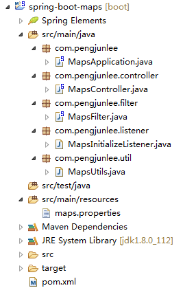

在对一个APP项目后台进行重构的过程中遇到了以下问题：重构系统的请求接口需按照新的设计要求进行开发，同时，还需要保证老版本的APP端能够通过旧的请求地址正常访问。

解决办法：将旧的请求地址与对应的新地址按照 oldUrl=newUrl 的格式添加到配置文件中，并使用过滤器对请求进行拦截，根据配置文件中的配置将对旧地址的请求重定向到新地址，示例项目的完整目录层次如下图所示。

# 添加Maven依赖

	<parent>
		<groupId>org.springframework.boot</groupId>
		<artifactId>spring-boot-starter-parent</artifactId>
		<version>1.5.6.RELEASE</version>
	</parent>
 
	<dependencies>
		<dependency>
			<groupId>org.projectlombok</groupId>
			<artifactId>lombok</artifactId>
		</dependency>
		<dependency>
			<groupId>org.springframework.boot</groupId>
			<artifactId>spring-boot-starter-web</artifactId>
		</dependency>
	</dependencies>

# 配置地址映射

根据实际情况对需要处理的旧请求地址按照`旧地址=新地址` 的格式在maps.properties中进行配置，配置示例如下。 

	# format: oldUrl = newUrl
	/spring/boot/hello.ihtml=/hello
	/index.ihtml=/home

# MapsApplication应用启动类

MapsApplication启动类中添加了一个自定义的`MapsInitializeListener`用来对映射地址配置文件进行加载，其代码如下。 

	import org.springframework.boot.SpringApplication;
	import org.springframework.boot.autoconfigure.SpringBootApplication;
	 
	import com.pengjunlee.listener.MapsInitializeListener;
	 
	@SpringBootApplication
	public class MapsApplication {
	 
		public static void main(String[] args) {
			SpringApplication application = new SpringApplication(MapsApplication.class);
			// 添加一个初始化监听器，对映射地址配置进行加载
			application.addListeners(new MapsInitializeListener("maps.properties"));
			application.run(args);
		}
	}

# MapsInitializeListener初始化监听器

MapsInitializeListener初始化监听器负责对maps.properties中的地址映射配置进行加载。 

	import org.springframework.boot.context.event.ApplicationStartingEvent;
	import org.springframework.context.ApplicationListener;
	 
	import com.pengjunlee.util.MapsUtils;
	 
	/**
	 * URL映射的初始化监听器
	 * 
	 * @author pengjunlee
	 * @date 2017年11月23日上午11:31:16
	 */
	public class MapsInitializeListener implements ApplicationListener<ApplicationStartingEvent> {
	 
		private String propertiesFileName;
	 
		public MapsInitializeListener(String propertiesFileName) {
			super();
			this.propertiesFileName = propertiesFileName;
		}
	 
		@Override
		public void onApplicationEvent(ApplicationStartingEvent event) {
			MapsUtils.loadAllProperties(propertiesFileName);
		}
	}

# MapsUtils工具类

	import java.io.IOException;
	import java.io.UnsupportedEncodingException;
	import java.util.HashMap;
	import java.util.Map;
	import java.util.Properties;
	 
	import lombok.extern.slf4j.Slf4j;
	 
	import org.springframework.core.io.support.PropertiesLoaderUtils;
	 
	/**
	 * Url映射配置加载辅助工具类
	 * 
	 * @author pengjunlee
	 * @date 2017年11月23日上午11:30:47
	 */
	@Slf4j
	public class MapsUtils {
	 
		private static Map<String, String> propertiesMap = null;
	 
		private static void processProperties(Properties properties) {
			propertiesMap = new HashMap<String, String>();
			for (Object key : properties.keySet()) {
				String keyStr = key.toString();
				try {
					propertiesMap.put(keyStr, new String(properties.getProperty(keyStr).getBytes("ISO-8859-1"), "UTF-8"));
				} catch (UnsupportedEncodingException e) {
					log.error(e.getMessage());
					e.printStackTrace();
				}
			}
		}
	 
		public static void loadAllProperties(String propertiesFileName) {
			try {
				Properties properties = PropertiesLoaderUtils.loadAllProperties(propertiesFileName);
				processProperties(properties);
			} catch (IOException e) {
				log.error(e.getMessage());
				e.printStackTrace();
			}
		}
	 
		public static String getProperty(String name) {
			return propertiesMap.get(name) == null ? "" : propertiesMap.get(name);
		}
	 
		public static Map<String, String> getAllProperty() {
			return propertiesMap;
		}
	}

# MapsFilter过滤器

通过@WebFilter的urlPatterns属性来对过滤器需要过滤的请求进行配置，本例仅拦截匹配 /spring/boot/* 和 /index.ihtml 的请求URL进行过滤。 

	import java.io.IOException;
	 
	import javax.servlet.Filter;
	import javax.servlet.FilterChain;
	import javax.servlet.FilterConfig;
	import javax.servlet.ServletException;
	import javax.servlet.ServletRequest;
	import javax.servlet.ServletResponse;
	import javax.servlet.annotation.WebFilter;
	import javax.servlet.http.HttpServletRequest;
	 
	import org.springframework.boot.web.servlet.ServletComponentScan;
	import org.springframework.stereotype.Component;
	 
	import com.pengjunlee.util.MapsUtils;
	 
	import lombok.extern.slf4j.Slf4j;
	 
	/**
	 * URL映射过滤器
	 * 
	 * @author pengjunlee
	 * @date 2017年11月23日上午11:31:52
	 */
	@ServletComponentScan
	@Component
	@WebFilter(urlPatterns = { "/spring/boot/*", "/index.ihtml" }, filterName = "urlMappingFilter")
	@Slf4j
	public class MapsFilter implements Filter {
	 
		@Override
		public void destroy() {
	 
		}
	 
		@Override
		public void doFilter(ServletRequest req, ServletResponse response, FilterChain filterChain)
				throws IOException, ServletException {
			HttpServletRequest request = (HttpServletRequest) req;
			log.info(request.getRequestURI());
			String property = MapsUtils.getProperty(request.getRequestURI());
			if (null != property && "" != property) {
				req.getRequestDispatcher(MapsUtils.getProperty(request.getRequestURI())).forward(req, response);
			} else {
				filterChain.doFilter(req, response);
			}
	 
		}
	 
		@Override
		public void init(FilterConfig arg0) throws ServletException {
	 
		}
	 
	}

# MapsController控制器

在实际开发过程中，MapsController的请求映射路径是根据新设计要求进行开发的，此处仅为示例。 

	import org.springframework.web.bind.annotation.RequestMapping;
	import org.springframework.web.bind.annotation.RestController;
	 
	@RestController
	public class MapsController {
	 
		@RequestMapping("/hello")
		public String hello(String userName) {
			return "Hello " + userName;
		}
	 
		@RequestMapping("/home")
		public String home() {
			return "Welcome To Home ! ";
		}
	}

# 请求测试

启动应用，访问 `http://localhost:8080/index.ihtml` 和 `http://localhost:8080/spring/boot/hello.ihtml?userName=pengjunlee` 两个地址，若返回以下结果则表示过滤器添加成功。

# 项目源码

本文项目源码已上传至CSDN，资源地址：<http://download.csdn.net/download/pengjunlee/10170556>