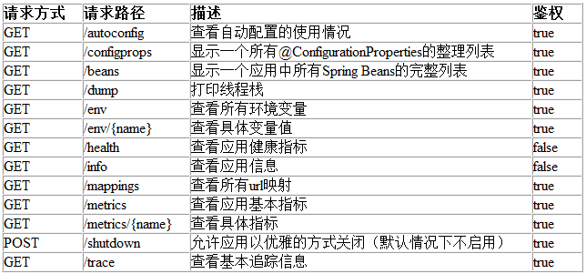
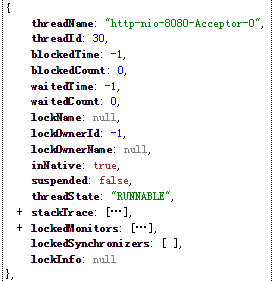
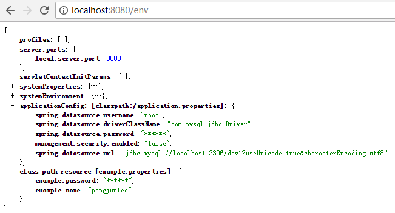
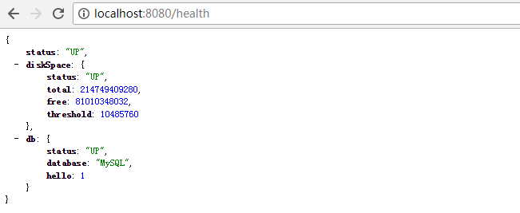
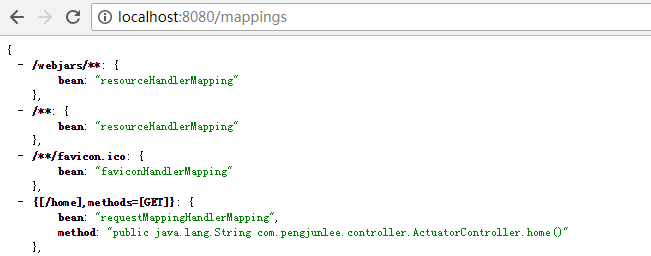
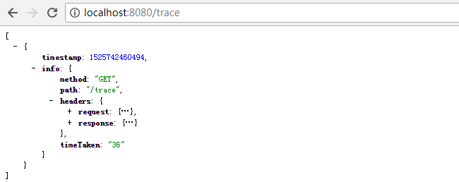

Actuator是Springboot提供的用来对应用系统进行自省和监控的功能模块，借助于Actuator开发者可以很方便地对应用系统某些监控指标进行查看、统计等。本文将通过示例来对如何在Springboot中使用Actuator监控做一个简单介绍，更多内容请移步[官方文档](https://docs.spring.io/spring-boot/docs/current/reference/htmlsingle/#production-ready "官方文档")。  

# 添加依赖与配置
在Springboot中使用Actuator监控非常简单，只需要在工程POM文件中引入`spring-boot-starter-actuator`依赖即可。 

		<!-- 引入Actuator监控依赖 -->
		<dependency>
			<groupId>org.springframework.boot</groupId>
			<artifactId>spring-boot-starter-actuator</artifactId>
		</dependency>

在本项目中，除了引入Actuator依赖之外还额外引入了JDBC依赖（用来对数据源健康状态进行示例）和WEB依赖（启用WEB方式查看监控信息），完整的依赖配置如下。  

	<parent>
		<groupId>org.springframework.boot</groupId>
		<artifactId>spring-boot-starter-parent</artifactId>
		<version>1.5.6.RELEASE</version>
	</parent>
 
	<dependencies>
		<!-- 添加MySQL依赖 -->
		<dependency>
			<groupId>mysql</groupId>
			<artifactId>mysql-connector-java</artifactId>
		</dependency>
		<!-- 添加JDBC依赖 -->
		<dependency>
			<groupId>org.springframework.boot</groupId>
			<artifactId>spring-boot-starter-jdbc</artifactId>
		</dependency>
		<dependency>
			<groupId>org.springframework.boot</groupId>
			<artifactId>spring-boot-starter-web</artifactId>
		</dependency>
		<!-- 引入Actuator监控依赖 -->
		<dependency>
			<groupId>org.springframework.boot</groupId>
			<artifactId>spring-boot-starter-actuator</artifactId>
		</dependency>
	</dependencies>

同时，`application.properties`核心配置文件中除了定义数据源外，还需要添加 `management.security.enabled=false` 配置。  

	#########################################################
	###   Actuator Monitor  --   Actuator configuration   ###
	#########################################################
	management.security.enabled=false
	
	#########################################################
	###  Spring DataSource  -- DataSource configuration   ###
	#########################################################
	spring.datasource.url=jdbc:mysql://localhost:3306/dev1?useUnicode=true&characterEncoding=utf8
	spring.datasource.driverClassName=com.mysql.jdbc.Driver
	spring.datasource.username=root
	spring.datasource.password=123456

**注意**：若在核心配置文件中未添加 `management.security.enabled=false` 配置，将会导致用户在访问部分监控地址时访问受限，报401未授权错误。  

# Actuator监控项

下表包含了Actuator提供的主要监控项。 

下面逐个对每一个监控项进行举例介绍。

**/autoconfig**用来查看自动配置的使用情况，包括：哪些被应用、哪些未被应用以及它们未被应用的原因、哪些被排除。 

**/configprops**可以显示一个所有@ConfigurationProperties的整理列表。

**/beans**可以显示Spring容器中管理的所有Bean的信息。 

**/dump**用来查看应用所启动的所有线程，每个线程的监控内容如下图所示。 

**/env**用来查看整个应用的配置信息，使用/env/[name]可以查看具体的配置项。 

**/health**用来查看整个应用的健康状态，包括磁盘空间使用情况、数据库和缓存等的一些健康指标。 

此外，Springboot还允许用户自定义健康指标，只需要定义一个类实现HealthIndicator接口，并将其纳入到Spring容器的管理之中。  

	@Component
	public class MyHealthIndicator implements HealthIndicator{
	 
		@Override
		public Health health() {
			return Health.down().withDetail("error", "spring boot error").build();
		}
	 
	}

**/info**可以显示配置文件中所有以info.开头或与Git相关的一些配置项的配置信息。

**/mappings**用来查看整个应用的URL地址映射信息。  

**/metrics**用来查看一些监控的基本指标，也可以使用**/metrics/[name]**查看具体的指标。 

此外，Springboot还为提供了CounterService和GaugeService两个Bean来供开发者使用，可以分别用来做计数和记录double值。 

	@RestController
	public class ActuatorController {
	 
		@Autowired
		private CounterService counterService;
	 
		@Autowired
		private GaugeService gaugeService;
	 
		@GetMapping("/home")
		public String home() {
			//请求一次浏览数加1
			counterService.increment("home browse count");
			//请求时将app.version设置为1.0
			gaugeService.submit("app.version", 1.0);
			return "Actuator home";
		}
	 
	}

**/shutdown**是一个POST请求，用来关闭应用，由于操作比较敏感，默认情况下该请求是被禁止的，若要开启需在配置文件中添加以下配置：  

`endpoints.shutdown.enabled: true`  

**/trace**用来监控所有请求的追踪信息，包括：请求时间、请求头、响应头、响应耗时等信息。 

# Actuator监控管理

## 打开或关闭
Actuator监控的所有项目都定义在spring-boot-actuator-x.x.x.RELEASE.jar的org.springframework.boot.actuate.endpoint包中，包含以下Endpoint。 

这些Endpoint都继承自AbstractEndpoint，AbstractEndpoint中定义了两个重要的属性：enabled和sensitive。

其中，enabled用来打开或关闭该监控项，语法为：`endpoints.[endpoint_name].enabled=false/true`，以关闭/autoconfig监控项为例，其配置如下。 

`endpoints.autoconfig.enabled=false`

**sensitive**用来配置该监控项是否属于敏感信息，访问敏感信息需要用户具有ACTUATOR角色权限，或者使用以下配置关闭安全限制。  

`management.security.enabled=false`

## 端口与地址
除了使用与应用相同的端口访问监控地址外，我们还可以在配置文件中增加 `management.port` 配置项来自己指定监控的请求端口。 

`management.port=9090`

还可以通过 `management.address` 配置项来指定可以请求监控的IP地址，比如只能通过本机监控，可以设置 `management.address = 127.0.0.1` 。