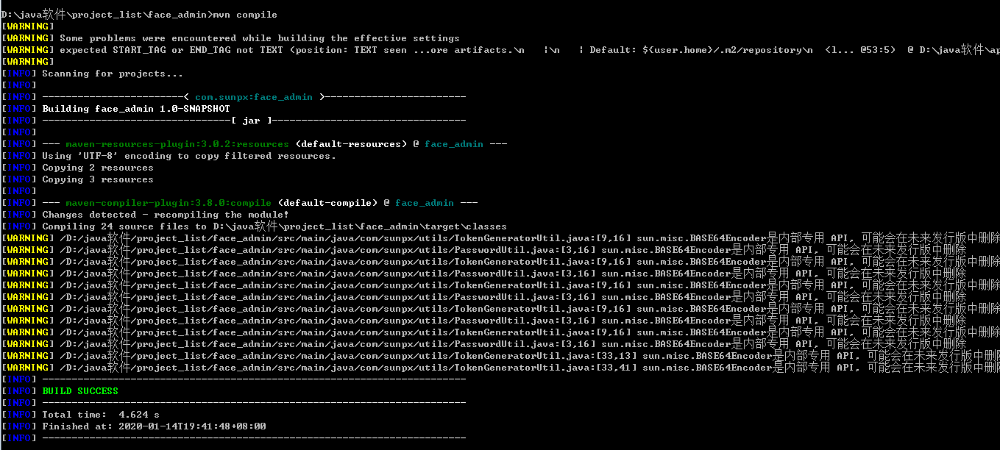

> 原文链接： <https://blog.csdn.net/sunpx3/article/details/81170873>

之前写的打包方式有问题，自已第二次用用那个方法都没成功，所以不能坑别人- - ，重新写一下。
先写方法，再说为什么。打包方式用的是`spring-boot-maven-plugin`插件打包。
`maven pom.xml`加入`springboot`的打包插件配置，`Spring Boot Maven plugin`能够将`Spring Boot`应用打包为可执行的`jar`或`war`文件，然后以可执行的方式运行`Spring Boot`应用。

	<plugins>
	      <plugin>
	          <groupId>org.springframework.boot</groupId>
	          <artifactId>spring-boot-maven-plugin</artifactId>
	          <executions>
	              <execution>
	                  <goals>
	                       <goal>repackage</goal>
	                   </goals>
	                </execution>
	          </executions>
	       </plugin>
	</plugins>

**第一步**: 必须先编译，不然找包后报找不到类，先使用maven编译整个项目,用idea的同学可以点`maven compile`编译。使用外部maven的同学执行`mvn compile`.看最后是否`success`。

**第二步**: 执行命令 

	mvn package spring-boot:repackage

这个命令能将`spring-boot`打包为`jar`，并将依赖打进去，就可以放到其他地方执行，`mvn package`这种打包是没有依赖的，放在别的环境就不能运行了。
这样就打包完成了，打成的`jar`在`target`目录下。