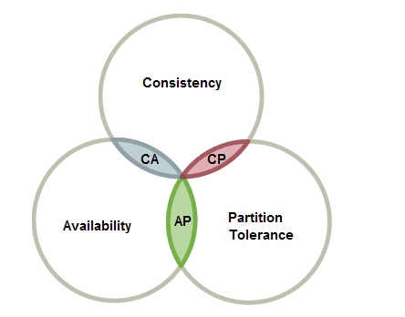

# 定理简介

1998年，加州大学的计算机科学家 Eric Brewer 提出了分布式系统的三个指标：

- C：Consistency，一致性。在分布式系统中的所有数据备份，在同一时刻具有同样的值，所有节点在同一时刻读取的数据都是最新的数据副本（all nodes see the same data at the same time）。
- A：Availability ，可用性，好的响应性能。完全的可用性指的是在任何故障模型下，服务都会在有限的时间内处理完成并进行响应（Reads and writes always succeed）。
- P：Partition Tolerance ，分区容错性，即分布式系统在遇到某些节点或网络分区故障的时候，仍然能够对外提供满足一致性或可用性的服务。分区容错性要求一个分布式系统中有某一个或者几个节点故障时，其他剩下的节点还能够正常运转并对外提供服务，对于用户而言并没有什么体验上的影响。

Eric Brewer 指出任何分布式系统只可同时满足CAP三个指标中的两个，无法三者兼顾，这个结论就叫做 CAP 定理。

# 定理解读
分布式的服务化系统都需要满足分区容忍性，那么我们必须在一致性（C）和可用性（A）之间进行权衡。在网络分区故障发生时，两个分布式节点之间无法进行通信，那么我们对一个节点进行的修改操作将无法同步到另外一个节点，所以数据的一致性（C）将无法满足，因为两个分布式节点的数据不再保持一致。除非我们牺牲可用性（A），也就是在网络分区故障发生时，暂停分布式系统对外提供修改数据服务，直到网络状况完全恢复正常再继续对外提供修改数据服务。

- CP满足的情况下，A不能满足的原因：

若要满足一致性（C）就需要在多个分布式节点之间进行数据同步，在数据同步完成之前整个系统都将不可用。节点数量越多分区容错性（P）越好，同时数据同步所耗费的时间自然也就越长，从而无法在有限的时间内完成请求响应，导致可用性（A）不能满足。

- CA满足的情况下，P不能满足的原因：

若要满足一致性（C）就需要在多个分布式节点之间进行数据同步，在数据同步完成之前整个系统都将不可用。需同步的节点数量越多，数据同步所需耗费的时间越长，可用性（A）也越差。若要同时保证可用性（A），那么需同步的节点数量就需要尽量减少，从而导致分区容错性（P）无法满足。

- AP满足的情况下，C不能满足的原因：

节点的数量越多，分区容错性（P）越好，节点间数据同步所需耗费的时间越长，若要在有限的时间内完成请求响应即保证可用性（A），那么数据就可能不能及时地同步到其他节点，从而无法保证节点间的数据一致性（C）。

# 如何抉择
对于现如今大多数的互联网应用场景，都倾向于采用分布式微服务架构，它们通常节点众多、部署相对分散，随着集群规模变得越来越大，节点故障、网络故障已是常态。

在这种情况下，对于那些对数据一致性（C）要求不高的场景，例如电商系统，我们只需要保证分区容错性（P）和可用性（A），对于数据一致性（C）退而求其次仅保证数据的最终一致性即可。这虽然会某些地方影响客户体验，但并不会达到造成用户流失的严重程度。

对于像银行系统这类对数据一致性（C）要求较高的场景，数据一致性（C）必须保证。网络发生故障宁可停止服务（或者只读不写），这是保证分区容错性（P）和数据一致性（C），舍弃可用性（A）。

目前比较主流的注册中心有 Zookeeper、Eureka、Consul、Etcd 等，以Zookeeper 和Eureka为例， 在进行注册中心选择时，CAP又该如何抉择呢？

- Zookeeper：CP设计，保证了一致性，集群搭建的时候，某个节点失效，则会进行选举新的Leader，或者半数以上节点不可用，则无法提供服务，因此可用性（A）没法满足。

- Eureka：AP设计，无主从节点，一个节点挂了，自动切换其他节点继续使用，去中心化，但数据一致性（C）不满足。

在分布式系统中分区容错性（P）肯定要满足，所以只能在CA中二选一， 没有最好的选择，只有更适合的，我们需要根据自己的业务场景来进行架构设计：

- 如果要求一致性，则选择 Zookeeper，如金融行业

- 如果要求可用性，则选择 Eureka，如电商系统