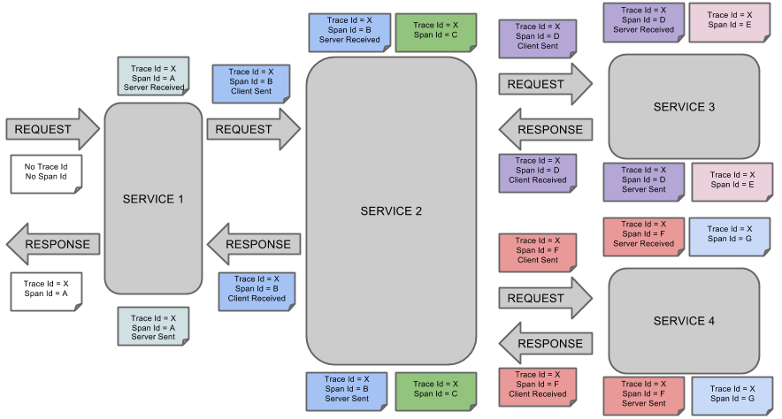
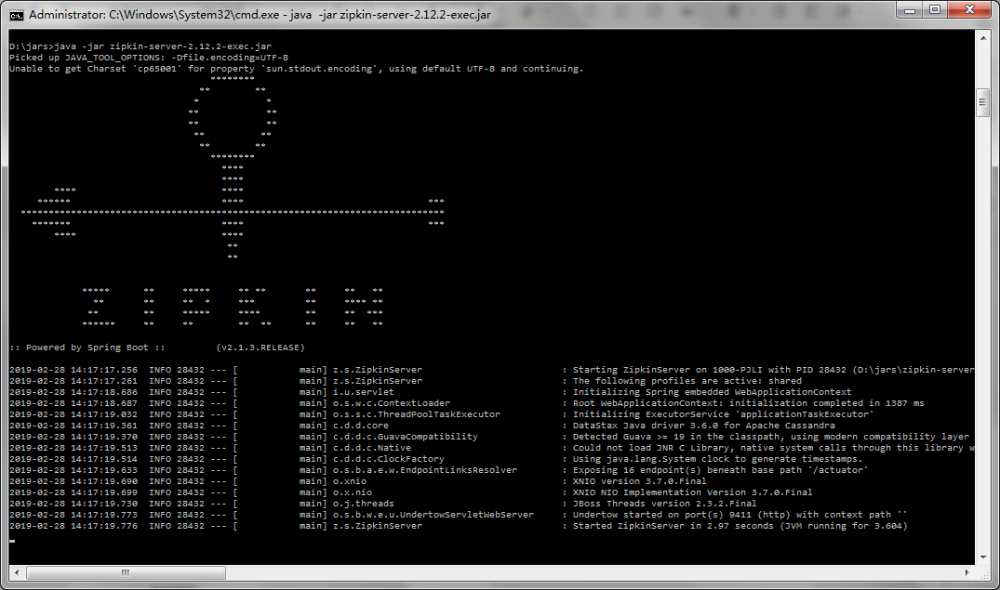
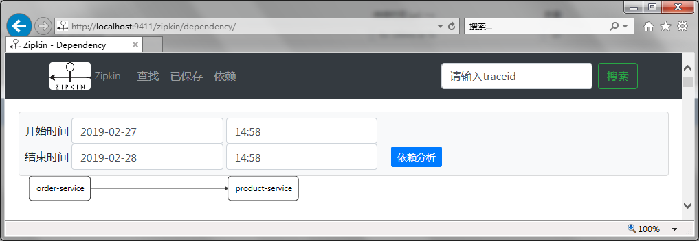

# Sleuth简介
Sleuth是Spring Cloud的组件之一，它为Spring Cloud实现了一种分布式追踪解决方案，兼容Zipkin，HTrace和其他基于日志的追踪系统，例如 ELK（Elasticsearch 、Logstash、 Kibana）。

# 相关术语
Sleuth引入了许多 Dapper中的术语：

- **Span**  
基本的工作单元。无论是发送一个RPC或是向RPC发送一个响应都是一个Span。每一个Span通过一个64位ID来进行唯一标识，并通过另一个64位ID对Span所在的Trace进行唯一标识。  
Span能够启动和停止，他们不断地追踪自身的时间信息，当你创建了一个Span，你必须在未来的某个时刻停止它。  
提示：启动一个Trace的初始化Span被叫作 Root Span ，它的 Span ID 和 Trace Id 相同。

- **Trace**  
由一系列Span 组成的一个树状结构。例如，如果你要执行一个分布式大数据的存储操作，这个Trace也许会由你的PUT请求来形成。

- **Annotation**  
用来及时记录一个事件的存在。通过引入 Brave 库，我们不用再去设置一系列的特别事件，从而让 Zipkin 能够知道客户端和服务器是谁、请求是从哪里开始的、又到哪里结束。出于学习的目的，还是把这些事件在这里列举一下：
- cs （Client Sent） - 客户端发起一个请求，这个注释指示了一个Span的开始。
- sr （Server Received） - 服务端接收请求并开始处理它，如果用 sr 时间戳减去 cs 时间戳便能看出有多少网络延迟。
- ss（Server Sent）- 注释请求处理完成(响应已发送给客户端)，如果用 ss 时间戳减去sr 时间戳便可得出服务端处理请求耗费的时间。
- cr（Client Received）- 预示了一个 Span的结束，客户端成功地接收到了服务端的响应，如果用 cr 时间戳减去 cs 时间戳便可得出客户端从服务端获得响应所需耗费的整个时间。

下图展示了一个系统中的 Span 和 Trace 大概的样子：

颜色相同的注释表示是同一个Span（这里一共有7个Span，编号从 Ａ到Ｇ），以下面这个注释为例：

	Trace Id = X
	Span Id = D
	Client Sent

这个注释表示当前Span的Trace Id 为 X，Span Id 为 D，同时，发生了 Client Sent 事件。

下图展示了父子关系的Span的调用链路：

# 使用Sleuth
为了确保你的应用名称能够在Zipkin中正确显示，你需要先在Springboot的核心配置文件中对spring.application.name 属性进行配置。

## 引入依赖
如果你只想使用SpringCloud Sleuth 而不想与 Zipkin 做集成，引入如下依赖：

	<dependencies>
		<!-- Sleuth 依赖 -->
		<dependency>
			<groupId>org.springframework.cloud</groupId>
			<artifactId>spring-cloud-starter-sleuth</artifactId>
		</dependency>
	</dependencies>
 
	<dependencyManagement>
		<dependencies>
			<!-- SpringCloud 版本控制依赖 -->
			<dependency>
				<groupId>org.springframework.cloud</groupId>
				<artifactId>spring-cloud-dependencies</artifactId>
				<version>${spring-cloud.version}</version>
				<type>pom</type>
				<scope>import</scope>
			</dependency>
		</dependencies>
	</dependencyManagement>

如果你想通过 HTTP 将 SpringCloud Sleuth 与 Zipkin做集成，引入如下依赖：

	<dependencies>
		<!-- Zipkin 依赖 -->
		<dependency>
			<groupId>org.springframework.cloud</groupId>
			<artifactId>spring-cloud-starter-zipkin</artifactId>
		</dependency>
	</dependencies>
 
	<dependencyManagement>
		<dependencies>
			<!-- SpringCloud 版本控制依赖 -->
			<dependency>
				<groupId>org.springframework.cloud</groupId>
				<artifactId>spring-cloud-dependencies</artifactId>
				<version>${spring-cloud.version}</version>
				<type>pom</type>
				<scope>import</scope>
			</dependency>
		</dependencies>
	</dependencyManagement>

如果你想使用RabbitMQ 或者Kafka 替代 HTTP ，需先引入 spring-rabbit 或者 spring-kafka 依赖。默认的目标名称是 zipkin 。如果你使用的是Kafka ，必须设置相应的 spring.zipkin.sender.type 属性：

`spring.zipkin.sender.type: kafka`  

**注意**：spring-cloud-sleuth-stream已经过期并且和这些目标不兼容。

如果你使用的是RabbitMQ，需要添加 spring-cloud-starter-zipkin 和 spring-rabbit 依赖。

	<dependencyManagement>
		<dependencies>
			<dependency>
				<groupId>org.springframework.cloud</groupId>
				<artifactId>spring-cloud-dependencies</artifactId>
				<version>${release.train.version}</version>
				<type>pom</type>
				<scope>import</scope>
			</dependency>
		</dependencies>
	</dependencyManagement>
 
	<dependency>
		<groupId>org.springframework.cloud</groupId>
		<artifactId>spring-cloud-starter-zipkin</artifactId>
	</dependency>
	<dependency>
		<groupId>org.springframework.amqp</groupId>
		<artifactId>spring-rabbit</artifactId>
	</dependency>

为了示例，这里我们使用Sleuth+Zipkin的默认配置，在需要进行链路追踪的所有服务端添加如下配置：

	<parent>
		<groupId>org.springframework.boot</groupId>
		<artifactId>spring-boot-starter-parent</artifactId>
		<version>2.0.6.RELEASE</version>
	</parent>
 
	<properties>
		<spring-cloud.version>Finchley.SR2</spring-cloud.version>
	</properties>
 
	<dependencies>
		<dependency>
			<groupId>org.springframework.boot</groupId>
			<artifactId>spring-boot-starter-web</artifactId>
		</dependency>
		<!-- Eureka-Server 依赖 -->
		<dependency>
			<groupId>org.springframework.cloud</groupId>
			<artifactId>spring-cloud-starter-netflix-eureka-client</artifactId>
		</dependency>
		<!-- Feign 依赖 -->
		<dependency>
			<groupId>org.springframework.cloud</groupId>
			<artifactId>spring-cloud-starter-openfeign</artifactId>
		</dependency>
		<!-- Sleuth+Zipkin 依赖 -->
		<dependency>
			<groupId>org.springframework.cloud</groupId>
			<artifactId>spring-cloud-starter-zipkin</artifactId>
		</dependency>
	</dependencies>
 
	<dependencyManagement>
		<dependencies>
			<!-- SpringCloud 版本控制依赖 -->
			<dependency>
				<groupId>org.springframework.cloud</groupId>
				<artifactId>spring-cloud-dependencies</artifactId>
				<version>${spring-cloud.version}</version>
				<type>pom</type>
				<scope>import</scope>
			</dependency>
		</dependencies>
	</dependencyManagement>

## 创建服务

 如图所示，创建order-service和product-service两个服务，并在order-service中通过Feign对product-service进行远程调用。

### product-service
 在product-service的controller中提供一个商品服务：

	@RestController
	@RequestMapping("/api/v1/product")
	public class ProductController {
	 
		private final Logger logger = LoggerFactory.getLogger(getClass());
	 
		/**
		 * 商品服务
		 */
		@GetMapping("/service")
		public String productService() {
			logger.info("Product Service Is Called...");
			return "Product Service Is Called...";
		}
	}

### order-service
由于需要在 order-service 中调用product-service，先创建一个ProductClient：

	@FeignClient(name = "product-service")
	public interface ProductClient {
	 
		@GetMapping("/api/v1/product/service")
		public String productService();
	 
	}

为了示例简单，我们直接在order-service的controller中通过ProductClient对product-service进行调用：

	@RestController
	@RequestMapping("/api/v1/order")
	public class OrderController {
	 
		private final Logger logger = LoggerFactory.getLogger(getClass());
	 
		@Autowired
		private ProductClient productClient;
	 
		@GetMapping(value = "/service")
		public String orderService() {
			logger.info("Order Service Is Called...");
			String ret = productClient.productService();
			logger.info(ret.toString());
			return "Order Service Is Called...";
		}
	}

### 启动&测试
按照以下顺序启动应用进行测试：

`==>启动Eureka注册中心，端口号 8761`  
`==>分别通过8771和8781两个端口启动product-service和order-service两个服务`  

启动完成之后，Eureka注册中心中注册的服务列表如下：

在浏览器中输入以下地址: http://localhost:8781/api/v1/order/service，返回如下内容：

同时，在order-service后台打印如下日志：

	2019-02-27 13:49:17.439  INFO [order-service,895caa4daa30bb0a,895caa4daa30bb0a,true] 2812 --- [nio-8781-exec-2] c.pengjunlee.controller.OrderController  : Order Service Is Called...
	2019-02-27 13:49:17.465  INFO [order-service,895caa4daa30bb0a,895caa4daa30bb0a,true] 2812 --- [nio-8781-exec-2] c.pengjunlee.controller.OrderController  : Product Service Is Called...

在product-service后台打印如下日志： 

	2019-02-27 13:49:17.448  INFO [product-service,895caa4daa30bb0a,9cd122253ea82104,true] 20736 --- [nio-8771-exec-8] c.p.controller.ProductController         : Product Service Is Called...

正如上面 product-service 和 order-service 中打印的日志所示，Sleuth将Trace Id和Span Id添加到Slf4J MDC（Mapped Diagnostic Context）并在日志中进行了打印，这样，你就能够从日志聚合器中提取任何一个给定的Trace 或者Span 的所有日志了。

接下来，重点解释一下日志中的 [appname,traceId,spanId,exportable] 各部分所代表的含义：

- appname：记录日志的应用的名称，即spring.application.name的值；
- traceId：Sleuth为一次请求链路生成的唯一ID，一个Trace中可以包含多个Span；
- spanId：请求链路基本的工作单元，代表发生一次特定的操作，例如：发送一个Http请求；
- exportable：是否需要将日志导出到 Zipkin；

Sleuth提供了对常见分布式链路追踪数据模型的抽象：Trace、Span、Annotation和键值对Annotation。Spring-Cloud-Sleuth虽然基于htrace，但与Zipkin（dapper）也兼容。

Sleuth记录时间信息以帮助进行延迟分析。通过使用sleuth，您可以查明应用程序中延迟的原因。

当spring-cloud-sleuth-zipkin包含在classpath中时，应用程序将生成并收集与zipkin兼容的追踪记录。默认情况下，会通过HTTP将它们发送到本地主机（端口9411）上的Zipkin服务器。您可以通过设置spring.zipkin.baseurl来配置服务的地址。

如果你依赖的是spring-rabbit，那么应用程序会将追踪记录发送到Rabbit MQ代理，而不是HTTP。

如果你依赖的是spring-kafka，并设置了spring.zipkin.sender.type:kafka，那么应用程序会将追踪记录发送到Kafka代理而不是HTTP。

**注意**：如果你使用的是Zipkin，请通过设置spring.sleuth.sampler.probability来配置导出Span的概率（默认值：0.1，即10%）。否则，您可能会认为Sleuth不起作用，因为它省略了一些Span。

**注意**：如果你使用的是SLF4J，Trace和Span的追踪记录默认会被记录到MDC，所以日志的用户可以立刻看到。但如果你使用的是其他的日志系统，你还需要对日志的打印格式进行设置才能看到相同的结果：

	logging.pattern.level = %5p [${spring.zipkin.service.name:${spring.application.name:-}},%X{X-B3-TraceId:-},%X{X-B3-SpanId:-},%X{X-Span-Export:-}]

# Zipkin
Zipkin是一个分布式系统的APM工具（Application Performance Management），基于Google Dapper 实现。它帮助收集解决微服务架构中延迟问题所需的时间数据，并管理这些数据。和Sleuth结合可以提供可视化Web界面分析调用链路耗时情况。

#使用Zipkin
如果你使用的Java版本为JDK 8，可以下载一个Zipkin的独立可执行Jar。

下载地址：

<https://search.maven.org/remote_content?g=io.zipkin.java&a=zipkin-server&v=LATEST&c=exec>

使用如下命令启动Zipkin：

`java -jar zipkin-server-2.12.2-exec.jar`  

启动完成后，访问 http://localhost:9411/zipkin/dependency/ 查看服务的依赖关系。

# 参考文章

<https://cloud.spring.io/spring-cloud-netflix/single/spring-cloud-netflix.html#netflix-zuul-starter>

<https://github.com/openzipkin/brave>

<https://cloud.spring.io/spring-cloud-static/Finchley.SR2/single/spring-cloud.htmlhttps://cloud.spring.io/spring-cloud-static/Finchley.SR2/single/spring-cloud.html>