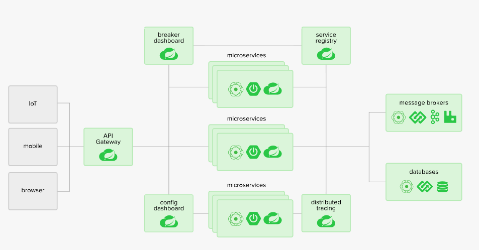
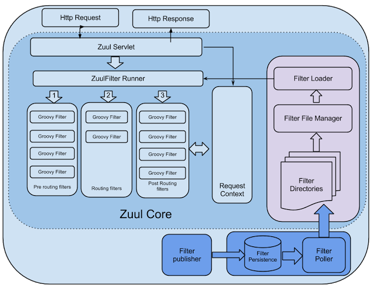
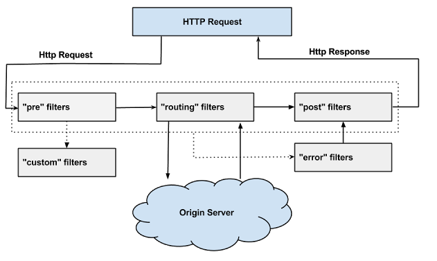
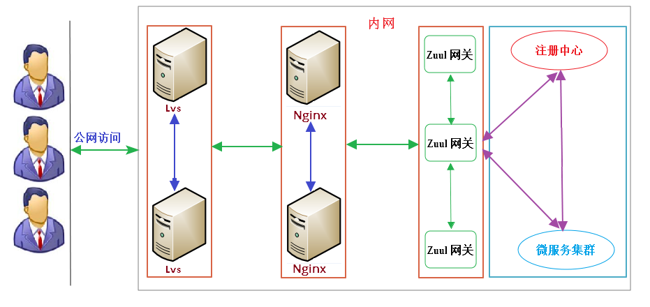

# Zuul是什么？
API Gateway 是随着微服务（Microservice）这个概念一起兴起的一种架构模式，它用于解决微服务过于分散，没有一个统一的出入口来进行流量管理的问题。

API Gateway可以作为整个系统对外的唯一入口，它是一个介于客户端和服务器之间的中间层，用来处理一些与业务无关的边缘功能，例如：智能路由、登录鉴权、流量监控与限流、网络隔离，等等。

API Gateway 的一种比较常规的选择就是使用Nginx代理，但是Netflix带来了它自己的解决方案----Zuul。Zuul 是Netflix公司开源的基于JVM的微服务网关，可以和Eureka、Ribbon和Hystrix等组件配合使用，提供动态路由，监控，弹性，安全等边缘服务。它相当于是设备和 Netflix 流应用的 Web 网站后端所有请求的前门，可以适当的对多个 Amazon Auto Scaling Groups 进行路由请求。

Netflix公司主要使用Zuul完成以下功能：

- 鉴权
- 流量监控
- 压力测试
- 金丝雀测试（灰度测试/AB测试）
- 动态路由
- 服务迁移
- 限流
- 安全防护
- 静态响应处理

# Zuul的工作原理
和大部分基于Java的Web应用类似，Zuul也采用了servlet架构，因此Zuul处理每个请求的方式是：针对每个请求使用一个线程来处理。通常情况下，为了提高性能，所有请求会被放到处理队列中，从线程池中选取空闲线程来处理该请求。这样的设计方式，足以应付一般的高并发场景。

如图所示，Zuul的核心是一系列的filters，并且它还提供了一个框架，可以对过滤器进行动态的加载，编译，运行。Zuul的过滤器之间并不会直接进行通信，而是通过一个RequestContext的静态类进行数据传递。RequestContext用ThreadLocal变量来记录每个Request所需要传递的数据。

Zuul的过滤器是使用Groovy语言编写而成的，这些过滤器文件被放在Zuul Server上的特定目录下面，Zuul会定期轮询这些目录，修改过的过滤器会动态的加载到Zuul Server中以便于request使用。

Zuul的标准过滤器有以下四种类型：

- 前置过滤器(pre filters)：在请求到达Origin Server之前调用。我们可利用这种过滤器实现身份验证、在集群中选择请求的Origin Server、记录调试信息等。

- 路由过滤器(routing filters)：将用户的请求转发给Origin Server。发送给Origin Server的用户请求在这类过滤器中build，并使用Apache HttpClient或者Netfilx Ribbon发送给Origin Server。

- 后置过滤器(post filters)：在用户请求从Origin Server返回以后执行。这种过滤器可用来为响应添加标准的HTTP Header、收集统计信息和指标、将从Origin Server获取到的响应发送给客户端等。

- 错误过滤器(error filters)：在其他阶段发生错误时执行该过滤器。

一个请求会先按顺序通过所有的前置过滤器，之后在路由过滤器中转发给后端应用，得到响应后又会通过所有的后置过滤器，最后再将响应发送给客户端。在整个流程中如果发生了异常则会跳转到错误过滤器中。

一般来说，如果需要在请求到达后端应用前就进行处理的话，会选择前置过滤器，例如鉴权、请求转发、增加请求参数等行为。在请求完成后需要处理的操作放在后置过滤器中完成，例如统计返回值和调用时间、记录日志、增加跨域头等行为。路由过滤器一般只需要选择 Zuul 中内置的即可，错误过滤器一般只需要一个，这样可以在 Gateway 遇到错误逻辑时直接抛出异常中断流程，并直接统一处理返回结果。

# 使用Zuul
接下来我们将沿用上一章《客户端负载均衡(Ribbon)》中的项目，演示如何使用Zuul。 

## 引入Zuul依赖
新建一个maven项目，起名为api-gateway，在其 pom.xml 文件中引入Zuul依赖：

	<parent>
		<groupId>org.springframework.boot</groupId>
		<artifactId>spring-boot-starter-parent</artifactId>
		<version>2.0.6.RELEASE</version>
	</parent>
 
	<properties>
		<spring-cloud.version>Finchley.SR2</spring-cloud.version>
	</properties>
 
	<dependencies>
		<dependency>
			<groupId>org.springframework.boot</groupId>
			<artifactId>spring-boot-starter-web</artifactId>
		</dependency>
		<!-- Eureka-Client 依赖 -->
		<dependency>
			<groupId>org.springframework.cloud</groupId>
			<artifactId>spring-cloud-starter-netflix-eureka-client</artifactId>
		</dependency>
 
		<!-- Zuul 依赖 -->
		<dependency>
			<groupId>org.springframework.cloud</groupId>
			<artifactId>spring-cloud-starter-netflix-zuul</artifactId>
		</dependency>
	</dependencies>
 
	<dependencyManagement>
		<dependencies>
			<!-- SpringCloud 版本控制依赖 -->
			<dependency>
				<groupId>org.springframework.cloud</groupId>
				<artifactId>spring-cloud-dependencies</artifactId>
				<version>${spring-cloud.version}</version>
				<type>pom</type>
				<scope>import</scope>
			</dependency>
		</dependencies>
	</dependencyManagement>

## 修改启动类
新建一个Springboot应用的启动类ApiGatewayApplication，并在上面添加@EnableZuulProxy注解，用来启用Zuul反向代理。

	import org.springframework.boot.WebApplicationType;
	import org.springframework.boot.autoconfigure.SpringBootApplication;
	import org.springframework.boot.builder.SpringApplicationBuilder;
	import org.springframework.cloud.client.discovery.EnableDiscoveryClient;
	import org.springframework.cloud.netflix.zuul.EnableZuulProxy;
	 
	@SpringBootApplication
	@EnableDiscoveryClient
	@EnableZuulProxy
	public class ApiGatewayApplication {
		public static void main(String[] args) {
			new SpringApplicationBuilder(ApiGatewayApplication.class).web(WebApplicationType.SERVLET).run(args);
		}
	}

## 添加配置
application.yml 添加配置如下： 
	
	server:
	  port: 8791
	 
	# 服务的名称
	spring:
	  application:
	    name: api-gateway
	 
	# 注册中心地址
	eureka:
	  client:
	    serviceUrl:
	      defaultZone: http://localhost:8761/eureka/

## 启动测试
按照以下顺序启动应用进行测试：

`==>启动Eureka注册中心，端口号 8761`  
`==>分别通过8771和8772两个端口启动message-service`  
`==>启动api-gateway，端口号 8791`  

启动完成之后，Eureka注册中心中注册的服务列表如下：

首先，我们在浏览器中输入以下地址: http://localhost:8771/api/v1/msg/get，将会显示以下界面：

同样的，访问地址：http://localhost:8772/api/v1/msg/get，将会显示以下界面：

证明两个message-service服务都能正常访问。

接下来我们通过Zuul网关请求服务，请求地址的格式如下：

	<zuul-host>:<zuul-port>/service-name/[service-URI] 
	# zuul-host zuul网关的主机名称或IP地址，本例中为localhost
	# zuul-port zuul网关的端口号，本例中为 8791
	# service-name 要请求的服务名称，本例中为 message-service
	# service-URI 要请求的服务的uri地址，本例中为 /api/v1/msg/get

本例中，完整的请求地址为：<http://localhost:8791/message-service/api/v1/msg/get> ，连续请求两次，返回结果如下：

可见，Zuul不仅成功地帮我们路由到了相应的微服务还对请求做了负载均衡。

# Zuul集群架构
通常我们都会启动多个Zuul网关节点，并通过Nginx对多个网关进行负载均衡。为了防止Nginx出现单点故障，还需要在Nginx集群之前使用Lvs+KeepAlived进行健康检查以及故障迁移，典型的Zuul高可用集群架构如下图所示。

# 参考文章

<https://www.jianshu.com/p/e0434a421c03>

<https://cloud.spring.io/spring-cloud-netflix/single/spring-cloud-netflix.html#netflix-zuul-starter>
