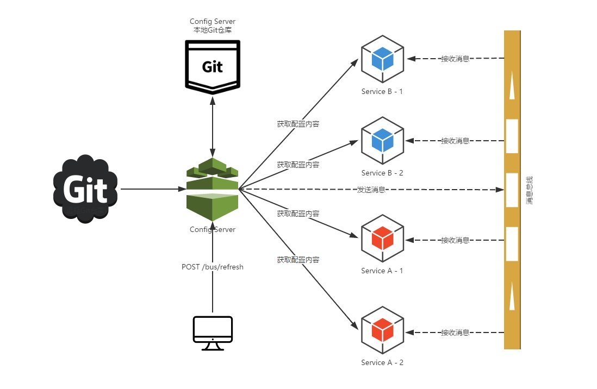
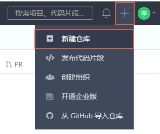
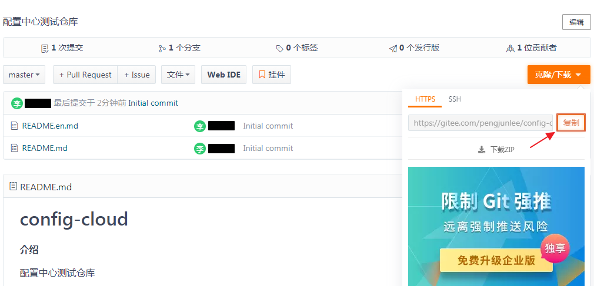
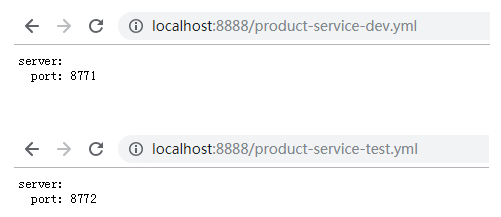

Spring Cloud 配置中心为分布式系统中的服务器端和客户端提供外部化配置支持。通过Config-Server，你可以在一个地方集中对所有环境中的应用程序的外部化配置进行管理。例如，当一个应用程序从开发环境切换到测试环境，然后再从测试环境切换到生产环境，你可以使用Config-Server统一管理这些环境之间的配置，并确保应用程序在迁移时能够拥有它运行所需要的一切配置。简而言之：Config-Server 就是用来实现配置统一管理和不同环境间配置的统一切换的。Config-Server 服务器的后端存储默认使用Git，因此它很容易支持配置环境的标签版本，同时可供多数的内容管理工具去访问。你也可以很容易地添加其他的替代实现，并将它们插入到Spring配置中。

**相关产品**：

来自淘宝的[Diamond](https://github.com/takeseem/diamond "Diamond")

来自百度的[Disconf](https://disconf.readthedocs.io/zh_CN/latest/ "Disconf")

来自Springcloud的[Config-Server](https://cloud.spring.io/spring-cloud-stream/ "Config-Server")

# 搭建配置中心
Config-Server配置中心的工作原理如下图所示：

## 引入依赖

新建一个maven项目，起名为config-center，在其 pom.xml 文件中引入如下依赖：

	<parent>
		<groupId>org.springframework.boot</groupId>
		<artifactId>spring-boot-starter-parent</artifactId>
		<version>2.0.6.RELEASE</version>
	</parent>
 
	<properties>
		<spring-cloud.version>Finchley.SR2</spring-cloud.version>
	</properties>
 
	<dependencies>
		<!-- Eureka-Client 依赖 -->
		<dependency>
			<groupId>org.springframework.cloud</groupId>
			<artifactId>spring-cloud-starter-netflix-eureka-client</artifactId>
		</dependency>
		<!-- Config-Server 依赖 -->
		<dependency>
			<groupId>org.springframework.cloud</groupId>
			<artifactId>spring-cloud-config-server</artifactId>
		</dependency>
	</dependencies>
 
	<dependencyManagement>
		<dependencies>
			<!-- SpringCloud 版本控制依赖 -->
			<dependency>
				<groupId>org.springframework.cloud</groupId>
				<artifactId>spring-cloud-dependencies</artifactId>
				<version>${spring-cloud.version}</version>
				<type>pom</type>
				<scope>import</scope>
			</dependency>
		</dependencies>
	</dependencyManagement>

## 创建启动类
新建一个Springboot应用的启动类ConfigCenterApplication类，并在上增加@EnableConfigServer注解，用来启用Config-Server。

	import org.springframework.boot.SpringApplication;
	import org.springframework.boot.autoconfigure.SpringBootApplication;
	import org.springframework.cloud.config.server.EnableConfigServer;
	 
	@SpringBootApplication
	@EnableConfigServer
	public class ConfigCenterApplication {
		public static void main(String[] args) {
			SpringApplication.run(ConfigCenterApplication.class, args);
		}
	}

## 添加配置
application.yml 添加配置如下： 

	server:
	  port: 9001
	spring:
	  application:
	    name: config-center
	eureka:
	  client:
	    serviceUrl:
	      defaultZone: http://localhost:8761/eureka/

此时，由于尚未配置用来作为服务器后端存储的Git仓库地址，若启动应用会报如下错误：

	***************************
	APPLICATION FAILED TO START
	***************************
	 
	Description:
	 
	Invalid config server configuration.
	 
	Action:
	 
	If you are using the git profile, you need to set a Git URI in your configuration.  If you are using a native profile and have spring.cloud.config.server.bootstrap=true, you need to use a composite configuration.

与一般的Spring Boot应用相同，默认情况下Config-Server也通过8080端口启动。为了客户端读取配置方便，你可以把启动端口改为8888（客户端默认会从http://localhost:8888/加载与服务ID相同的配置）。此外，Config-Server还通过spring.config.name=configserver（Config-Server Jar包中有一个configserver.yml 配置文件）配置为我们设置了一个默认配置库，客户端通过配置  spring.cloud.config.discovery.serviceId=configserver 便可直接使用。当然你也可以通过application.yml来对配置中心进行配置。

## 创建Git仓库
本文使用开源中国的码云来创建我们的Git仓库，当然你也可以选择其他的Github或者阿里云Git等创建自己的Git仓库。

点击导航栏中的“+”按钮==>新建仓库，填入仓库信息，完成创建。

点击 克隆/下载 ==>复制，将Git仓库地址复制下来备用。

## 配置Git仓库
接下来，在application.yml中添加Git仓库配置如下：

	spring:
	  cloud:
	    config:
	      server:
	        git:
	          uri: https://gitee.com/pengjunlee/config-cloud.git
	          username: 你的码云账号
	          password: 你的账号密码

再次启动ConfigCenterApplication，发现可以正常启动了。启动完成之后，Eureka注册中心中注册的服务列表如下：

# 搭建客户端
接下来，我们通过对上一章《微服务下的链路追踪（Sleuth+Zipkin）》中的product-service服务进行改造，来示例如何从配置中心获取配置。

## 引入依赖
 在product-service的pom.xml中添加配置中心客户端依赖：

		<!-- Config-Client 依赖 -->
		<dependency>
			<groupId>org.springframework.cloud</groupId>
			<artifactId>spring-cloud-config-client</artifactId>
		</dependency>

或者： 

		<!-- Starter-Config 依赖 -->
		<dependency>
			<groupId>org.springframework.cloud</groupId>
			<artifactId>spring-cloud-starter-config</artifactId>
		</dependency>

## 修改配置
先将product-service中的application.yml文件改名为bootstrap.yml（bootstrap.yml在应用上下文启动阶段加载，比application.yml早），然后再对其内容进行修改：

	# 设置服务(应用)名称
	spring:
	  application:
	    name: product-service
	    
	# 指定用于获取配置的配置中心服务(应用)名称
	  cloud:
	    config:
	      discovery:
	        enabled: true
	        serviceId: config-center
	      profile: dev
	      # 指定分枝版本，默认为master
	      label: master
	        
	# 指定注册中心地址
	eureka:
	  client:
	    serviceUrl:
	      defaultZone: http://localhost:8761/eureka/

**注意**：如果不指定配置中心，客户端默认会从 <http://localhost:8888> 加载与服务ID相同的配置。

## 在Git仓库创建配置文件
客户端通过发送Http请求来从配置中心读取配置，这些Http请求的URI遵循以下规则：

	/{name}-{profiles}.properties
	/{name}-{profiles}.yml || /{name}-{profiles}.yaml
	/{label}/{name}-{profiles}.properties
	/{label}/{name}-{profiles}.json
	/{name}/{profiles}/{label:.*}
	/{name}-{profiles}.json
	/{label}/{name}-{profiles}.yml || /{label}/{name}-{profiles}.yaml
	/{name}/{profiles:.*[^-].*}
	/{name}/{profile}/{label}/**
	/{name}/{profile}/{label}/**
	/{name}/{profile}/**

其中各个参数的含义如下：

- name 服务的ID，即spring.application.name的值，本例中为 product-service；
- profiles 激活的profile，通过spring.cloud.config.profile指定，本例中为 dev；
- label 分枝的版本，通过spring.cloud.config.label指定，本例中为默认值 master； 

接下来我们需要按照上述规则，在Git仓库的相应位置创建配置文件。根据bootstrap.yml中的配置，资源请求地址可以为 /master/product-service-dev.yml 。

在Git仓库的master分枝中创建product-service-dev.yml和product-service-test.yml两个文件，分别将服务的启动端口指定为8771和8772：
	
	# product-service-dev.yml
	server:
	port: 8771
	 
	# product-service-test.yml
	server:
	port: 8772

文件创建完成之后，启动配置中心，先在浏览器对两个文件进行访问。

此时，启动product-service将读取http://localhost:8888/product-service-dev.yml中的配置，即启动端口为8771。若将 bootstrap.yml中的spring.cloud.config.profile的值设置为test，则将读取http://localhost:8888/product-service-test.yml中的配置，应用的启动端口也会相应地变为8772，证明从配置中心读取配置成功。

# 参考文章

<http://jm.taobao.org/2016/09/28/an-article-about-config-center/>

<https://cloud.spring.io/spring-cloud-stream/>

<https://spring.io/projects/spring-cloud-config>

<https://cloud.spring.io/spring-cloud-static/Finchley.SR2/single/spring-cloud.html>