> 原文链接： <https://baijiahao.baidu.com/s?id=1618794879569468435&wfr=spider&for=pc>

如果你之前使用过`vue.js`，你一定知道在vue中各个组件之间传值的痛苦，在vue中我们可以使用`vuex`来保存我们需要管理的状态值，值一旦被修改，所有引用该值的地方就会自动更新，那么接下来我们就来学习一下`vuex`是如何修改状态值的。

我们新建一个vue项目（这里由于我们是讲解`vuex`，所以对于vue项目的创建我们不会讲解太详细）；在命令行输入`vue init webpack web`（使用webpack创建一个项目名为web的项目）；

项目创建后，然后安装`vuex`，使用命令：`npm install vuex --save`（安装vuex保存到本地），安装成功后你会看到这个界面：

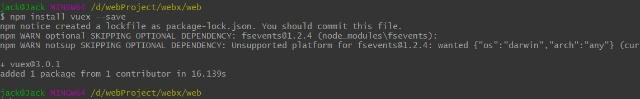

然后我们执行`npm run dev`启动项目，在浏览器输入：<localhost:8080>，正常的话然后我们会看到项目的启动页。

看到这个界面说明项目启动成功，然后我们在项目的`src`目录下新建一个目录`store`，在该目录下新建一个`index.js`文件，我们用来创建`vuex`实例，然后在该文件中引入vue和vuex，创建`Vuex.Store`实例保存到变量`store`中，最后使用`export default`导出`store`：

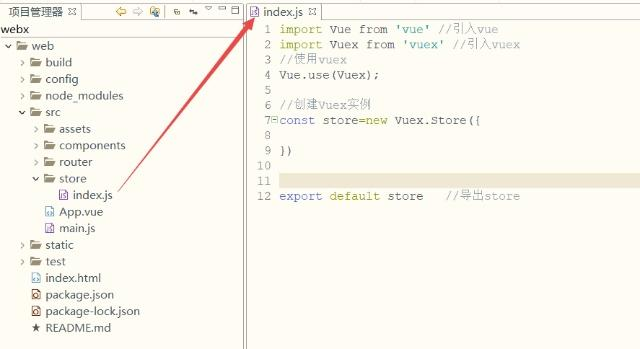

然后我们在`main.js`文件中引入该文件，在文件里面添加`import store from './store'`;，再在vue实例全局引入`store`对象；

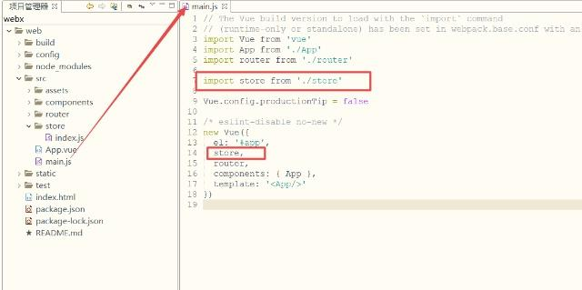

然后我们就可以开始编写我们的vuex业务代码了，那么，我们的数据如何保存？

# State
vuex中的数据源，我们需要保存的数据就保存在这里，可以在页面通过`this.$store.state`来获取我们定义的数据；

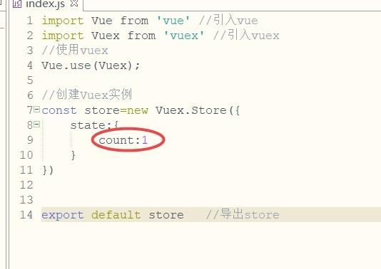

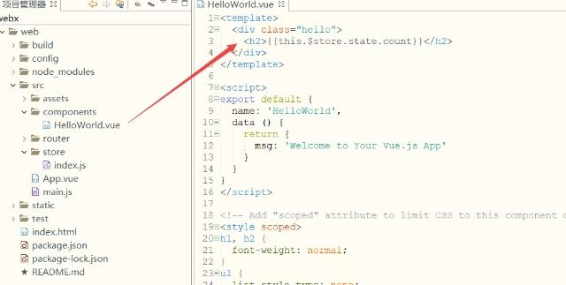

这时候我们页面上就得到了这个count值1：

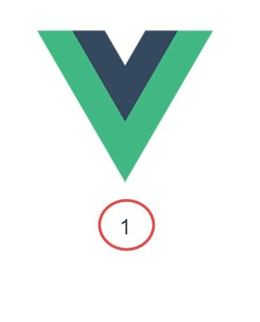

# Getters
`Getter`相当于vue中的`computed`计算属性，`getter`的返回值会根据它的依赖被缓存起来，且只有当它的依赖值发生了改变才会被重新计算，这里我们可以通过定义vuex的Getter来获取，`Getters`可以用于监听、state中的值的变化，返回计算后的结果，这里我们修改`Hello World.vue`文件如下：

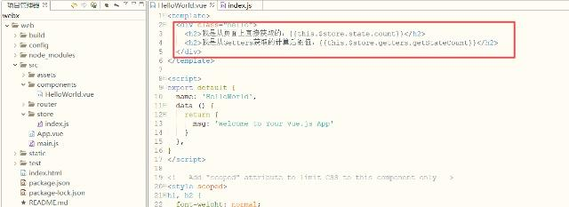

再修改`index.js`文件如下，其中getters中的`getStateCount`方法接收一个参数state，这个参数就是我们用来保存数据的那个对象；

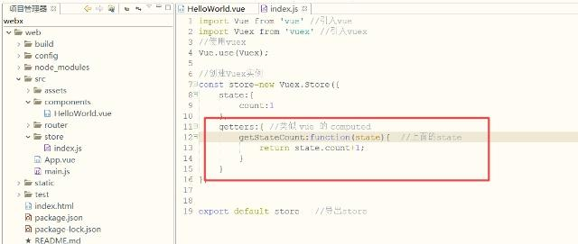

然后我们在页面显示：

# Mutations
数据我们在页面是获取到了，但是如果我们需要修改`count`值怎么办？如果需要修改store中的值唯一的方法就是提交`mutation`来修改，我们现在`Hello World.vue`文件中添加两个按钮，一个加`1`，一个减`1`；这里我们点击按钮调用`addFun`（执行加的方法）和`reductionFun`（执行减法的方法），然后在里面直接提交`mutations`中的方法修改值：

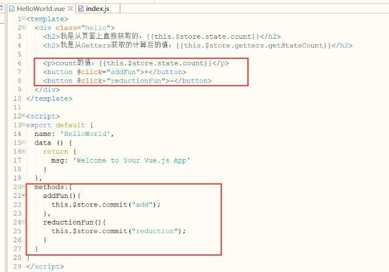

修改`index.js`文件，添加`mutations`，在`mutations`中定义两个函数，用来对`count`加`1`和减`1`，这里定义的两个方法就是上面`commit`提交的两个方法如下：

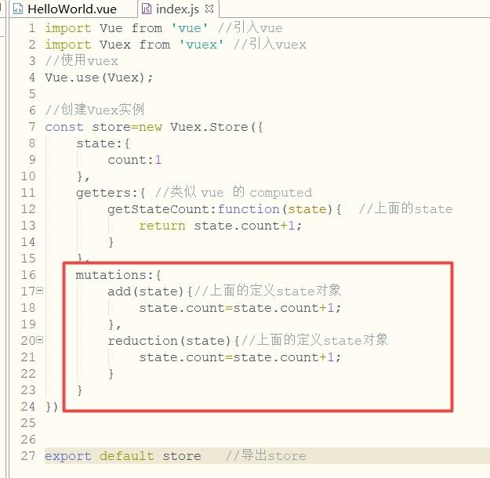

页面上点击`+`、`-`按钮操作数据：

点击 “+”按钮

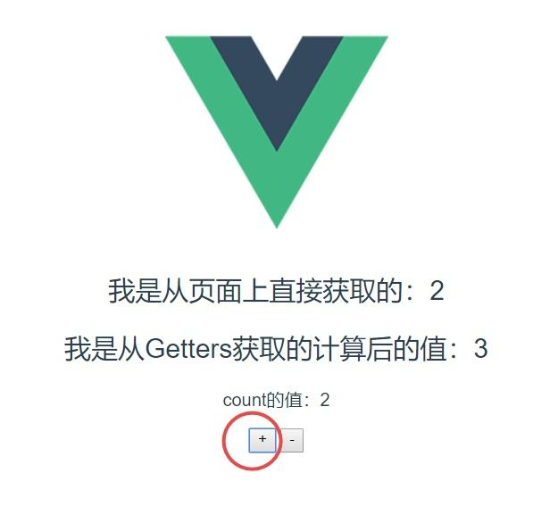

执行成功，我们再连续点击三次减`-`按钮：

ok！完美。

# Actions
我们看到，当点击三次后值从`2`变成了`-1`；页面上的值是改变了；我们达到了修改`store`中状态值的目的，但是，官方并不介意我们这样直接去修改`store`里面的值，而是让我们去提交一个`actions`，在`actions`中提交`mutation`再去修改状态值，接下来我们修改`index.js`文件，先定义`actions`提交`mutation`的函数：

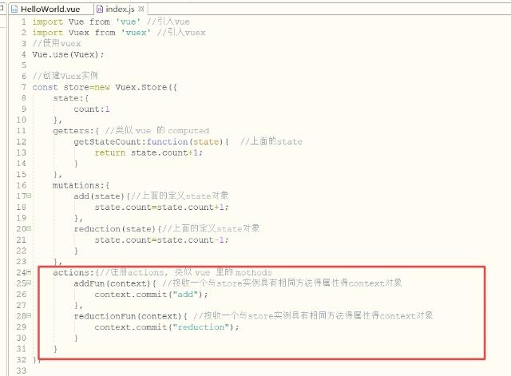

然后我们去修改`Hello World.vue`文件：

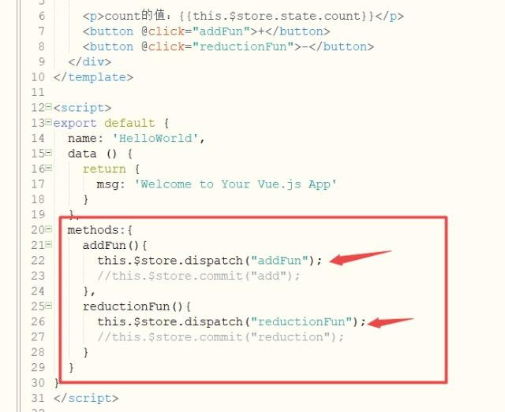

这里我们把`commit`提交`mutations`修改为使用`dispatch`来提交`actions`；我们点击页面，效果是一样的。

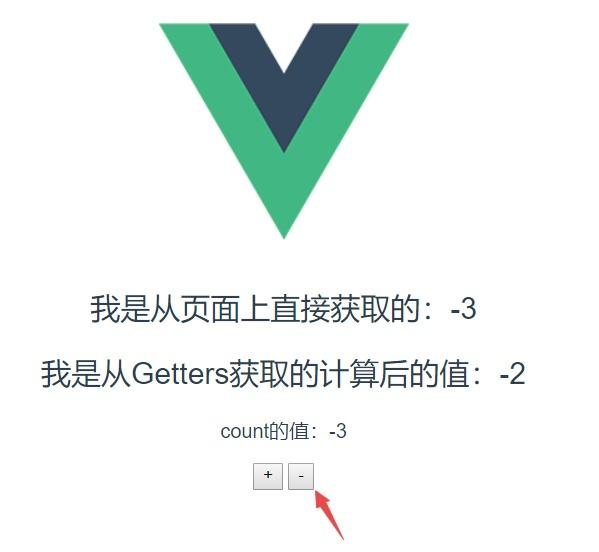

好了，我们这里已经实现了一个基本的vuex修改状态值的完整流程，如果我们需要指定加减的数值，那么我们直接传入`dispatch`中的第二个参数，然后在`actions`中的对应函数中接受参数在传递给`mutations`中的函数进行计算：

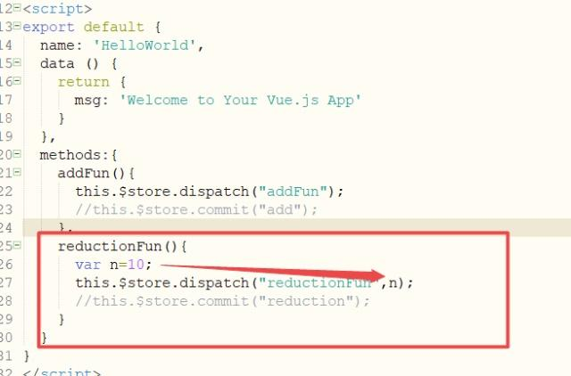

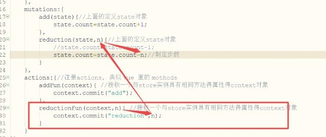

这个时候我们再去点击`-`按钮就会发现不再是减`1`了，而是减去`10`了。

# mapState、mapGetters、mapActions
如果我们不喜欢这种在页面上使用`this.$stroe.state.count`和`this.$store.dispatch('funName')`这种很长的写法，那么我们可以使用`mapState`、`mapGetters`、`mapActions`就不会这么麻烦了。

我们修改`Hello World.vue`文件如下：

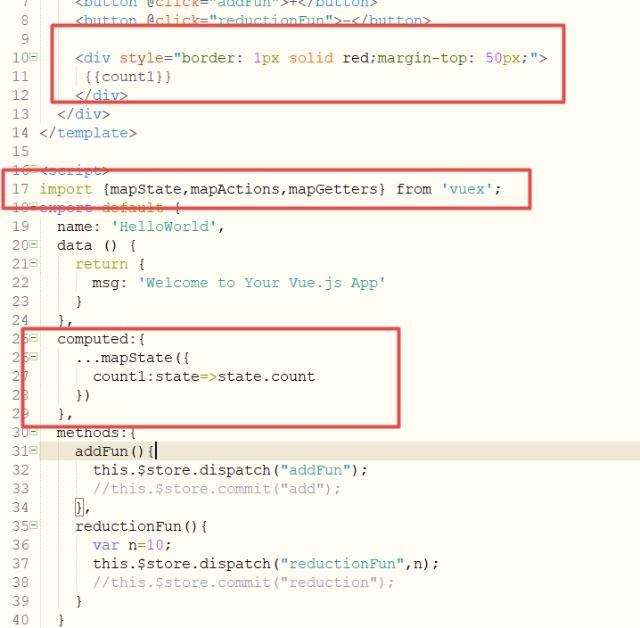

此时我们在页面使用`count1`调用：

正常显示，效果是一样的，我们就可以不再使用很长的写法来调用了。