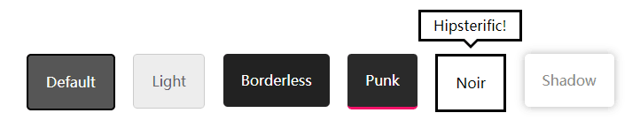

> 原文链接：<https://www.a5xiazai.com/demo/code_pop/28/72/>

插件描述：`Tooltipster`是一个`jQuery`提示框插件，用于对HTML元素的拖动、移入、点击等鼠标事件或其他键盘事件弹出效果炫酷的提示框。有助于丰富系统的提示功能。这是一个简单的且多才多艺的插件。

官网：<http://down.admin5.com/demo/code_pop/28/72/>

# 使用方法
## 引入jQuery和Tooltipster's文件
你可以[点击这里](https://github.com/iamceege/tooltipster/archive/master.zip "Tooltipster安装包")下载, 引入`jQuery`和`Tooltipster's CSS`还有`JavaScript`文件到你的页面。

	<head>
	    <link rel="stylesheet" type="text/css" href="tooltipster/dist/css/tooltipster.bundle.min.css" />
	    
	    
	</head>

> 兼容提醒： `jQuery 1.7`已经足够了,除非你需要SVG兼容IE(需要使用`jQuery 1.10+`). `Tooltipster`不能正常运行在IE9中引用`jQuery1.8`。

## 设置你的HTML
想让一个元素加入工具提醒, 我们会给他加上一个类名`class='tooltip'`. 你也可以选择使用自定义的类名或选择器(请继续往下看), 由你决定。之后, 我们将设置标题`title`属性为我们想要的提示. 这里有几个例子:

	// 在图片加入工具提醒:
	
	// 在文字加入工具提醒 (span, div or whatever):
	Some text

> 注意：如果您使用`Twitter's Bootstrap`，请使用另一个类名，因为`工具提示`会产生冲突。

## 激活Tooltipster
我们要做的最后一件事是激活`Tooltipster`. 我们需要在头部得问`</head>`标签加入`script`并激活`Tooltipster` (你可以选择使用自己定义的选择器 - 我们的栗子是使用`'tooltip' class`):

	<head>
	    ...
	    
	</head>

## 定义你的tooltips风格
第一个是默认样式, Tooltipster还为你提供另外五种主题风格.

要使用这些主题,需要引用一个`css`文件 (他的路径是`dist/css/plugins/tooltipster/sideTip/themes`文件里) 在你的页面并指定其名称在`Tooltipster's`选项。

	$('.tooltip').tooltipster({
	    theme: 'tooltipster-noir' //使用Noir主题
	});

你可以通过修改tooltips的样式达到你想要的效果, 自定义主题部分在下面等着你.

> 注: "sideTip"是Tooltipster默认插件的名称. 我们稍后会看到这个插件.

## 在HTML内使用你的tooltips
`Tooltipster`允许你使用任何HTML标记触发提醒. 这意味着可以插入像图像和文本格式标记之类的东西。.

代替之前加入的`title`属性, 这次我们使用`data-tooltip-content`属性来提供与HTML页面内对应的元素选择器,该元素作为内容显示. 栗子如下:

	This span has a tooltip with HTML when you hover over it!
	

	    
	         <strong>This is the content of my tooltip!</strong>
	    
	

在你的CSS文件, 加入`.tooltip_templates { display: none; }`这样内容不会在工具提示之外显示出来.

> 重点： 如果你有两个(或以上)的tooltips有相同的`data-tooltip-content`属性 (也就是说, 你想用一样的HTML元素), 请将`contentCloning`选项设置为`true`当你初始化你的`tooltips`:

	$('.tooltip').tooltipster({
	    contentCloning: true
	});

> 注: 其实还有其他设置提醒内容的方法.

## 使用插件
Tooltipster的功能可以通过插件扩展.他们可能会增加新的风格,新的选择,新的方法,新的行为,等等.

Tooltipster的一些流行插件:

- sideTip Tooltipster附带的和默认启动的
- SVG Tooltipster附带的, 增加了 SVG 支持, 但是默认情况是不启动的 (详情见[SVG section](http://www.a5xiazai.com/demo/code_pop/28/72/#svg "SVG section"))
- follower 让工具提示跟随光标，有空[看看这](https://github.com/louisameline/tooltipster-follower "看看这")
- scrollableTip 使工具提示增加滚动条当内容过多. 请[看这](https://github.com/louisameline/tooltipster-scrollableTip "看这")
- discovery 创建工具提示组更快显示 ,在分组提示 部分显示, 可以[看这]( "看这")
- selectableText 当你选择/高亮某段文字,让工具提醒显示. 详情见此

以跟随鼠标插件为例：[tooltipster-follower](https://github.com/louisameline/tooltipster-follower "ooltipster-follower")

	

# 附录：参数

`Tooltipster`的参数(选项)给你一个宽阔的可变范围来调整成你心仪的提醒. 这里教你如何配置参数:

	$(".tooltip").tooltipster({
	  animation: "fade",
	  delay: 200,
	  theme: "tooltipster-punk",
	  trigger: "click"
	});

这里是全部可用参数的列表:

<table border="0" cellpadding="0" cellspacing="0" id="table_options"><tbody><tr><td><strong>参数</strong></td>
			<td><strong>可用的值</strong></td>
			<td><strong>描述</strong></td>
		</tr><tr><td>
			
animation

			</td>
			<td>'fade', 
			'grow', 
			'swing', 
			'slide', 
			'fall'</td>
			<td>决定tooltips进场的动画. 除了内置的动画, 你也可以创建自定义动画在你的CSS文件. 在IE9及以下, 所有动画默认为javascript生成淡入动画.&nbsp;<strong>默认值: 'fade'</strong></td>
		</tr><tr><td>
			
animationDuration

			</td>
			<td>integer, 
			integer[]</td>
			<td>设置动画的持续时间, 以毫秒为单位. 如果你想为你的tooltips打开/关闭提供不同的持续时间, 你可以提供一个数组来表示不同的值(如:integer[400,500]).&nbsp;<strong>默认值: 350</strong></td>
		</tr><tr><td>
			
arrow

			</td>
			<td>boolean</td>
			<td>给你的tooltips加一个"气泡" 箭头.&nbsp;<strong>默认值: true</strong></td>
		</tr><tr><td>
			
content

			</td>
			<td>string, 
			jQuery object, 
			any</td>
			<td>如果设置了, 将会覆盖tooltips的内容. 如果您提供的内容不是字符串或jQuery封装的HTML元素,你需要使用'functionFormat'这个参数来格式化你的内容以达到显示效果<strong>默认值: null</strong></td>
		</tr><tr><td>
			
contentAsHTML

			</td>
			<td>boolean</td>
			<td>如果tooltip的内容是字符串, 会默认显示为纯文本. 如果想将内容解析为HTML, 请将这个参数设为true.&nbsp;<strong>默认值: false</strong></td>
		</tr><tr><td>
			
contentCloning

			</td>
			<td>boolean</td>
			<td>如果你提供了一个JQ对象给'content'这个参数,如果这个克隆对象应该被使用,则设置此参数.<strong>默认值: false</strong></td>
		</tr><tr><td>
			
debug

			</td>
			<td>boolean</td>
			<td>当你做了你不应该做的事情,tooltipster日志提醒和通知会在控制台报错,如果你设置了false便可以禁用日志记录<strong>默认值: true</strong></td>
		</tr><tr><td>
			
delay

			</td>
			<td>integer, 
			integer[]</td>
			<td>在鼠标交互的时候,这个属性是在hover/trigger..触发tooltip开始打开或者关闭动画使用时生效(简单来说就是一个延时器)(*). 如果你想为你的tooltips打开/关闭提供不同的持续时间, 你可以提供一个数组来表示不同的值(如:integer[400,500]).<strong>默认值: 300</strong></td>
		</tr><tr><td>
			
delayTouch

			</td>
			<td>integer, 
			integer[]</td>
			<td>在触摸交互的时候, 同上(*).如果你想为你的tooltips打开/关闭提供不同的持续时间, 你可以提供一个数组来表示不同的值(如:integer[400,500]).&nbsp;<strong>默认值: [300, 500]</strong></td>
		</tr><tr><td>
			
distance

			</td>
			<td>integer, 
			integer[]</td>
			<td>以像素为单位,远点到提醒工具的距离.如果您希望为每个边指定不同的距离，则该值可以是整数或整数数组（通常为CSS语法）。&nbsp;<strong>默认值: 6</strong></td>
		</tr><tr><td>
			
functionInit

			</td>
			<td>function</td>
			<td>在实例化时只被触发一次的自定义函数.&nbsp;<a href="http://www.a5xiazai.com/demo/code_pop/28/72/#callback_arguments" rel="nofollow">Arguments</a>.&nbsp;<strong>默认值: none (null)</strong></td>
		</tr><tr><td>
			
functionBefore

			</td>
			<td>function</td>
			<td>在打开工具提示之前要触发的自定义函数. 这个发方法会阻止tooltip打开如果返回false.<a href="http://www.a5xiazai.com/demo/code_pop/28/72/#callback_arguments" rel="nofollow">Arguments</a>.&nbsp;<strong>默认值: none (null)</strong></td>
		</tr><tr><td>
			
functionReady

			</td>
			<td>function</td>
			<td>当工具提示及其内容被添加到DOM时，将触发自定义函数.&nbsp;<a href="http://www.a5xiazai.com/demo/code_pop/28/72/#callback_arguments" rel="nofollow">Arguments</a>.&nbsp;<strong>默认值: none (null)</strong></td>
		</tr><tr><td>
			
functionAfter

			</td>
			<td>function</td>
			<td>一旦工具提示已关闭并从DOM中移除,则将定制一个函数.<a href="http://www.a5xiazai.com/demo/code_pop/28/72/#callback_arguments" rel="nofollow">Arguments</a>.&nbsp;<strong>默认值: none (null)</strong></td>
		</tr><tr><td>
			
functionFormat

			</td>
			<td>function</td>
			<td>格式化内容的函数.它得到两个第一个通常的<a href="http://www.a5xiazai.com/demo/code_pop/28/72/#callback_arguments" rel="nofollow">参数</a>和第三个参数的内容。它必须返回在工具提示中显示的值，无论是字符串还是jQuery封装的HTML元素（请参阅<a href="http://www.a5xiazai.com/demo/code_pop/28/72/#formatting" rel="nofollow">格式化部分</a>）.&nbsp;<strong>默认值: none (null)</strong></td>
		</tr><tr><td>
			
functionPosition

			</td>
			<td>function</td>
			<td>当tooltip重新定位时触发的自定义函数,它给你轻微或完全修改的位置，Tooltipster是要给tooltip的能力,它将建议的放置值集设置为第三个参数.函数必须返回您可能编辑过的位置值集合（请参阅<a href="http://www.a5xiazai.com/demo/code_pop/28/72/#positioning" rel="nofollow">定位部分</a>）.&nbsp;<strong>默认值: none (null)</strong></td>
		</tr><tr><td>
			
IEmin

			</td>
			<td>integer</td>
			<td>要运行的IE的最低版本.&nbsp;<strong>默认值: 6</strong></td>
		</tr><tr><td>
			
interactive

			</td>
			<td>boolean</td>
			<td>在工具提醒给用户尽可能多的交互.如果你想他们在工具提醒内容可以点击，填写表格或者其他交互，你就必须把这个参数设置为true.当使用“悬停”关闭触发器时，用户必须在开始关闭之前将光标移到工具提示上（此时间间隔由“delay”参数设置）.&nbsp;<strong>默认值: false</strong></td>
		</tr><tr><td>
			
maxWidth

			</td>
			<td>integer</td>
			<td>设置tooltip的最大宽度.&nbsp;<strong>默认值: null (无限制)</strong></td>
		</tr><tr><td>
			
minIntersection

			</td>
			<td>integer</td>
			<td>对应于箭头中心和工具提示边缘之间强制执行的最小距离. 主要用于创建大于默认主题的箭头.&nbsp;<strong>默认值: 16</strong></td>
		</tr><tr><td>
			
minWidth

			</td>
			<td>integer</td>
			<td>设置tooltip的最小宽度.<strong>默认值: 0 (auto width)</strong></td>
		</tr><tr><td>
			
multiple

			</td>
			<td>boolean</td>
			<td>允许你把几个提示在一个单一的元素 (详见&nbsp;<a href="http://www.a5xiazai.com/demo/code_pop/28/72/#multiple" rel="nofollow">multiple 部分</a>).&nbsp;<strong>默认值: false</strong></td>
		</tr><tr><td>
			
plugins

			</td>
			<td>string[]</td>
			<td>设置使用Tooltipster的插件名.&nbsp;<strong>默认值: ['sideTip']</strong></td>
		</tr><tr><td>
			
repositionOnScroll

			</td>
			<td>boolean</td>
			<td>为了使tooltip尽可能长时间可见,重新定位tooltip如果它在用户滚动页面时退出视窗.&nbsp;<strong>默认值: false</strong></td>
		</tr><tr><td>
			
restoration

			</td>
			<td>'none', 
			'previous', 
			'current'</td>
			<td>指定在调用“销毁”方法后，是否应该在HTML元素上恢复title属性.这个属性可以省略,或是在Tooltipster之前初始化存在的值恢复，或是与字符串化值的当前内容恢复.注意：在多个工具提示的情况下在一个单一的元素，只有最后的破坏可能会触发恢复提示.&nbsp;<strong>默认值: 'none'</strong></td>
		</tr><tr><td>
			
selfDestruction

			</td>
			<td>boolean</td>
			<td>在这个原点从DOM移除后，设置这个参数是否将tooltip自毁.这可以防止内存泄露.&nbsp;<strong>默认值: true</strong></td>
		</tr><tr><td>
			
side

			</td>
			<td>string, 
			string[]</td>
			<td>设置tooltip在哪侧显示. 这个值可能是一个: 'top', 'bottom', 'left', 'right'. 也可以是一个数组包括多个值. 当使用数组时,这些值的顺序要考虑到回退顺序和禁用没有用到的一侧 (see the&nbsp;<a href="http://www.a5xiazai.com/demo/code_pop/28/72/#sides" rel="nofollow">sides section</a>).&nbsp;<strong>默认值: ['top', 'bottom', 'right', 'left']</strong></td>
		</tr><tr><td>
			
timer

			</td>
			<td>integer</td>
			<td>设置这个工具提醒在关闭前的显示时间(以毫秒为单位)&nbsp;<strong>默认值: 0 (disabled)</strong></td>
		</tr><tr><td>
			
theme

			</td>
			<td>string, 
			string[]</td>
			<td>设置一个将覆盖默认工具提示外观的主题. 你可以提供多个字符串的数组来同时应用多个主题Y(详见&nbsp;<a href="http://www.a5xiazai.com/demo/code_pop/28/72/#theming" rel="nofollow">主题部分</a>).&nbsp;<strong>默认值: empty array</strong></td>
		</tr><tr><td>
			
trackerInterval

			</td>
			<td>integer</td>
			<td>设置追踪程序持续时间/毫秒(见trackOrigin 和 trackTooltip).当工具提醒被打开,即使trackOrigin和trackTooltip设置为false,追踪器运行会检查起点是否被移除,如非必要,你定的值不能太高或太低.&nbsp;<strong>默认值: 500</strong></td>
		</tr><tr><td>
			
trackOrigin

			</td>
			<td>boolean</td>
			<td>如果原点移动或调整大小需要复位提醒.由于此选项可能对性能有影响，我们建议您仅在需要时启用它.&nbsp;<strong>默认值: false</strong></td>
		</tr><tr><td>
			
trackTooltip

			</td>
			<td>boolean</td>
			<td>如果tooltip改变大小则重新配置tooltip.当尺寸受到'content'这个方法而改变尺寸，tooltip已经重新定位而不需要这个参数。由于此选项可能对性能有影响，我们建议您仅在需要时启用它。详情进入<a href="http://www.a5xiazai.com/demo/code_pop/28/72/#faq_sizeissue" rel="nofollow">这个入口</a>&nbsp;有常见问题解答&nbsp;<strong>默认值: false</strong></td>
		</tr><tr><td>
			
trigger

			</td>
			<td>'hover', 
			'click', 
			'custom'</td>
			<td>设置这个触发条件，有'click','hover',还可以自定义以达到你想要的效果. 见&nbsp;<a href="http://www.a5xiazai.com/demo/code_pop/28/72/#triggers" rel="nofollow">触发器部分</a>来学习如何使用自定义触发器.&nbsp;<strong>默认值: 'hover'</strong></td>
		</tr><tr><td>
			
triggerClose

			</td>
			<td>object</td>
			<td>当你把'trigger'设置为'custom',所有内置关闭触发器都默认不可用，此参数就是允许您激活您所选择的触发器来创建一个定制的行为，只在设置'trigger'为'custom'时有效。&nbsp;<a href="http://www.a5xiazai.com/demo/code_pop/28/72/#triggers" rel="nofollow">详见触发器部分</a>.</td>
		</tr><tr><td>
			
triggerOpen

			</td>
			<td>object</td>
			<td>类似于'triggerClose'(同上).</td>
		</tr><tr><td>
			
updateAnimation

			</td>
			<td>'fade', 
			'rotate', 
			'scale', 
			null</td>
			<td>用于打开tooltip后的后续动画设置，你可以创建自己的动画在您的CSS文件内但是要将值设为'null'.&nbsp;<strong>默认值: 'rotate'</strong></td>
		</tr><tr><td>
			
viewportAware

			</td>
			<td>boolean</td>
			<td>尝试将tooltip放置在屏幕打开时完全可见的地方,如果工具提示在其源于屏幕之外（使用方法调用）打开时，您可能希望将此选项设置为false。<strong>默认值: true</strong></td>
		</tr><tr><td>
			
zIndex

			</td>
			<td>integer</td>
			<td>设置tooltip的z-index<strong>默认值: 9999999</strong></td>
		</tr></tbody></table>