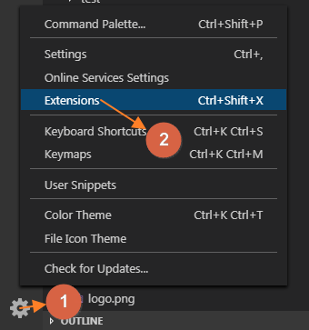
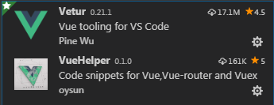
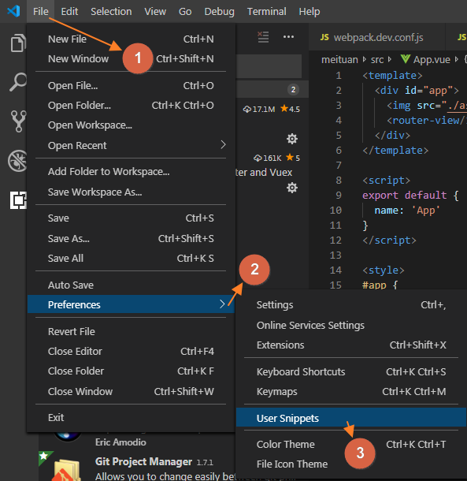
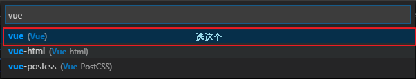

**（1）**安装`Vetur`和`VueHelper`插件，安装完成后需要重启`VScode`。

在扩展插件搜索框中找到如下 Vetur 和 VueHelper 两个插件，注意看图标，千万别安装错插件了。

**（2）**为 vue 添加模板代码片段。

选中`vue`项。

在打开的`vue.json`中加入你的模板代码片段。

	{
		"vue": {
		"prefix": "vue",
		"body": [
			"<template>",
			"  
",
			"  
",
			"</template>",
			"",
			"",
		],
		"description": "generate a vue file"}
	}

**（3）**在`vue`文件中，当你键入`vue`前缀时将自动联想出你在前面创建好的代码片段描述，此时按下`Tab`键或者选中它，模板代码片段将会被自动添加到你的`vue`文件中。

 