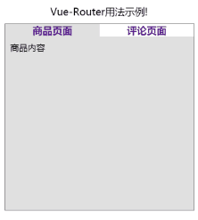
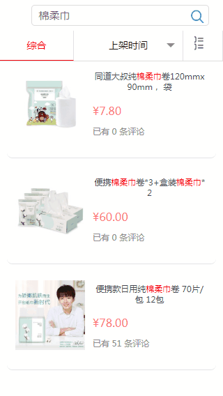
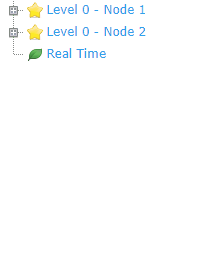

# Vue-Router简介
在传统的`MVC`架构中，是由服务端对用户的请求进行拦截，并根据请求URL的不同来返回不同的页面，这种路由方式叫做服务端路由。与之相对的还有另外一种前端路由方式，即把这些路由的工作交给前端来实现，由前端来根据不同的请求返回不同的页面。在单页面应用中，由于大部分的页面结构相对固定，需要改变的内容只占其中很小一部分，所以更适合使用前端路由。

`Vue Router`就属于前端路由，它是`Vue.js`官方的路由管理器，与`Vue.js`深度集成，让构建单页面应用变得易如反掌。

`Vue Router`可以提供如下功能：

- 嵌套的路由/视图表
- 模块化的、基于组件的路由配置
- 路由参数、查询、通配符
- 基于 Vue.js 过渡系统的视图过渡效果
- 细粒度的导航控制
- 带有自动激活的 CSS class 的链接
- HTML5 历史模式或 hash 模式，在 IE9 中自动降级
- 自定义的滚动条行为

# 安装
## 直接引用
通过`
	 
	<!-- 引用最新版本 vue-router.js -->
	
	 
	<!-- 引用指定版本 vue-router.js -->
	<!--  -->

## Npm安装

	npm install vue-router

如果在一个模块化工程中使用它，必须要通过`Vue.use()`明确地安装路由功能：

	import Vue from 'vue'
	import VueRouter from 'vue-router'
	 
	Vue.use(VueRouter)
	
# 路由示例

	<!DOCTYPE html>
	<html lang="en">
	 
	<head>
	    <meta charset="utf-8">
	    <meta name="viewport"
	        content="width=device-width,initial-scale=1.0,maximum-scale=1.0,minimum-scale=1.0,user-scalable=no">
	    <title>Vue-Router用法示例</title>
	    <!-- 引用 vue.min.js -->
	    
	    <!-- 引用最新版本 vue-router.js -->
	    
	    
	</head>
	 
	<body>
	    

	        
Vue-Router用法示例!

	        

	            

	                <!-- 使用 router-link 组件来导航，默认会被渲染成一个 `<a>` 标签 -->
	                <router-link to="/goods" class="nav-item">商品页面</router-link>
	                <router-link to="/rates" class="nav-item">评论页面</router-link>
	            

	            

	                <!-- 路由出口，路由匹配到的组件将渲染在这里-->
	                <router-view></router-view>
	            

	        

	    

	    
	</body>
	 
	</html>

路由效果演示： 

# 动态路由
我们经常会碰到需要把匹配某种模式的多个路由指向同一个组件的情形，例如下面这样：需要根据传入的商品`ID`参数来跳转到对应商品的详情页面，此时商品详情组件的路由匹配模式就是`/goods/商品ID`。

要实现这个效果，需要用到`vue-router`提供的“动态路径参数”(dynamic segment)  ，一个“路径参数”使用冒号`：`标记，并会被设置到Vue实例的`this.$route.params`属性中，例如：

<table><tbody><tr><td>
			
模式

			</td>
			<td>
			
匹配路径

			</td>
			<td>
			
$route.params

			</td>
		</tr><tr><td>
			
/user/:username

			</td>
			<td>
			
/user/evan

			</td>
			<td>
			
{ username: 'evan' }

			</td>
		</tr><tr><td>
			
/user/:username/post/:post_id

			</td>
			<td>
			
/user/evan/post/123

			</td>
			<td>
			
{ username: 'evan', post_id: '123' }

			</td>
		</tr></tbody></table>

路由匹配到的组件会被渲染到指定的`router-view`元素中，所以使用`vue-router`时需要提前定义好`router-view 元素。

	

	  <router-view></router-view>
	

例图中商品列表和商品详情的路由配置如下：

	export default new Router({
	  mode: 'history', // hash or history
	  routes: [
	    {
	      path: '/',
	      name: 'GoodsList',
	      component: GoodList
	    },
	    {
	      path: '/goods/:goodsId',
	      name: 'GoodsDetail',
	      component: {
	        template: GoodsDetails
	      }
	    }
	  ]
	});

> 需要注意的是：当使用动态路由参数时，参数不同的同一类型的多个组件实例会复用同一个组件实例。因为两个路由都渲染同个组件，比起销毁再创建，复用则显得更加高效。不过，这也意味着组件的生命周期钩子不会再被调用。如果想对路由参数的变化作出响应的话，你可以简单地`watch`(监测变化)`$route`对象：

	const User = {
	  template: '...',
	  watch: {
	    '$route' (to, from) {
	      // 对路由变化作出响应...
	    }
	  }
	}

或者使用`2.2`版本中引入的`beforeRouteUpdate`监测路由参数的变化：

	const User = {
	  template: '...',
	  beforeRouteUpdate (to, from, next) {
	    // react to route changes...
	    // don't forget to call next()
	  }
	}

在`vue-router`还可以使用`*`星号通配符来匹配任意路径，例如：

	{
	  // 会匹配所有路径
	  path: '*'
	}
	{
	  // 会匹配以 `/user-` 开头的任意路径
	  path: '/user-*'
	}

当使用通配符路由时，请确保路由的顺序是正确的，也就是说含有通配符的路由应该放在最后。当使用一个通配符时，`$route.params`内会自动添加一个名为`pathMatch`的参数。它包含了`URL`通过通配符被匹配的部分：

	// 给出一个路由 { path: '/user-*' }
	this.$router.push('/user-admin')
	this.$route.params.pathMatch // 'admin'
	// 给出一个路由 { path: '*' }
	this.$router.push('/non-existing')
	this.$route.params.pathMatch // '/non-existing'

# 嵌套路由
嵌套路由指的是路由里面嵌套路由的情形，一个最常见的应用场景就是文件目录树：点击一级目录会弹出它下面的二级目录，点击二级目录会弹出它下面的三级目录。

在这里我们还是以商城为例，假设在商品详情页面中我们既可以查看商品的详情，也可以查看商品的评论，详情页面与评论页面之间通过一个面包屑按钮来切换。在这种情况下，我们需要在商品页中嵌套商品详情和商品评论两个子路由，并且从商品列表页跳转到商品页面的时候需要携带上商品ID参数。

	export default new Router({
	  mode: 'history', // hash or history
	  routes: [
	    {
	      path: '/',
	      name: 'GoodsList',
	      component: GoodList
	    },
	    {
	      path: '/goods/:goodsId',
	      name: 'GoodsInfo',
	      component: GoodsInfo,
	      children: [
	        {
	          path: 'detail',
	          name: 'GoodsDetail',
	          component: {
	            template: detail
	          }
	        },
	        {
	          path: 'rates',
	          name: 'GoodsRates',
	          component: {
	            template: rates
	          }
	        }
	      ]
	    }
	  ]
	});

此时，在GoodsInfo组件中也需要包含自己的`<router-view>`用来渲染自己嵌套的路由匹配到的组件。

	<template>
	    

	        
商品介绍

	        <!-- ... -->
	        <router-link v-bind:to ="'/goods/'+goodsId+'/detail'">商品详情</router-link>
	        <router-link v-bind:to ="'/goods/'+goodsId+'/rates'">商品评论</router-link>
	        <!-- 路由出口，路由匹配到的组件将渲染在这里-->
	        <router-view></router-view>
	    

	</template>

# 编程式路由
在Vue实例内部可以通过`$router`访问路由实例，因此我们还可以通过编写代码调用`router`实例的方法来实现路由。

下面列举了router中比较常用的实例方法：

- router.push(location, onComplete?, onAbort?) 导航到一个新地址。
- router.replace(location, onComplete?, onAbort?) 导航到一个新地址，不会向 history 中添加记录，只会替换掉当前的 history 记录。
- router.go(n) 在 history 记录中前进或者后退指定步数。

	// 字符串
	router.push('home')
	 
	// 对象
	router.push({ path: 'home' })
	 
	// 命名的路由
	router.push({ name: 'user', params: { userId: '123' }})
	 
	// 带查询参数，变成 /register?plan=private
	router.push({ path: 'register', query: { plan: 'private' }})
	 
	// 如果提供了 path，params 参数会被忽略，例如下面这种情况
	router.push({ path: '/user', params: { userId }}) // -> /user
	 
	// 在浏览器记录中前进一步，等同于 history.forward()
	router.go(1)
	 
	// 后退一步记录，等同于 history.back()
	router.go(-1)

# 命名路由
还是以上面例子中的`GoodsDetail`路由为例： 

	export default new Router({
	  mode: 'history', // hash or history
	  routes: [
	    {
	      path: '/goods/:goodsId',
	      name: 'GoodsDetail',
	      component: {
	        template: GoodsDetails
	      }
	    }
	  ]
	});

有时候，通过路由的`name`来标识一个路由会显得更方便一些，例如下面的代码：

	<!-- 使用 <router-link 标签 -->
	<router-link :to="{ name: 'GoodsDetail', params: { goodsId: 123 }}">点击查看商品</router-link>
	 
	<!-- 编程式路由 -->
	router.push({ name: 'GoodsDetail', params: { goodsId: 123 }})

# 命名视图
对于一个组件或者页面包含有多个视图的情形，每一个视图都需要使用一个`<router-view/>`来作为渲染组件的出口，多个视图就需要有多个组件，为了能更好的区分每一个视图，我们需要为这些视图起一个名字，未设置名字的`<router-view/>`，使用默认名字`default`。

	<router-view class="view-one"></router-view>
	<router-view class="view-two" name="view2"></router-view>
	<router-view class="view-three" name="view3"></router-view>

在配置路由时，需要使用`components`(注意这里有个 s)为每一个视图绑定一个组件：

	const router = new VueRouter({
	  routes: [
	    {
	      path: '/',
	      components: {
	        default: GoodsDescription,
	        view2: GoodsBasic,
	        view3: GoodsImage
	      }
	    }
	  ]
	})

# 重定向和别名
“重定向”的意思是，当用户访问`/a`时，URL将会被替换成`/b`，然后匹配路由为`/b`。重定向有以下三种设置方法：

	// 方法一
	const router = new VueRouter({
	  routes: [
	    { path: '/a', redirect: '/b' }
	  ]
	})
	// 方法二
	const router = new VueRouter({
	  routes: [
	    { path: '/a', redirect: { name: 'foo' }}
	  ]
	})
	// 方法三
	const router = new VueRouter({
	  routes: [
	    { path: '/a', redirect: to => {
	      // 方法接收 目标路由 作为参数
	      // return 重定向的 字符串路径/路径对象
	    }}
	  ]
	})

“别名”的意思是：若`/a`的别名是`/b`，意味着，当用户访问`/b`时，URL会保持为`/b`，但是路由匹配则为`/a`，就像用户访问`/a`一样。

	const router = new VueRouter({
	  routes: [
	    { path: '/a', component: A, alias: '/b' }
	  ]
	})

# 路由组件传参
在组件中使用`$route`会使之与其对应路由形成高度耦合，从而使组件只能在某些特定的URL上使用，限制了其灵活性。

	const User = {
	  template: '
User {{ $route.params.id }}
'
	}
	const router = new VueRouter({
	  routes: [
	    { path: '/user/:id', component: User }
	  ]
	})

推荐使用`props`将组件和路由解耦，这样你便可以在任何地方使用该组件，使得该组件更易于重用和测试。

	const User = {
	  props: ['id'],
	  template: '
User {{ id }}
'
	}
	const router = new VueRouter({
	  routes: [
	    { path: '/user/:id', component: User, props: true },
	 
	    // 对于包含命名视图的路由，你必须分别为每个命名视图添加 `props` 选项：
	    {
	      path: '/user/:id',
	      components: { default: User, sidebar: Sidebar },
	      props: { default: true, sidebar: false }
	    }
	  ]
	})

如果`props`被设置为`true`，`route.params`将会被设置为组件属性。

如果`props`是一个对象，它会被按原样设置为组件属性。当`props`是静态的时候有用。 

你可以创建一个函数返回`props`。这样你便可以将参数转换成另一种类型，将静态值与基于路由的值结合等等。例如下面的例子，会将请求URL`/search?q=vue`中的`{query: 'vue'}`作为属性传递给`SearchUser`组件。

	const router = new VueRouter({
	  routes: [
	    { path: '/search', component: SearchUser, props: (route) => ({ query: route.query.q }) }
	  ]
	})

# 参考文章

<https://router.vuejs.org/zh/guide/>

<https://router.vuejs.org/zh/api/>