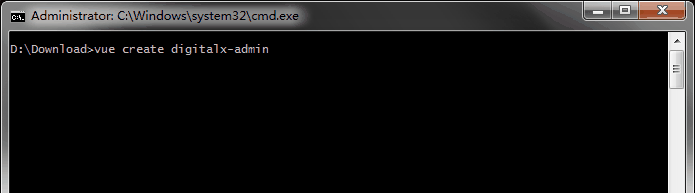
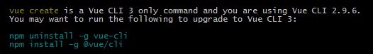
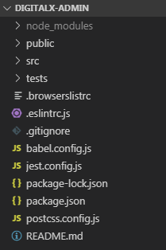
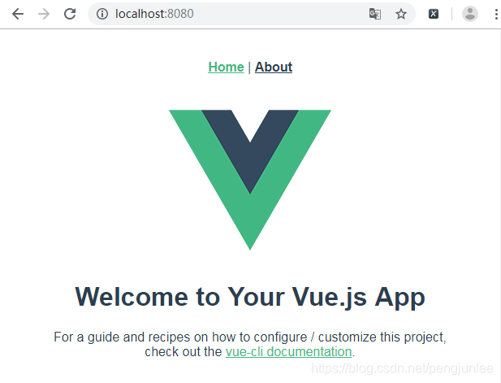

# 简介
`Vue-cli`是一个基于`Vue.js`进行快速开发的完整系统，可以用来为开发`单页面应用 (SPA)`快速搭建繁杂的脚手架。它为现代前端工作流提供了`batteries-included`的构建设置。只需要几分钟的时间就可以运行起来并带有热重载、保存时`lint`校验，以及生产环境可用的构建版本。

`Vue-cli`致力于将Vue生态中的工具基础标准化。它确保了各种构建工具能够基于智能的默认配置即可平稳衔接，这样你可以专注在撰写应用上，而不必花好几天去纠结配置的问题。与此同时，它也为每个工具提供了调整配置的灵活性，无需 `eject`。

`Vue-cli`项目地址：<https://github.com/vuejs/vue-cli>

`Vue-cli`帮助文档：<https://cli.vuejs.org/zh/guide/>

# 安装
使用之前，你需要先安装`vue-cli`模块。

	npm install -g @vue/cli
	# OR
	yarn global add @vue/cli

安装完成之后执行下面的命令来检查安装的版本是否正确 (**3.x**)：

	vue --version

如果已经安装`Vue-cli 2.x`版本，可以使用如下命令进行卸载：

	npm uninstall -g vue-cli

# 创建项目
`Vue-cli`脚手架工具能够帮我们编写好项目基础代码，涵盖了目录结构、本地调试、打包部署、热加载、单元测试等方面。

切换到想要创建项目的目录，运行以下命令来创建一个新项目：

	vue create digitalx-admin

你会被提示选取一个`preset`。你可以选默认的包含了基本的`Babel + ESLint`设置的`preset`，也可以选“手动选择特性”来选取需要的特性。

如果你决定手动选择特性，在操作提示的最后你可以选择将已选项保存为一个将来可复用的`preset`。被保存的`preset` 将会存在用户的`home`目录下一个名为`.vuerc`的`JSON`文件里。如果你想要修改被保存的`preset /`选项，可以编辑这个文件。

安装过程中，如果`Vue-cli`版本小于`3.0`会提示让你升级到`Vue-cli 3`。

创建好的项目的目录层级如下图所示。

使用`Vue-cli 2.x`版本创建项目，请移步《Vue基础入门》。

# 插件和预设配置
## 插件
`Vue CLI`使用了一套基于插件的架构。如果你查阅一个新创建项目的`package.json`，就会发现依赖都是以`@vue/cli-plugin-`开头的。插件可以修改内部的`webpack`配置，也可以向`vue-cli-service`注入命令。在项目创建的过程中列出的特性，绝大部分都是通过插件来实现的。

## 在现有的项目中安装插件
每个`CLI`插件都会包含一个(用来创建文件的)生成器和一个(用来调整`webpack`核心配置和注入命令的)运行时插件。当你使用`vue create`来创建一个新项目的时候，有些插件会根据你选择的特性被预安装好。如果你想在一个已经被创建好的项目中安装一个插件，可以使用`vue add`命令：

	vue add eslint

这个命令将`@vue/eslint`解析为完整的包名`@vue/cli-plugin-eslint`，然后从`npm`安装它，调用它的生成器。

	# 等价于
	vue add cli-plugin-eslint

如果不带`@vue`前缀，该命令会换作解析一个`unscoped`的包。例如以下命令会安装第三方插件`vue-cli-plugin-apollo`：

	# 安装并调用 vue-cli-plugin-apollo
	vue add apollo

你也可以基于一个指定的`scope`使用第三方插件。例如如果一个插件名为`@foo/vue-cli-plugin-bar`，你可以这样添加它：

	vue add @foo/bar

你可以向被安装的插件传递生成器选项 (这样做会跳过命令提示)：

	vue add eslint --config airbnb --lintOn save

`vue-router`和`vuex`的情况比较特殊——它们并没有自己的插件，但是你仍然可以这样添加它们：

	vue add router
	vue add vuex

如果一个插件已经被安装，你可以使用`vue invoke`命令跳过安装过程，只调用它的生成器。这个命令会接受和`vue add` 相同的参数。

# 启动项目
你可以通过调用如下命令来启动项目：

	npm run serve
	# OR
	yarn serve
	# OR
	npx vue-cli-service serve

访问项目地址，默认为<http://localhost:8080>，界面如下。

