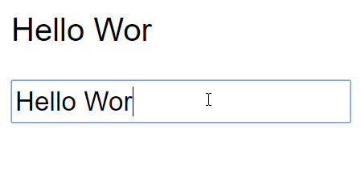
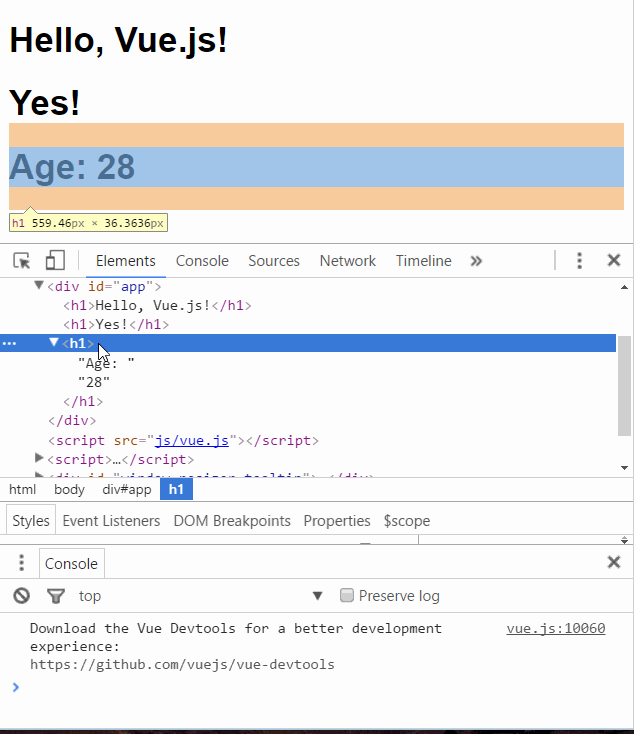

> 原文链接：<https://www.cnblogs.com/keepfool/p/5619070.html>

# Vue.js介绍
[Vue.js](https://github.com/vuejs/vue "Vue.js")是当下很火的一个`JavaScript MVVM`库，它是以数据驱动和组件化的思想构建的。相比于`Angular.js`，`Vue.js`提供了更加简洁、更易于理解的API，使得我们能够快速地上手并使用`Vue.js`。

如果你之前已经习惯了用`jQuery`操作DOM，学习Vue.js时请先抛开手动操作DOM的思维，因为`Vue.js`是数据驱动的，你无需手动操作DOM。它通过一些特殊的HTML语法，将DOM和数据绑定起来。一旦你创建了绑定，DOM将和数据保持同步，每当变更了数据，DOM也会相应地更新。

当然了，在使用`Vue.js`时，你也可以结合其他库一起使用，比如`jQuery`。

本文的Demo和源代码已放到GitHub，如果您觉得本篇内容不错，请点个赞，或在GitHub上加个星星！

[v-for Demo](https://keepfool.github.io/vue-tutorials/01.GettingStarted/v-for.html "v-for Demo")
[v-bind Demo](https://keepfool.github.io/vue-tutorials/01.GettingStarted/v-bind.html "v-bind Demo")
[Page Demo](https://keepfool.github.io/vue-tutorials/01.GettingStarted/simple-demo.html "Page Demo")
[GitHub Source](https://github.com/keepfool/vue-tutorials "GitHub Source")

# MVVM模式
下图不仅概括了`MVVM`模式（**Model-View-ViewModel**），还描述了在`Vue.js`中`ViewModel`是如何和View以及Model进行交互的。

**ViewModel**是`Vue.js`的核心，它是一个**Vue**实例。Vue实例是作用于某一个HTML元素上的，这个元素可以是HTML的body元素，也可以是指定了id的某个元素。

当创建了ViewModel后，双向绑定是如何达成的呢？

首先，我们将上图中的`DOM Listeners`和`Data Bindings`看作两个工具，它们是实现双向绑定的关键。

- 从View侧看，ViewModel中的`DOM Listeners`工具会帮我们监测页面上DOM元素的变化，如果有变化，则更改Model中的数据；
- 从Model侧看，当我们更新Model中的数据时，`Data Bindings`工具会帮我们更新页面中的DOM元素。

# Hello World示例
了解一门语言，或者学习一门新技术，编写`Hello World`示例是我们的必经之路。
这段代码在画面上输出"Hello World!"。

	<!DOCTYPE html>
	<html>
		<head>
			<meta charset="UTF-8">
			<title></title>
		</head>
	
		<body>
			<!--这是我们的View-->
			

				{{ message }}
			

		</body>
		
		
	</html>

使用Vue的过程就是定义MVVM各个组成部分的过程。

1. 定义`View`
2. 定义`Model`
3. 创建一个Vue实例或`ViewModel`，它用于连接`View`和`Model`

在创建Vue实例时，需要传入一个选项对象，选项对象可以包含数据、挂载元素、方法、生命周期钩子等等。

在这个示例中，选项对象的el属性指向View，`el: '#app'`表示该Vue实例将挂载到`
...
`这个元素；data属性指向Model，`data: exampleData`表示我们的Model是exampleData对象。
`Vue.js`有多种数据绑定的语法，最基础的形式是文本插值，使用一对大括号语法，在运行时`{{ message }}`会被数据对象的`message`属性替换，所以页面上会输出"Hello World!"。

> `Vue.js`已经更新到**2.0**版本了，但由于还不是正式版，本文的代码都是**1.0.25**版本的。

# 双向绑定示例
`MVVM`模式本身是实现了双向绑定的，在`Vue.js`中可以使用`v-model`指令在表单元素上创建双向数据绑定。

	<!--这是我们的View-->
	

		
{{ message }}

		<input type="text" v-model="message"/>
	

将**message**绑定到文本框，当更改文本框的值时，`
{{ message }}
`中的内容也会被更新。

反过来，如果改变message的值，文本框的值也会被更新，我们可以在Chrome控制台进行尝试。

Vue实例的data属性指向exampleData，它是一个引用类型，改变了exampleData对象的属性，同时也会影响Vue实例的data属性。

# Vue.js的常用指令
上面用到的`v-model`是`Vue.js`常用的一个指令，那么指令是什么呢？

`Vue.js`的指令是以`v-`开头的，它们作用于HTML元素，指令提供了一些特殊的特性，将指令绑定在元素上时，指令会为绑定的目标元素添加一些特殊的行为，我们可以将指令看作特殊的HTML特性（attribute）。
`Vue.js`提供了一些常用的内置指令，接下来我们将介绍以下几个内置指令：

- v-if指令
- v-show指令
- v-else指令
- v-for指令
- v-bind指令
- v-on指令

`Vue.js`具有良好的扩展性，我们也可以开发一些自定义的指令，后面的文章会介绍自定义指令。

## v-if指令
`v-if`是条件渲染指令，它根据表达式的真假来删除和插入元素，它的基本语法如下：

	v-if="expression"

expression是一个返回`bool`值的表达式，表达式可以是一个bool属性，也可以是一个返回bool的运算式。例如：

	<!DOCTYPE html>
	<html>
		<head>
			<meta charset="UTF-8">
			<title></title>
		</head>
		<body>
			

				<h1>Hello, Vue.js!</h1>
				<h1 v-if="yes">Yes!</h1>
				<h1 v-if="no">No!</h1>
				<h1 v-if="age >= 25">Age: {{ age }}</h1>
				<h1 v-if="name.indexOf('jack') >= 0">Name: {{ name }}</h1>
			

		</body>
		
		
	</html>

> 注意：`yes`, `no`, `age`, `name`这4个变量都来源于Vue实例选项对象的data属性。

这段代码使用了4个表达式：

- 数据的`yes`属性为`true`，所以`Yes!`会被输出；
- 数据的`no`属性为`false`，所以`No!`不会被输出；
- 运算式`age >= 25`返回`true`，所以`Age: 28`会被输出；
- 运算式`name.indexOf('jack') >= 0`返回`false`，所以`Name: keepfool`不会被输出。

> 注意：`v-if`指令是根据条件表达式的值来执行元素的插入或者删除行为。

这一点可以从渲染的HTML源代码看出来，面上只渲染了3个`<h1>`元素，`v-if`值为`false`的`<h1>`元素没有渲染到HTML。

为了再次验证这一点，可以在Chrome控制台更改age属性，使得表达式`age >= 25`的值为`false`，可以看到`<h1>Age: 28</h1>`元素被删除了。

**age**是定义在选项对象的`data`属性中的，为什么Vue实例可以直接访问它呢？
这是因为每个Vue实例都会代理其选项对象里的data属性。

## v-show指令
`v-show`也是条件渲染指令，和`v-if`指令不同的是，使用`v-show`指令的元素始终会被渲染到HTML，它只是简单地为元素设置CSS的style属性。

	<!DOCTYPE html>
	<html>
		<head>
			<meta charset="UTF-8">
			<title></title>
		</head>
		<body>
			

				<h1>Hello, Vue.js!</h1>
				<h1 v-show="yes">Yes!</h1>
				<h1 v-show="no">No!</h1>
				<h1 v-show="age >= 25">Age: {{ age }}</h1>
				<h1 v-show="name.indexOf('jack') >= 0">Name: {{ name }}</h1>
			

		</body>
		
		
	</html>

在**Chrome**控制台更改age属性，使得表达式`age >= 25`的值为`false`，可以看到`<h1>Age: 24</h1>`元素被设置了`style="display:none"`样式。

## v-else指令
可以用`v-else`指令为`v-if`或`v-show`添加一个`else块`。`v-else`元素必须立即跟在`v-if`或`v-show`元素的后面——否则它不能被识别。

	<!DOCTYPE html>
	<html>
	
		<head>
			<meta charset="UTF-8">
			<title></title>
		</head>
		<body>
			

				<h1 v-if="age >= 25">Age: {{ age }}</h1>
				<h1 v-else>Name: {{ name }}</h1>
				<h1>---------------------分割线---------------------</h1>
				<h1 v-show="name.indexOf('keep') >= 0">Name: {{ name }}</h1>
				<h1 v-else>Sex: {{ sex }}</h1>
			

		</body>
		
		
	</html>

`v-else`元素是否渲染在HTML中，取决于前面使用的是`v-if`还是`v-show`指令。
这段代码中`v-if`为`true`，后面的`v-else`不会渲染到HTML；`v-show`为`tue`，但是后面的`v-else`仍然渲染到HTML了。

## v-for指令
`v-for`指令基于一个数组渲染一个列表，它和**JavaScript**的遍历语法相似：

	v-for="item in items"

`items`是一个数组，`item`是当前被遍历的数组元素。

	<!DOCTYPE html>
	<html>
	
		<head>
			<meta charset="UTF-8">
			<title></title>
			<link rel="stylesheet" href="styles/demo.css" />
		</head>
	
		<body>
			

				<table>
					<thead>
						<tr>
							<th>Name</th>
							<th>Age</th>
							<th>Sex</th>
						</tr>
					</thead>
					<tbody>
						<tr v-for="person in people">
							<td>{{ person.name  }}</td>
							<td>{{ person.age  }}</td>
							<td>{{ person.sex  }}</td>
						</tr>
					</tbody>
				</table>
			

		</body>
		
		
	
	</html>

我们在选项对象的data属性中定义了一个people数组，然后在`#app`元素内使用`v-for`遍历people数组，输出每个person对象的姓名、年龄和性别。

[View Demo](https://keepfool.github.io/vue-tutorials/01.GettingStarted/v-for.html "View Demo")

## v-bind指令
`v-bind`指令可以在其名称后面带一个参数，中间放一个冒号隔开，这个参数通常是HTML元素的特性（attribute），例如：`v-bind:class`

	v-bind:argument="expression"

下面这段代码构建了一个简单的分页条，`v-bind`指令作用于元素的class特性上。
这个指令包含一个表达式，表达式的含义是：`高亮当前页`。

	<!DOCTYPE html>
	<html>
		<head>
			<meta charset="UTF-8">
			<title></title>
			<link rel="stylesheet" href="styles/demo.css" />
		</head>
		<body>
			

				<ul class="pagination">
					<li v-for="n in pageCount">
						<a href="javascripit:void(0)" v-bind:class="activeNumber === n + 1 ? 'active' : ''">{{ n + 1 }}</a>
					</li>
				</ul>
			

		</body>
		
		
	</html>

> 注意：`v-for="n in pageCount"`这行代码，pageCount是一个整数，遍历时n从0开始，然后遍历到`pageCount –1`结束。

[View Demo](https://keepfool.github.io/vue-tutorials/01.GettingStarted/v-bind.html "View Demo")

## v-on指令
`v-on`指令用于给监听DOM事件，它的用语法和`v-bind`是类似的，例如`监听<a>元素的点击事件`：

	<a v-on:click="doSomething">

有两种形式调用方法：**绑定一个方法（让事件指向方法的引用），或者使用内联语句**。

**Greet**按钮将它的单击事件直接绑定到`greet()`方法，而**Hi按钮**则是调用`say()`方法。

	<!DOCTYPE html>
	<html>
		<head>
			<meta charset="UTF-8">
			<title></title>
		</head>
		<body>
			

				
<input type="text" v-model="message">

				

					<!--click事件直接绑定一个方法-->
					<button v-on:click="greet">Greet</button>
				

				

					<!--click事件使用内联语句-->
					<button v-on:click="say('Hi')">Hi</button>
				

			

		</body>
		
		
	</html>

## v-bind和v-on的缩写
`Vue.js`为最常用的两个指令`v-bind`和`v-on`提供了缩写方式。`v-bind`指令可以缩写为一个冒号，`v-on`指令可以缩写为`@`符号。

	<!--完整语法-->
	<a href="javascripit:void(0)" v-bind:class="activeNumber === n + 1 ? 'active' : ''">{{ n + 1 }}</a>
	<!--缩写语法-->
	<a href="javascripit:void(0)" :class="activeNumber=== n + 1 ? 'active' : ''">{{ n + 1 }}</a>
	
	<!--完整语法-->
	<button v-on:click="greet">Greet</button>
	<!--缩写语法-->
	<button @click="greet">Greet</button>

## 综合示例
现在我们已经介绍了一些`Vue.js`的基础知识了，结合以上知识我们可以来做个小Demo。

	<!DOCTYPE html>
	<html>
	
		<head>
			<meta charset="UTF-8">
			<title></title>
			<link rel="stylesheet" href="styles/demo.css" />
		</head>
	
		<body>
			

	
				<fieldset>
					<legend>
						Create New Person
					</legend>
					

						<label>Name:</label>
						<input type="text" v-model="newPerson.name"/>
					

					

						<label>Age:</label>
						<input type="text" v-model="newPerson.age"/>
					

					

						<label>Sex:</label>
						<select v-model="newPerson.sex">
						<option value="Male">Male</option>
						<option value="Female">Female</option>
					</select>
					

					

						<label></label>
						<button @click="createPerson">Create</button>
					

			</fieldset>
			<table>
				<thead>
					<tr>
						<th>Name</th>
						<th>Age</th>
						<th>Sex</th>
						<th>Delete</th>
					</tr>
				</thead>
				<tbody>
					<tr v-for="person in people">
						<td>{{ person.name }}</td>
						<td>{{ person.age }}</td>
						<td>{{ person.sex }}</td>
						<td :class="'text-center'"><button @click="deletePerson($index)">Delete</button></td>
					</tr>
				</tbody>
			</table>
			

		</body>
		
		
	
	</html>

在我的[GitHub Pages](https://keepfool.github.io/vue-tutorials/01.GettingStarted/simple-demo.html "GitHub Pages")查看该Demo。

# 总结
本文简单介绍了·Vue.js·的MVVM模型和它的双向绑定机制，然后以一个·Hello World·示例开始了我们的·Vue.js·之旅，接着我们了解了几个比较常用的指令，最后根据这些知识我们构建了一个简单的示例。

