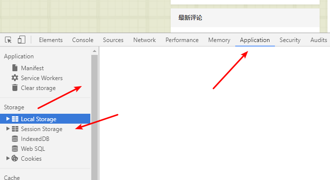

> 原文链接：<https://blog.csdn.net/hong10086/article/details/89684772>

# 什么是localStorage
对浏览器来说，使用`Web Storage`存储键值对比存储`Cookie`方式更直观，而且容量更大，它包含两种：`localStorage`和`sessionStorage`。

- sessionStorage（临时存储）：为每一个数据源维持一个存储区域，在浏览器打开期间存在，包括页面重新加载
- localStorage（长期存储）：与`sessionStorage`一样，但是浏览器关闭后，数据依然会一直存在

所以上次使用`cookie`的时候就遇到了一个坑,设置后马上访问`session`会获取不到,蛋疼,还需要刷新一下,原因是：当我们首次访问设置`Cookie`的页面时，服务器会把设置的`Cookie`值通过响应头发送过来，告诉浏览器将`cookie`存储的本地相应文件夹中（注意：第一次访问时本地还没有存储`Cookie`,所以此时获取不到值）;

当第二次访问(或在进行`cookie`设置后,过期前所有的访问)时，请求头信息你中都会把`Cookie`值携带。(百度到的,暂时还没理解透彻,先搬过来).

# 使用方法
> 注意：`sessionStorage`和`localStorage`的用法基本一致，引用类型的值要转换成JSON，所以这里就只列举`localStorage`。

## 保存

	//对象
	const info = { name: 'hou', age: 24, id: '001' };
	 
	//字符串
	const str="haha";
	 
	localStorage.setItem('hou', JSON.stringify(info));
	 
	localStorage.setItem('zheng', str);

## 获取

	var data1 = JSON.parse(localStorage.getItem('hou'));
	 
	var data2 = localStorage.getItem('zheng');

## 删除

	//删除某个
	 
	localStorage.removeItem('hou');
	//删除所有
	localStorage.clear();

## 监听

	Storage 发生变化（增加、更新、删除）时的 触发，同一个页面发生的改变不会触发，只会监听同一域名下其他页面改变 Storage
	window.addEventListener('storage', function (e) {
	　　console.log('key', e.key); console.log('oldValue', e.oldValue);
	　　console.log('newValue', e.newValue); console.log('url', e.url);
	})

## 浏览器中查看

 

# vue中实践
根据我的需求来的一个默认记住上次选择的，很简单，添加数据的时候，下次添加默认记住我上次的选择。所以,在添加或者提交的时候存储值即可。

	localStorage.setItem('projectId',me.workhourData.projectId+","+me.workhourData.projectManager);

在打开新建页面的时候获取一下就好了,只需要判断非空就行。

	// 记住上次选中的审核人
	if(localStorage.length>0){
	    var mydata = localStorage.getItem('projectId');
	    if(mydata!=null){
	        var arr3=mydata.split(",");
	        if(arr3[0]==me.workhourData.projectId){
	            me.workhourData.projectManager=arr3[1];
	        }
	    }
	}

解决vue页面刷新后原先获取的`vuex`中`state`消失的问题：

原文地址：<https://blog.csdn.net/goodaxuan/article/details/82113123>

在`app.vue`中的`created`函数中写如下代码：`localstorage`和`sessionStorage`都可以。

	created() {
		//在页面加载时读取sessionStorage里的状态信息
		if (sessionStorage.getItem("store")) {
		  this.$store.replaceState(
		    Object.assign(
		      {},
		      this.$store.state,
		      JSON.parse(sessionStorage.getItem("store"))
		    )
		  );
		}
		
		//在页面刷新时将vuex里的信息保存到sessionStorage里
		window.addEventListener("beforeunload", () => {
		  sessionStorage.setItem("store", JSON.stringify(this.$store.state));
		});
	}

# 注意点

- localStorage有效期是永久的。一般的浏览器能存储的是5MB左右。sessionStorage api与localStorage相同。
- sessionStorage默认的有效期是浏览器的会话时间（也就是说标签页关闭后就消失了）。
- localStorage作用域是协议、主机名、端口。（理论上，不人为的删除，一直存在设备中）
- sessionStorage作用域是窗口、协议、主机名、端口。

知道了这些知识点后，你的问题就很好解决了。

`localStorage`是`window`上的。所以不需要写`this.localStorage`，vue中如果写`this`，是指vue实例。会报错！

 