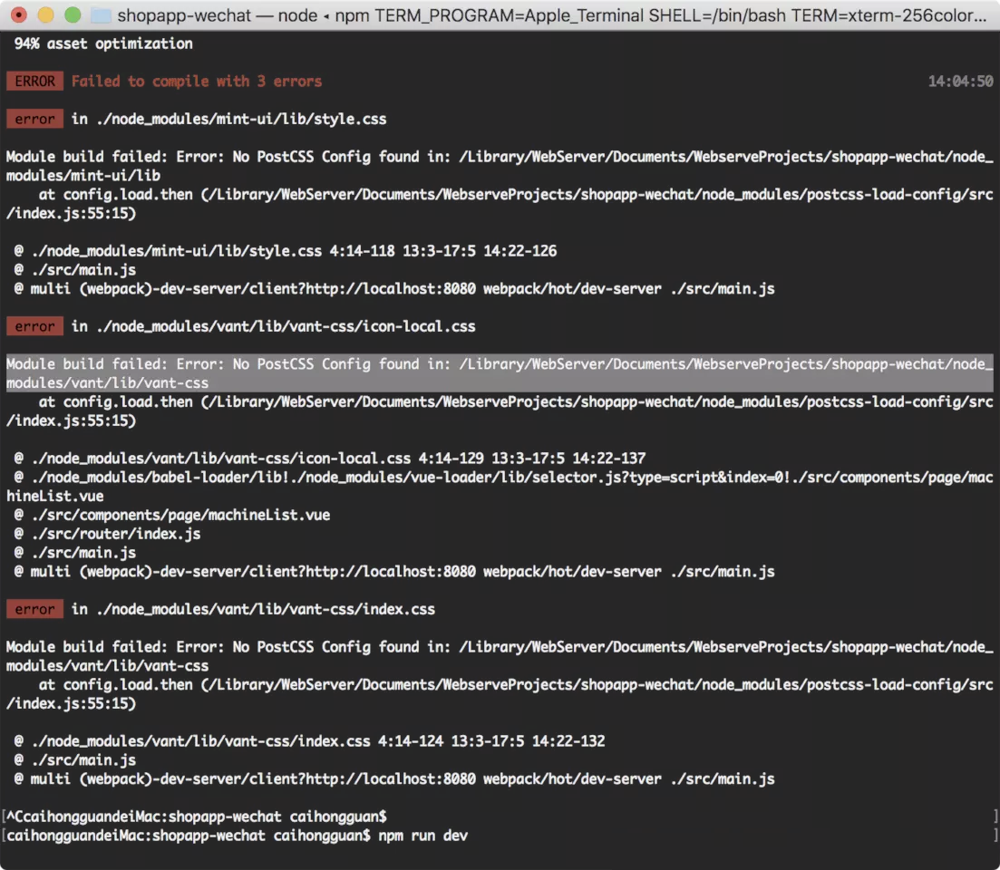

> 原文链接：<https://blog.csdn.net/cxwtsh123/article/details/83013908>

# 1.新建的vue项目启动后报错

No PostCSS Config found in: /Library/WebServer/Documents/WebserveProjects/shopapp-wechat/node_module

# 2.此时需要对webpack 3.0进行配置

`postcss.config.js`是针对`webpack3.0`做的特殊处理。

在项目根目录新建`postcss.config.js`文件，并对`postcss`进行配置：

	module.exports = {
	    plugins: {
	        'autoprefixer': {browsers: 'last 5 version'}
	    }
	}
