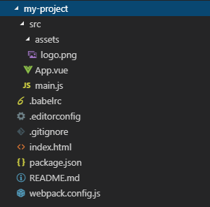

# VUE简介

`Vue`(读音 `/vjuː/`，类似于`view`) 是一套用于构建用户界面的渐进式框架。与其它大型框架不同的是，Vue被设计为可以自底向上逐层应用。Vue的核心库只关注视图层，不仅易于上手，还便于与第三方库或既有项目整合。另一方面，当与现代化的工具链以及各种支持类库结合使用时，Vue也完全能够为复杂的单页应用提供驱动。

# NodeJS和NPM安装
`Node.js`是一个基于`Chrome V8`引擎的**JavaScript**运行环境，而`NPM`是随同`NodeJS`一起安装的一个包管理工具。`NPM`能解决`NodeJS`代码部署上的很多问题，常见的使用场景有以下三种：

- 允许用户从NPM服务器下载别人编写的第三方包到本地使用。
- 允许用户从NPM服务器下载并安装别人编写的命令行程序到本地使用。
- 允许用户将自己编写的包或命令行程序上传到NPM服务器供别人使用。

由于我们在使用VUE进行前端项目开发需要依赖于NodeJS运行环境和使用NPM来帮助我们自动下载所需要的插件，所以我们需要先安装`NodeJS`和`NPM`。

## Windows平台
访问**NodeJS**官网：<https://nodejs.org/en/> ，下载对应`Windows`平台的安装包。

按照下图所示，傻瓜式点击下一步、下一步完成安装。

由于新版的`NodeJS`已经集成了`npm`，所以NPM也一并安装好了。在CMD命令行输入`node -v`和`npm -v`命令查看安装的NodeJS和NPM的版本，出现版本号就表示安装成功：

随NodeJS一起安装的NPM可能不是最新版本，最好用下面的命令，更新到最新版本。

	npm install npm@latest -g

由于NPM是国外站点，下载插件速度会比较慢，推荐安装淘宝镜像并使用CNPM来安装所需插件。CNPM与NPM命令语法基本一致，但安装速度会快很多。

	npm install -g cnpm --registry=https://registry.npm.taobao.org

下面列举了几个常用的NPM命令：

	npm install <package name> # 本地安装
	npm install <package name>@version # 安装时指定版本
	npm install -global <package name> --force # 全局安装
	npm install -g <package name> -f # 全局安装
	npm install git://github.com/package/xxx.git#x.x.x # 安装Github代码库
	npm help # 查看 npm 命令简单帮助信息
	npm -l # 查看 npm 各命令的详细用法
	npm list # 以树型结构列出已安装的模块

## Linux平台
官网地址：<https://nodejs.org/en/download/current/>

### 二进制安装

	// 下载二进制包
	wget https://nodejs.org/dist/v12.7.0/node-v12.7.0-linux-x64.tar.xz
	 
	// 解压文件
	tar Jxvf node-v12.7.0-linux-x64.tar.xz
	 
	// 将解压文件移动到安装目录并改名
	mv /usr/local/src/node-v12.7.0-linux-x64 /usr/local/node-v12.7.0
	 
	// 创建软链接
	ln -s /usr/local/node-v12.7.0/bin/node /usr/local/bin/node
	ln -s /usr/local/node-v12.7.0/bin/npm /usr/local/bin/npm
	 
	// 查看node版本
	node -v
	v12.7.0
	 
	// 查看npm版本
	npm --version
	6.10.0

### 源码包安装

	// 安装gcc编译器
	yum -y install gcc gcc-c++
	 
	// 下载源码包
	wget https://nodejs.org/dist/v10.16.1/node-v10.16.1.tar.gz
	 
	// 解压文件
	tar zxvf node-v10.16.1.tar.gz
	 
	// 将解压文件移动到安装目录
	mv /usr/local/src/node-v10.16.1 /usr/local/node-v10.16.1
	 
	// 切换到安装目录进行编译安装
	cd /usr/local/node-v10.16.1
	./configure
	make
	make install
	 
	// 查看node版本
	node -v
	v10.16.1

> 注意： 在使用源码包安装NodeJS时，make编译出现了error::make_unique is not a member of ‘std’错误，初步推断是由于当前安装的**gcc**编译器版本与编译NodeJS所需版本不匹配导致，我的解决办法是将`gcc`升级至`4.9`版本。

	yum install centos-release-scl -y
	yum install devtoolset-3-toolchain -y
	scl enable devtoolset-3 bash
	 
	// 查看gcc编译器版本
	gcc --version
	gcc (GCC) 4.9.2 20150212 (Red Hat 4.9.2-6)
	Copyright (C) 2014 Free Software Foundation, Inc.
	This is free software; see the source for copying conditions.  There is NO
	warranty; not even for MERCHANTABILITY or FITNESS FOR A PARTICULAR PURPOSE.

# VUE安装与使用
## 直接引用
我们可以在`
 
    <!-- 引用 vue.min.js -->
    

## NPM安装
切换到项目目录，执行如下NPM命令，将vue下载到项目目录。

	npm install vue --save

然后，在`

# VUE-CLI
`Vue`提供了一个官方的`CLI`，为`单页面应用(SPA)`快速搭建繁杂的脚手架。它为现代前端工作流提供了`batteries-included`的构建设置。只需要几分钟的时间就可以运行起来并带有热重载、保存时`lint`校验，以及生产环境可用的构建版本。

`Vue-cli`脚手架工具能够帮我们编写好项目基础代码，涵盖了目录结构、本地调试、打包部署、热加载、单元测试等方面。

Vue-cli项目地址：<https://github.com/vuejs/vue-cli>

Vue-cli帮助文档：<https://cli.vuejs.org/zh/guide/>

使用之前，你需要先安装`vue-cli`模块。

	npm install -g vue-cli # 安装 vue-cli 模块
	vue --version # 查看 vue-cli 版本
	2.9.6
	vue list # 查看官方提供的项目模板
	 
	  Available official templates:
	 
	  ★  browserify - A full-featured Browserify + vueify setup with hot-reload, linting & unit testing.
	  ★  browserify-simple - A simple Browserify + vueify setup for quick prototyping.
	  ★  pwa - PWA template for vue-cli based on the webpack template
	  ★  simple - The simplest possible Vue setup in a single HTML file
	  ★  webpack - A full-featured Webpack + vue-loader setup with hot reload, linting, testing & css extraction.
	  ★  webpack-simple - A simple Webpack + vue-loader setup for quick prototyping.

切换到想要创建项目的目录，开始创建项目，我们先来创建一个`webpack-simple`示例项目 。

	vue init webpack-simple my-project # 创建 webpack-simple 项目

创建好的`webpack-simple`项目的目录层级如下图所示。

切换到项目目录，启动项目。

项目启动后，访问<http://localhost:8080>。

# VUE基础语法
`Vue.js`使用了基于HTML的模板语法，允许开发者声明式地将DOM绑定至底层Vue实例的数据。所有Vue.js的模板都是合法的HTML，所以能被遵循规范的浏览器和HTML解析器解析。

在底层的实现上，Vue将模板编译成虚拟DOM渲染函数。结合响应系统，Vue能够智能地计算出最少需要重新渲染多少组件，并把DOM操作次数减到最少。

下面是一个Vue.js的用法示例，代码如下。

	<!DOCTYPE html>
	<html lang="en">
	 
	<head>
	    <meta charset="utf-8">
	    <title>VUE 模板语法</title>
	    <!-- 引用 vue.min.js -->
	    
	    
	</head>
	 
	<body>
	    

	        <!-- Mustache 语法，绑定文本-->
	        
Welcom to the world of {{ rawText }}

	        <!-- v-text 语法，绑定文本-->
	        
Welcom to the world of 

	        <!-- v-html 语法，绑定 HTML -->
	        
Welcom to the world of 

	        <!-- v-bind 语法，绑定属性，对于布尔值属性，存在即值为 True-->
	        
Welcom to the world of {{ rawText }}

	        <!-- 计算属性，v-once 限制只绑定一次-->
	        
反过来看： {{ reverMsg }}

	        <!-- v-on 语法，绑定事件-->
	        
<input type="button" v-on:click="reverseMsg" value="点击反转">：</input> {{ reverMsg }}

	        
Are U ready ? {{ isReady ? "Yes,Come on baby!" : "No,I'm scared!" }}

	        
Next year is {{ curYear+1 }}

	    

	 
	    
	</body>
	 
	</html>
在浏览器中访问页面，效果如下。

此外， `Vue.js`还提供了如下事件修饰符和按键修饰符用来对事件的细节进行控制。

<table><tbody><tr><td>
			
类型

			</td>
			<td>
			
名称

			</td>
			<td>
			
用途

			</td>
		</tr><tr><td colspan="1" rowspan="5">
			
事件修饰符

			</td>
			<td>
			
stop

			</td>
			<td>
			
阻止事件冒泡

			</td>
		</tr><tr><td>
			
prevent

			</td>
			<td>
			
阻止默认事件

			</td>
		</tr><tr><td>
			
capture

			</td>
			<td>
			
捕获事件

			</td>
		</tr><tr><td>
			
self

			</td>
			<td>
			
仅元素自身触发事件，子元素不触发事件

			</td>
		</tr><tr><td>
			
once

			</td>
			<td>
			
事件只触发一次

			</td>
		</tr><tr><td colspan="1" rowspan="8">
			
按键修饰符

			</td>
			<td>
			
up/down/left/right

			</td>
			<td>
			
↑↓←→

			</td>
		</tr><tr><td>
			
enter

			</td>
			<td>
			
回车

			</td>
		</tr><tr><td>
			
tab

			</td>
			<td>
			
Tab键

			</td>
		</tr><tr><td>
			
delete

			</td>
			<td>
			
删除或退格

			</td>
		</tr><tr><td>
			
esc

			</td>
			<td>
			
Esc键

			</td>
		</tr><tr><td>
			
space

			</td>
			<td>
			
空格

			</td>
		</tr><tr><td>
			
ctrl/alt/shift

			</td>
			<td>
			
Ctrl Alt Shift

			</td>
		</tr><tr><td>
			
meta

			</td>
			<td>&nbsp;</td>
		</tr></tbody></table>
 
下面是两个示例。

	<!-- 提交表单时阻止默认事件，不刷新页面 -->
	<form v-on:submit.prevent="onSubmit"></form>
	<!-- Ctrl + C -->
	<input @keyup.ctrl.67="clear">

`Vue.js`还允许用户自定义过滤器，通常被用作一些常见的文本格式化。由"管道符"指示, 例如：

	

	  {{ message | capitalize }}
	

	

更多关于VUE语法的细节，请移步《Vue.js--60分钟快速入门》 或者参考官网帮助文档。

# Webpack项目配置
使用`vue-cli`创建好的`webpack`模板项目的目录结构如下图所示。

其中`build`目录中包含了`webpack`构建所需要的配置，通常情况下，我们不需要对这里面的配置做改动。项目中一些需要我们经常去改动的重要配置（例如，项目启动时的主机名和端口号，是否启用`Eslint语法检查`，静态资源的存放目录，打包文件的存放目录，等等）都被提取到了`config`目录中的`index.js`配置文件中。

这里我们只简单贴出`build.js`的代码，并在重要的地方添加了注释。

	'use strict'
	require('./check-versions')() // 引入 versions.js 校验 node npm 的版本
	 
	process.env.NODE_ENV = 'production' // 生产环境
	 
	const ora = require('ora') // 正在加载的动态展示插件
	const rm = require('rimraf') // 删除文件的插件，相当于Unix系统中的 rm -rf
	const path = require('path') // 路径插件
	const chalk = require('chalk') // 彩色打印字符串插件
	const webpack = require('webpack') // 打包插件
	const config = require('../config') // 引入 ../config/index.js 项目配置
	const webpackConfig = require('./webpack.prod.conf') // 引入 ./webpack.prod.conf 打包生产配置
	 
	const spinner = ora('building for production...')
	spinner.start()
	 
	// 先删除之前的打包文件，默认目录 /dist
	rm(path.join(config.build.assetsRoot, config.build.assetsSubDirectory), err => {
	  if (err) throw err
	  webpack(webpackConfig, (err, stats) => { // 重新打包
	    spinner.stop()
	    if (err) throw err
	    process.stdout.write(stats.toString({
	      colors: true,
	      modules: false,
	      children: false, // If you are using ts-loader, setting this to true will make TypeScript errors show up during build.
	      chunks: false,
	      chunkModules: false
	    }) + '\n\n')
	 
	    if (stats.hasErrors()) {
	      console.log(chalk.red('  Build failed with errors.\n'))
	      process.exit(1)
	    }
	 
	    console.log(chalk.cyan('  Build complete.\n'))
	    console.log(chalk.yellow(
	      '  Tip: built files are meant to be served over an HTTP server.\n' +
	      '  Opening index.html over file:// won\'t work.\n'
	    ))
	  })
	})

# 参考文章

<https://www.runoob.com/vue2/vue-tutorial.html>

<https://cn.vuejs.org/v2/guide/>

<http://vuejs-templates.github.io/webpack/>

<https://cli.vuejs.org/zh/guide/>

<https://webpack.github.io/>