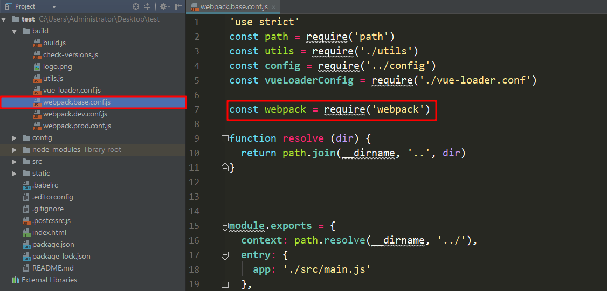
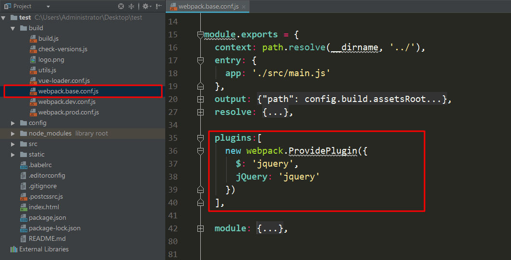

> 原文链接：<https://www.jianshu.com/p/8118f7f5298e>

如果想在普通的HTML页面引入`jQuer`库的话，直接使用``即可。但是如果要在Vue组件中使用jQuery库的话，使用这样的方式就不行了，需要使用以下方法。

# 安装jQuery依赖
在使用`jQuery`之前，我们首先要通过以下命令来安装`jQuery`依赖：

	npm install jquery --save
 
	# 如果你更换了淘宝镜像，可以使用cnpm来安装，速度更快
	cnpm install jquery --save

# 修改配置文件
完成安装`jQuery`依赖之后，我们要修改`webpack.base.conf`文件配置文件。注意我现在的Vue版本是`2.9`，如果你使用的是`Vue3.x`版本的话，这个配置文件的位置可能不一样，需要你在项目中找一下。

首先添加一行代码，引入`webpack`，如下图所示：

	const webpack = require('webpack')

其次是在下图的位置，添加代码配置`jQuery`插件：

	plugins: [
	new webpack.ProvidePlugin({ $: 'jquery', JQuery: 'jquery', 'window.jQuery': 'jquery', 'window.$': 'jquery' })
	],

# 在组件中引入jquery
我们想在哪个组件中使用`jQuery`库，首先要使用如下命令引入`jquery`，然后就可以正常使用了

	import $ from 'jquery'

比如我们要在`App.vue`组件中使用`jQuery`，实例代码如下：

	<template>
	  

	  

	</template>
	 
	
	 
	
 