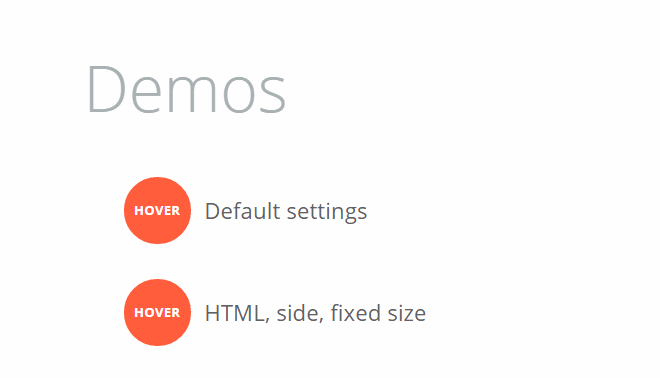
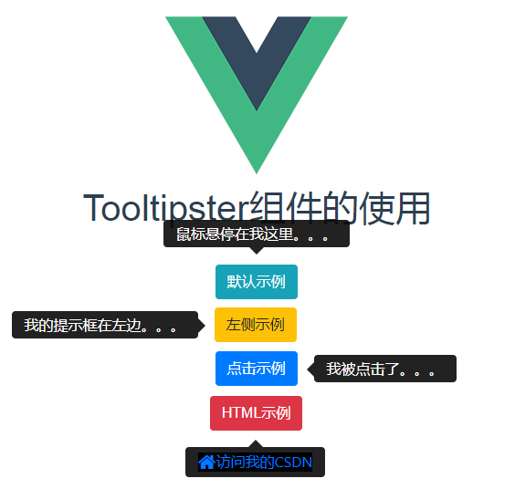

`Tooltipster`是一个简单易用且功能强大的`jQuery`提示框插件，用于对HTML元素的拖动、移入、点击等鼠标事件或其他键盘事件提供效果炫酷的提示框，有助于丰富系统的提示功能。本文主要记录一下如何在`webpack`项目中使用`ToolTipster`来构建自己的提示框组件。

官网地址：<http://down.admin5.com/demo/code_pop/28/72/>

官网示例：<https://vuejsexamples.com/vuejs-2-x-tooltip-component-based-tooltipster-js/>

# 安装ToolTipster
在开始安装`ToolTipster`之前，我们需要先安装好`JQuery`和`Bootstrap4.x`。

《Webpack项目中引入Bootstrap4.x》

《Vue组件中引入jQuery》

本例中还用到了`Lodash`来合并`ToolTipster`的参数选项，使用NPM进行安装：

	npm install tooltipster --save // 安装ToolTipster
	npm install lodash --save // 安装Lodash

# 创建提示框组件
创建一个提示框组件，取名为`V-ToolTip.vue`，组件模板如下：

	<template>
	  

	    

	      <slot></slot>
	    

	    

	      

	        <slot name="content"></slot>
	      

	    

	  

	</template>
	 
	
	

# 使用提示框组件
在其他的VUE组件（`Hello.vue`）中导入提示框组件（`V-ToolTip.vue`）进行使用：

	<template>
	  

	    <h1>Tooltipster组件的使用</h1>
	     
	    

	      <vue-tooltipster label="鼠标悬停在我这里。。。">
	        默认示例
	      </vue-tooltipster>
	      <vue-tooltipster label="我的提示框在左边。。。" :tooltipsterOptions="{side: 'left'}">
	        左侧示例
	      </vue-tooltipster>
	      <vue-tooltipster label="我被点击了。。。" :tooltipsterOptions="{trigger: 'click',side:'right'}">
	        点击示例
	      </vue-tooltipster>
	      <vue-tooltipster :tooltipsterOptions="{side:'bottom'}">
	        HTML示例
	        

	          <a href="https://blog.csdn.net/pengjunlee">
	            <i class="icon-home icon-large"></i>访问我的CSDN
	          </a>
	        

	      </vue-tooltipster>
	    

	  

	</template>
	 
	
	

在浏览器端访问`Hello`组件的效果如下图所示：

# 参考文章

<http://iamceege.github.io/tooltipster/>

<http://www.a5xiazai.com/demo/code_pop/28/72/>