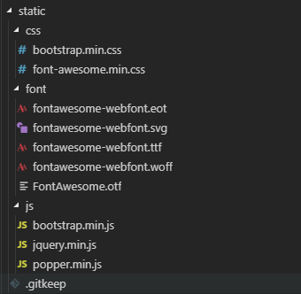
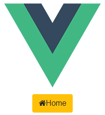

`Bootstrap`是一个简洁、直观、强悍的前端开发框架，在Web开发中使用频率很高，本文主要记录一下如何在`webpack`项目中引入`Bootstrap4.x`。

由于Bootstrap在各个Vue组件中经常会被用到，为了避免在每一个组件中重复引入，本文将直接在`index.html`中引入Bootstrap。

# 文件下载

	npm install jquery --save // Bootstrap4.x 依赖JQuery，所以需要先安装JQuery
	npm install popper.js --save // Bootstrap4.x 依赖Popper，所以需要先安装Popper
	npm install bootstrap --save // 安装Bootstrap4.x

安装完成后，按照下图所示，将项目node_modules 文件夹下的如下几个文件拷贝到项目static目录下的相应文件夹中。

	\node_modules\jquery\dist\jquery.min.js
	\node_modules\popper.js\dist\umd\popper.min.js
	\node_modules\bootstrap\dist\js\bootstrap.min.js
	\node_modules\bootstrap\dist\css\bootstrap.min.css

> 注意：需要复制`umd`文件夹下的`popper.js`文件，否则使用时有可能会报错Uncaught SyntaxError: Unexpected token export popper.js。

为了能够使用Bootstrap的`Font Awesome`字体图标，从官网下载所需文件，将解压获得的`font-awesome.min.css `和整个`font`文件夹一同拷贝到`static`目录的图示位置。

	\Font-Awesome-3.2.1\css\font-awesome.min.css
	\Font-Awesome-3.2.1\font\*

# 修改index.html

	<!DOCTYPE html>
	<html>
	 
	<head>
	  <meta charset="utf-8">
	  <meta name="viewport" content="width=device-width,initial-scale=1.0">
	  <!--  引入Bootstrap样式文件  -->
	  <link type="text/css" rel="stylesheet" href="./static/css/bootstrap.min.css" />
	  <!--  引入Font Awesome字体样式文件  -->
	  <link type="text/css" rel="stylesheet" href="./static/css/font-awesome.min.css" />
	 
	  <title>webpack-demo</title>
	</head>
	 
	<body>
	  

	  <!--  注意JS文件引入顺序，JQuery==>Popper==>Bootstrap  -->
	  
	  
	  
	</body>
	 
	</html>

# 使用Bootstrap

创建一个示例组件测试一下，组件模板如下：

	<template>
	  

	    <button type="button" class="btn btn-warning">
	      <i class="icon-home"></i>Home
	    </button>
	  

	</template>

浏览器端效果如下图所示，按钮样式和图标样式均能正常使用：

 