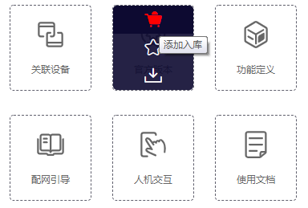
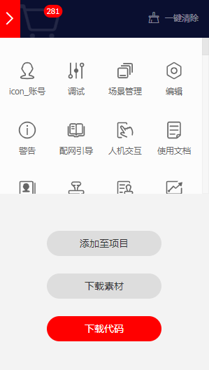
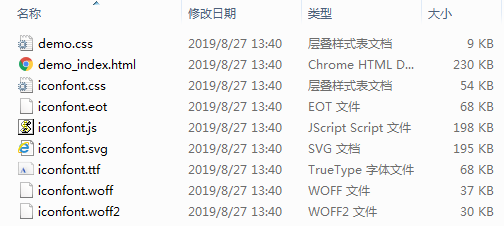
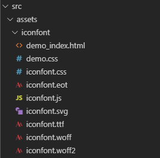
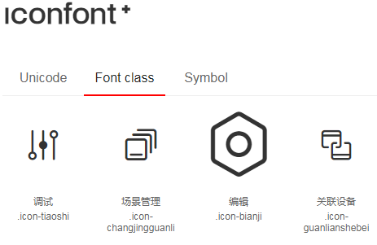
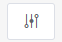

本篇文章将介绍一下如何在`Vue Webpack`项目中引入`IconFont`图标。

IconFont官网：<https://www.iconfont.cn/>

**1、**打开[IconFont官网](https://www.iconfont.cn/ "IconFont官网")并登陆自己的账户。

**2、**挑选你喜欢的图标，添加入库。

**3、**进入购物车查看已挑选的图标，下载代码。

**4、**将下载后的图标代码解压，文件如下。

**5、**将解压文件复制到项目的`src/assets`目录下。

**6、**在`App.vue`中引入`iconfont.css`。

	<template>
	  

	    <router-view/>
	  

	</template>
	 
	
	 
	

**7、**如何使用`IconFont`图标。

在图标代码的解压目录中有一个`demo_index.html`文件，其中包含了所下载的图标用法示例，提供了`Unicode`、`Font class`、`Symbol`三种方式使用图标。

`Font-class`是`Unicode`使用方式的一种变种，主要是解决`Unicode`书写不直观，语意不明确的问题。

例如，在`element`按钮中使用上面的调试图标：

      

        <i id="collapsedIcon" class="iconfont icon-icon_tiaoshi"></i>
      

效果如下：

 