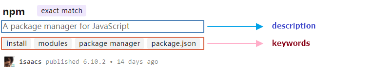

本篇文章我们一起来看一看`npm`的`package.json`的配置细节。

首先，你需要知道的是我们在`package.json`中配置的内容不仅仅是一个`Javascript`对象，它实际上还是一个`JSON`对象。而且这里面有很多配置项的表现都会受到`npm-config`配置文件中一些配置的影响。

下面进入正题，逐个对`package.json`的配置项进行说明。

# name
如果你打算把你的项目打包发布出去，那么名称和版本字段是最重要的，而且是必需的。名称和版本一起构成了一个预设完全唯一的标识符，用以区别不同的包及版本。对程序包做了更改，相应的版本信息也要一起更新。如果你并不打算把你的包发布到npm，那么名称和版本字段就是可选的了。

`name`用来设置包的名称，其内容需遵循以下规则：

- 长度必须小于或等于214个字符。
- 不能以点或下划线开头。
- 不能在名称中包含大写字母。
- 该名称最终会成为URL的一部分、命令行上的参数或者文件夹的名称。因此，名称中不能包含任何非URL安全字符。

另外，还有一些注意事项：

- 请勿使用与核心节点模块相同的名称。
- 不要在名称中加上“js”或“node”。
- 该名称可能会作为参数传递给require()，因此它应该尽量简短，并能合理描述自己。
- 在包发布之前，你可以通过 https://www.npmjs.com/ 来检查npm注册表，看看你的包名称是否已经被使用了。
- 名称可以选择以作用域为前缀，例如@myorg/mypackage，更多细节请参考 npm-scope。

# version
`version`用来设置包的版本，其内容必须是`semver`模块（`npm install semver`进行安装并使用）能够解析的格式。

# description
包的简介，是一个字符串，该内容会显示在`npm search`搜索的结果列表中。

# keywords
包的关键字，是一个字符串数组，该内容也会显示在`npm search`搜索的结果列表中。

# homepage
项目的主页网址。例：

	"homepage": "https://github.com/owner/project#readme"

# bugs
项目用于追踪BUG的`url`或邮件地址。例：

	{
	    "url": "http://github.com/owner/project/issues", 
	    "email": "project@hostname.com"
	}

# license
指定包的使用许可证书，让用户知道允许他如何使用该包，以及你对包使用做的限制。例：

	{ "license" : "BSD-2-Clause" } // BSD或MIT等常用许可证
	{ "license" : "(ISC OR GPL-3.0)" } // 使用多个许可证
	{ "license" : "SEE LICENSE IN <filename>" } // 自定义许可证，许可文件放在包的根目录下

# author与contributors
`author`(作者)是一个人。`contributors`(贡献者)是包含多个人的数组。其中每一个人都是一个包含`name`（必选）、`url`（可选）、`email`（可选）字段的对象，像这样：

	{
	    "name": "Barney Rubble", 
	    "email": "b@rubble.com", 
	    "url": "http://barnyrubble.tumblr.com/"
	}

或者也可以把这个对象简化为一个字符串，npm会给你解析：

	"Barney Rubble <b@rubble.com> (http://barnyrubble.tumblr.com/)"

# files
`files`是一个可选项，用来指定该包作为依赖被安装时需要包括的文件所匹配的模式，文件匹配模式的定义语法与`.gitignore`中类似，但是作用相反。默认值`["*"]`，表示需要包括所有文件。在`files`中配置的文件将无法在`.npmignore`或者`.gitignore`被排除。并且，有一些特定的文件或者目录是包含还是排除是不受`files`配置的影响的。

不管`files`中如何配置，下面这些文件始终都会被包含进来：

- package.json
- README
- CHANGES / CHANGELOG / HISTORY
- LICENSE / LICENCE
- NOTICE
- main 字段中配置的文件

而下面这些文件始终都会被排除：

- .git
- CVS
- .svn
- .hg
- .lock-wscript
- .wafpickle-N
- .*.swp
- .DS_Store
- ._*
- npm-debug.log
- .npmrc
- node_modules
- config.gypi
- *.orig
- package-lock.json

# main
包的入口程序，一般都是指定主程序的脚本文件。例如，执行`require("semver")`，此时会将`main`中配置的 `semver.js`文件中`exports`的对象返回。例：

	"main": "semver.js"

# bin
`bin`用来处理一个包中有多个可执行文件需要被添加到PATH中的情况。例：

	{
	    "bin": {
	        "app-cli": "./cli.js", 
	        "app-ser": "./ser.js"
	    }
	}

当执行`npm install app-cli`时，它会为`cli.js`创建一个符号链接到`/usr/local/bin/app-cli`。

如果你的包只包含一个可执行文件，并且文件名称与包名称相同，那么你可以这么设置：

	{
	    "name": "my-program", 
	    "version": "1.2.5", 
	    "bin": "./path/to/program"
	}

跟下面这样配置的效果是一样的：

	{
	    "name": "my-program", 
	    "version": "1.2.5", 
	    "bin": {
	        "my-program": "./path/to/program"
	    }
	}

# man
指定一个文件或者一个文件数组供man程序使用。

# directories
`directories`用来指示包的文件结构。例：

    "directories": {
        "bin": "./bin", 
        "doc": "./doc", 
        "lib": "./lib", 
        "example": "./example", 
        "man": "./man"
    }

# repository
指定你的代码的存放地址，执行`npm docs`命令会请求该地址。例：

    "repository": {
        "type": "git", 
        "url": "http://github.com/isaacs/npm.git"
    }
    "repository": {
        "type": "svn", 
        "url": "http://v8.googlecode.com/svn/trunk/"
    }

# scripts
`scripts`是一个包含了该包各个生命周期阶段的脚本命令的字典对象，key是生命周期事件，value是要运行的命令。例：

 
    "scripts": {
        "dev": "node build/dev-server.js", 
        "start": "npm run dev", 
        "build": "node build/build.js"
    }

# config
`config`可以用来对包脚本执行的参数进行配置。例：

	{
	    "name": "foo", 
	    "config": {
	        "port": "8080"
	    }
	}

# dependencies
`dependencies`是映射了包名及其版本范围的一个简单对象。

关于指定版本范围的更多内容，请参考`semver` ：

	version // 等于
	>=version // 大于等于
	<version // 小于
	<=version // 小于等于
	~version // 约等于
	1.2.x // 1.2.0, 1.2.1, 等，但不包括1.3.0
	* // 所有
	"" // 空，同*
	version1 - version2 // 同 >=version1 <=version2
	range1 || range2 // 二选一

例：

	{
	    "dependencies": {
	        "foo": "1.0.0 - 2.9999.9999", 
	        "bar": ">=1.0.2 <2.1.2", 
	        "baz": ">1.0.2 <=2.3.4", 
	        "boo": "2.0.1", 
	        "qux": "<1.0.0 || >=2.3.1 <2.4.5 || >=2.5.2 <3.0.0", 
	        "asd": "http://asdf.com/asdf.tar.gz", 
	        "til": "~1.2", 
	        "elf": "~1.2.3", 
	        "two": "2.x", 
	        "thr": "3.3.x"
	    }
	}

你可以用一个`URL`来指定包的版本，在安装包时会从该URL进行下载并替换掉本地的包。

`Git URL`的格式如下：

	<protocol>://[<user>[:<password>]@]<hostname>[:<port>][:][/]<path>[#<commit-ish> | #semver:<semver>]

<protocol> 可以是 `git`，`git+ssh`，`git+http`， `git+https`，或者 `git+file` 中的一个。例：

	git+ssh://git@github.com:npm/cli.git#v1.0.27
	git+ssh://git@github.com:npm/cli#semver:^5.0
	git+https://isaacs@github.com/npm/cli.git
	git://github.com/npm/cli.git#v1.0.27

从`1.1.65`版起，`Git URL`还可以这样来简化配置：

	{
	    "name": "foo", 
	    "version": "0.0.0", 
	    "dependencies": {
	        "express": "expressjs/express", 
	        "mocha": "mochajs/mocha#4727d357ea", 
	        "module": "user/repo#feature/branch"
	    }
	}

从`2.0.0`版本起，我们也使用`npm install -S`或者`npm install --save`来安装本地包，需要指定一个本地的目录：

	../foo/bar
	~/foo/bar
	./foo/bar
	/foo/bar

然后，在package.json中直接引用本地包：

	{
	    "name": "baz", 
	    "dependencies": {
	        "bar": "file:../foo/bar"
	    }
	}

# devDependencies
如果有人要使用你的模块，那么他们可能不需要你开发时使用的外部测试或者文档框架。在这种情况下，最好将这些额外的模块列在devDependencies中。例：

	{
	    "name": "ethopia-waza", 
	    "description": "a delightfully fruity coffee varietal", 
	    "version": "1.2.3", 
	    "devDependencies": {
	        "coffee-script": "~1.6.3"
	    }, 
	    "scripts": {
	        "prepublish": "coffee -o lib/ -c src/waza.coffee"
	    }, 
	    "main": "lib/waza.js"
	}

`prepublish`脚本会在`publishing`前运行，这样用户就不用自己去`require`来编译就能使用。并且在开发模式中（比如本地运行`npm install`）会运行这个脚本以便更好地测试。

# optionalDependencies
如果你希望在引入某些依赖出错时不会导致你的整个`install`操作失败，你可以把它们放在`optionalDependencies hash`中。`optionalDependencies`会覆盖`dependencies`中同名的项，所以通常同一个依赖最好只在其中一个地方引入。

# engines
指定`node`的版本：

	{
	    "engines": {
	        "node": ">=0.10.3 <0.12"
	    }
	}

并且，像`dependensies`一样，如果你不指定版本或者指定`*`作为版本，那么所有版本的node都可以。

如果指定一个`engines`字段，那么npm会需要node在里面，如果`engines`被省略，npm会假定它在node上工作。

你也可以用`engines`字段来指定哪一个npm版本能更好地初始化你的程序，如：

	{
	    "engines": {
	        "npm": "~1.0.20"
	    }
	}

记住，除非用户设置`engine-strict`标记，这个字段只是建议值。

# os
指定你的模块可以运行在哪些操作系统中：

	"os" : [ "darwin", "linux" ]

你也可以用黑名单代替白名单，在名字前面加上“!”就可以了：

	"os" : [ "!win32" ]

操作系统用process.platform来检测。

# cpu
指定你的模块可以运行在哪些类型的cpu：

	"cpu" : [ "x64", "ia32" ]

或者使用黑名单替代白名单：

	"cpu" : [ "!arm", "!mips" ]

cpu类型用`process.arch`检测。

# private
如果设置`"private": true`，npm将拒绝发布它。

# publishConfig
npm发布包时的配置，可选的配置项请参考`npm-config` 。

# 参考文章

<https://docs.npmjs.com/files/package.json>

<https://docs.npmjs.com/misc/config>

<https://docs.npmjs.com/misc/scope>

<https://github.com/isaacs/node-semver>

<https://docs.npmjs.com/misc/semver>

<https://spdx.org/licenses/>

<https://docs.npmjs.com/misc/scripts>