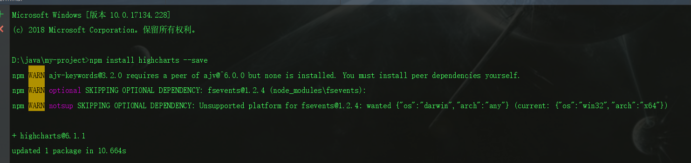
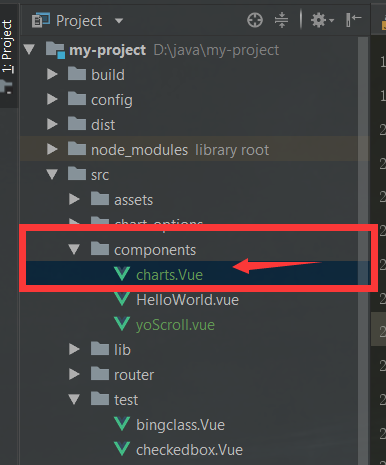
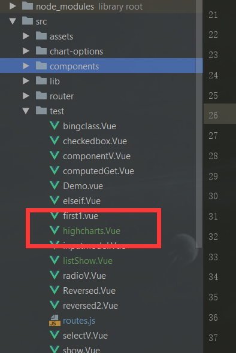
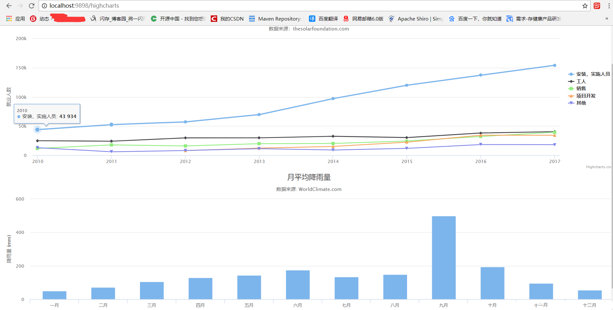

> 原文链接：<https://blog.csdn.net/Crazy_Cw/article/details/82216832>

# 配置highcharts环境
如果你只是自己单独的写个测试`demo`，请先安装`highcharts`，命令：

	npm  install highcharts  --save

# 新建组件

在`src`-->`components`(组件目录下)，新建一个`charts.vue`页面，代码如下：

	<template>
	  

	    

	  

	</template>
	

# 编辑视图

新建一个页面`highcharts.vue`测试页面，代码如下：

	<template>
	  

	    <x-chart id="highcharts" class="high" :option="option"></x-chart>
	    <x-chart id="high" class="high" :option="option1"></x-chart>
	  

	</template>
	
	

# 运行结果

 