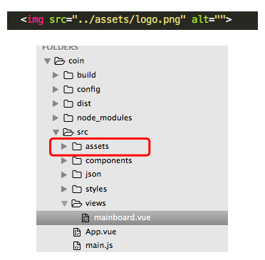
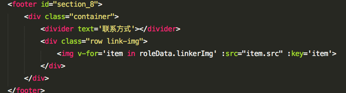
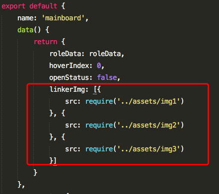
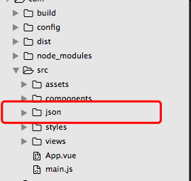
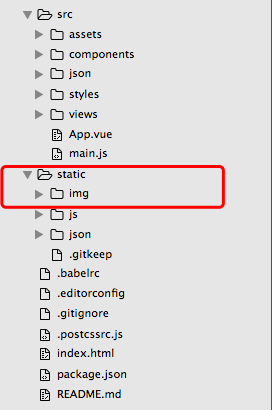
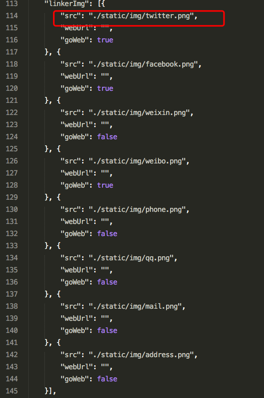
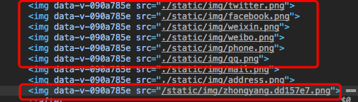
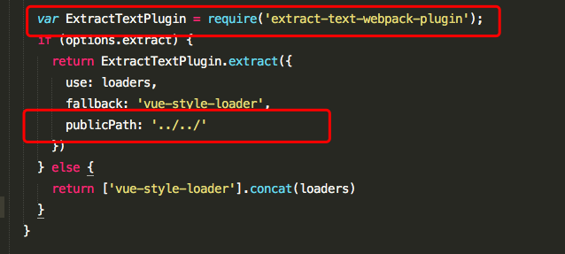

> 原文链接：<https://www.cnblogs.com/xiaojingyuan/p/7080768.html>

# 本地图片动态绑定img的src属性
一般我们在html中或者vue组件文件中引用图片是这样，这是不需要做特别处理的。

我们将图片放入`assets`中或者重新建立个文件夹`img`什么的都可以，随意～。

但是我们这时候可能会有个需求就是我们要动态绑定一组本地图片。

将图片当成模块先引进来，再绑定。

但是这种做法局限性比较大，模块化差，代码不好看 。

如果我做的是纯静态的网站展示，有许多的本地静态资源需要加载，里面包括本地数据和本地图片混合的好几组，那不是要麻烦死～。

## 三步解决问题
第一步我们在`src`下面建立一个`json`文件夹里面放置静态的`json`数据。

第二步将所有的静态图片资源放在和`src`同级目录下的`static`文件夹下。

第三步你的路径可以写成自然的`../../static/img/xxx.png`也可以按照红框中的写法（这种写法对应的是编译后文件的目录）。

这样子按照平常的动态绑定`src`属性你的图片路径在开发模式下和生产模式下的图片资源路径都是不会出问题的。

## 小问题
但也有个问题就是这种方式引用图片是不会被`url`等加载器处理的。

上面的红框都是这种方式，最下面的红框是用`require`的方式将图片引进来的（被当成模块被`url-loader`处理，加入了`hash`值）。

这个需要看网站本身的性质和具体业务以及个人取舍了，当然也可以混合着用，灵活一点没有死的处理方法！

# css中的本地图片路径在打包后的问题
你的项目在开发模式下`css`中用`url()`引用图片是正常的，但是打包后图片路径却并没有被处理或者说特别怪异。导致本地图片资源无法加载，是不是有这样的困惑？

只需要在原有的一个插件上添加一段代码即可：

这个插件大家又应该都比较熟悉，就是将`css`从打包中单独提取出来作为一个文件夹，上面这个是`vue-cil`的编译模板，大家可以根据这个参考一下

`publicPath`这个配置属性的具体其他用法大家可以去官网看看，或者看看源码。了解更多！