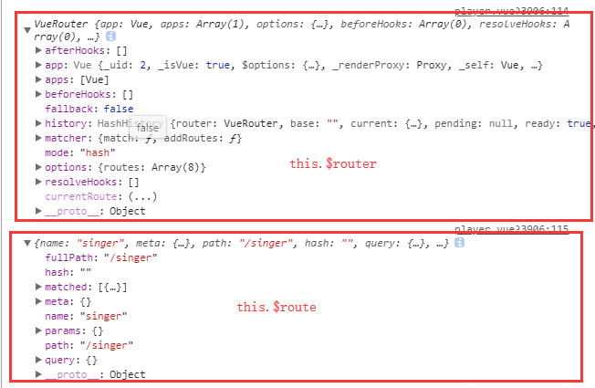

> 原文链接：<https://segmentfault.com/a/1190000012735168>

今天做项目时踩到了`vue-router`传参的坑（`query`和`params`），所以决定总结一下二者的区别。

直接总结干货！！！

# query方式传参和接收参数

**传参:**

	this.$router.push({
	    path:'/xxx',
	    query:{
	      id:id
	    }
	})
  
**接收参数:**

	this.$route.query.id

> 注意:传参是`this.$router`,接收参数是`this.$route`,这里千万要看清了！！！

`this.$router`和`this.$route`**有何区别？**

在控制台打印两者可以很明显的看出两者的一些区别：

1. $router为VueRouter实例，想要导航到不同URL，则使用$router.push方法
2. $route为当前router跳转对象，里面可以获取name、path、query、params等

# params方式传参和接收参数

**传参:** 

	this.$router.push({
		name:'xxx',
		params:{
		  id:id
		}
	})
  
**接收参数:**

	this.$route.params.id

> 注意:`params`传参，`push`里面只能是`name:'xxxx'`,不能是`path:'/xxx'`,因为`params`只能用`name`来引入路由，如果这里写成了`path`，接收参数页面会是`undefined`！！！

另外，二者还有点区别，直白的来说`query`相当于`get`请求，页面跳转的时候，可以在地址栏看到请求参数，而`params`相当于`post`请求，参数不会再地址栏中显示。