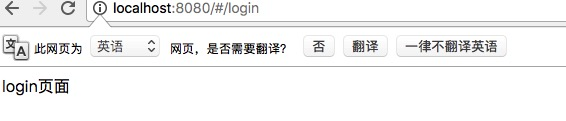

> 原文链接：<https://blog.csdn.net/hong10086/article/details/89684772>

# vue-router按需加载
vue的单页面`（SPA）`项目,必然涉及路由按需的问题。以前我们是这么做的。

	// require.ensure是webpack里面的，这样做会将单独拉出来作为一个chunk文件
	const Login = r => require.ensure( [], () => r (require('../component/Login.vue')));

但现在`vue-router`的官网看看，推荐这种方式：

	// vue异步组件和webpack的【代码分块点】功能结合，实现了按需加载
	const App = () => import('../component/Login.vue');

可是，很多情况下，我们这么写`npm run dev`控制台直接报错:Module build failed: SyntaxError: Unexpected token，这是为什么呢？

原来是`import`这儿报错了，这就需要`babel`的插件了，`vue-router`官网上有一段提示：

> 如果您使用的是 Babel，你将需要添加`syntax-dynamic-import`插件，才能使`Babel`可以正确地解析语法。

至此，问题全部解决了。

如果使用`vue-cli`生成项目，很可能在`babel-loader`没有配置上面的插件，这时需要我们自己去安装此插件：

	cnpm install babel-plugin-syntax-dynamic-import --save-dev

然后修改`webpack`的js的`loader`部分：

      {
        test: /\.js$/,
        loader: 'babel-loader',
        options: {
          plugins: ['syntax-dynamic-import']
        },
        include: [resolve('src'), resolve('test'), resolve('node_modules/webpack-dev-server/client')]
      },

增加了option选项，至此，能识别我们的语法了：

	const App = () => import('../component/Login.vue');

页面出来了：

在打包的时候，发现我们如果只是这么写，出现的`chunk`包名字都是乱的，如果我们指定命名，该怎么办呢？`webpack3`提供了`Magic Comments`（魔法注释）

	const App = () => import(/* webpackChunkName:'login'*/ '../component/Login.vue');

这样我们就为打包出来的`chunk`指定一个名字，最终生成`login.js`的`chunk`包。