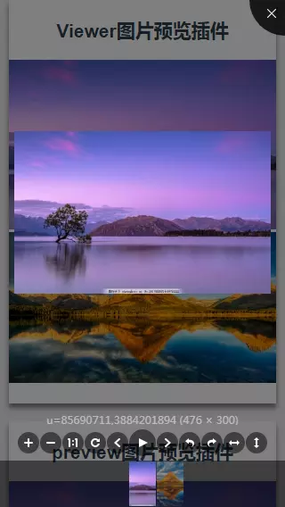
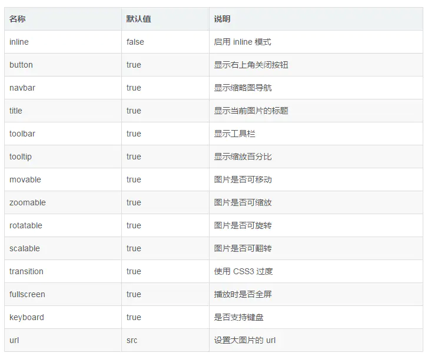

> 原文链接：<https://www.jianshu.com/p/e3350aa1b0d0>

在看项目时，突然看到预览图片的弹窗，感觉好僵硬，不能放大，不能切换，于是便在网上找下关于图片预览的插件，有找到三个插件，具体的优劣势的看自己的使用吧，我目前只是在电脑查看效果，分别是[viewerjs插件](https://github.com/fengyuanchen/viewerjs "viewerjs插件")、基于`photoswipe`的[vue-photo-preview插件](https://github.com/dimsemenov/PhotoSwipe "vue-photo-preview插件")以及[vue-picture-preview插件](https://github.com/xLogic92/vue-picture-preview "vue-picture-preview插件")。

# viewerjs

## 安装依赖

	npm install v-viewer --save

## main.js内引用并注册调用

	//main.js
	import Viewer from 'v-viewer'
	import 'viewerjs/dist/viewer.css'
	 
	Vue.use(Viewer);
	Viewer.setDefaults({
	  Options: { "inline": true, "button": true, "navbar": true, "title": true, "toolbar": true, "tooltip": true, "movable": true, "zoomable": true, "rotatable": true, "scalable": true, "transition": true, "fullscreen": true, "keyboard": true, "url": "data-source" }
	});

## 代码中使用xxx.vue

	<template>
	    

	        <h1>Viewer图片预览插件</h1>
	        <viewer :images="imgs">
	            
	        </viewer>
	   

	</template>
	

# vue-photo-preview

## 安装依赖

	npm install vue-photo-preview --save

## main.js内引用并注册调用

	//main.js
	import preview from 'vue-photo-preview'
	import 'vue-photo-preview/dist/skin.css'
	Vue.use(preview)

## 代码中使用xxx.vue

	<template>
	    

	       <section>
	        <h1>preview图片预览插件</h1>
	        
	    </section>
	   

	</template>
	

`option`配置请查看<http://photoswipe.com/documentation/options.html>

# vue-picture-preview

## 安装依赖

	npm install vue-picture-preview --save

## main.js内引用并注册调用

	//main.js
	iimport vuePicturePreview from 'vue-picture-preview'
	Vue.use(vuePicturePreview)

## 在根组件添加lg-preview 组件的位置

	<!-- APP.vue -->
	

	    <router-view></router-view>
	    <lg-preview></lg-preview>
	

## 代码中使用xxx.vue

	<template>
	    

	        <h1>vuePicturePreview图片预览插件</h1>
	        
	   

	</template>
	

# 总结
这三个插件介绍完了，除了第三种`vue-picture-preview`插件只有预览和切换上下张功能，另外两种都有放大和缩小（包括手势）以及其他功能。还是蛮好上手的插件，但我是更喜欢第一种。