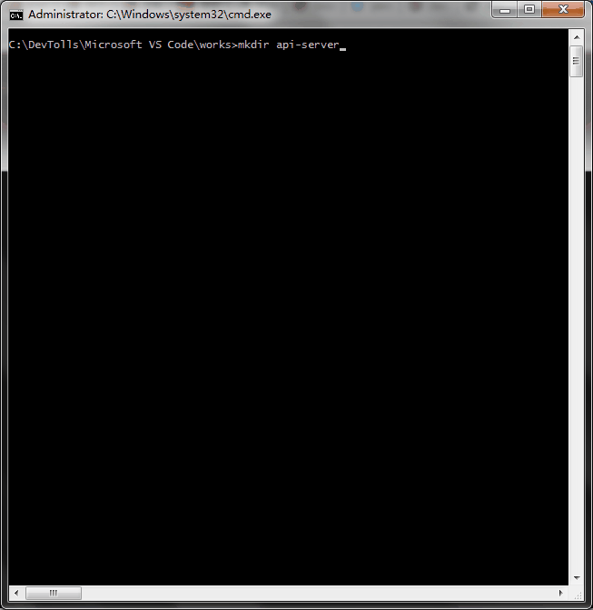
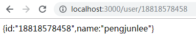
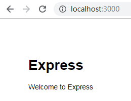
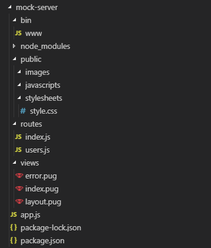
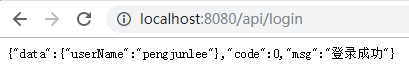

# Express简介
`Express`是一个基于`Node.js`平台，快速、开放、极简的Web开发框架。`Express`在`node.js`基础上扩展了Web应用所需的功能，并提供了丰富的HTTP实用工具以及来自Connect框架的中间件，使得创建强健、友好的API变得快速而且简单。

# NodeJS下安装Express

	npm install express -g // 全局安装
	npm install express --save // 项目本地安装

# 模拟接口数据
## 创建本地应用
打开命令行窗口，切换到要创建应用的目录下，执行如下命令完成项目创建。

	// 创建项目目录
	mkdir api-server
	 
	// 进入项目目录
	cd api-server
	 
	// 生成项目的 package.json 文件，此命令需要输入几个参数，参见下图
	npm init
	 
	// 引入依赖
	npm install express --save

如图所示，本例中项目的入口文件名称被指定为`server.js`（默认为`index.js`），在项目根目录下创建 `server.js`，内容如下：

	const express = require('express');
	const app = express();
	 
	// 模拟字符串数据
	app.get('/user/18818578458', (req, res) => res.send('{id:"18818578458",name:"pengjunlee"}'));
	 
	// 模拟HTML数据
	app.get('/index', function getHome(req,res,next){
	    res.setHeader('Content-Type', 'text/html');
	    res.sendfile(`${__dirname}/index.html`);
	})
	 
	app.listen(3000, () => console.log('Example app listening on port 3000!'));

然后，执行如下命令启动项目并监听`3000`端口：

	node server.js

访问<http://localhost:3000/user/18818578458>，返回如下内容：

## 使用Express-Generator创建应用
通过应用生成器工具`express-generator`可以快速创建一个应用的骨架。`express-generator`包含了`express`命令行工具。通过如下命令即可安装：

	npm install express-generator -g

`-h`参数可以列出所有可用的命令行参数：

	> express -h
	 
	Usage: express [options] [dir]
	 
	Options:
	 
	-h, --help // 输出使用方法
	--version // 输出版本号
	-e, --ejs // 添加对 ejs 模板引擎的支持
	--hbs // 添加对 handlebars 模板引擎的支持
	--pug // 添加对 pug 模板引擎的支持
	-H, --hogan // 添加对 hogan.js 模板引擎的支持
	--no-view // 创建不带视图引擎的项目
	-v, --view <engine> // 添加对视图引擎（view） <engine> 的支持 (ejs|hbs|hjs|jade|pug|twig|vash) （默认是 jade 模板引擎）
	-c, --css <engine> // 添加样式表引擎 <engine> 的支持 (less|stylus|compass|sass) （默认是普通的 css 文件）
	--git // 添加 .gitignore
	-f, --force // 强制在非空目录下创建

例如，如下命令创建了一个名称为`mock-server`的`Express`应用。此应用将在当前目录下的`mock-server`目录中创建，并且设置为使用`Pug`模板引擎（view engine）：

	> express --view=pug mock-server
	 
	create : mock-server\
	create : mock-server\public\
	create : mock-server\public\javascripts\
	create : mock-server\public\images\
	create : mock-server\public\stylesheets\
	create : mock-server\public\stylesheets\style.css
	create : mock-server\routes\
	create : mock-server\routes\index.js
	create : mock-server\routes\users.js
	create : mock-server\views\
	create : mock-server\views\error.pug
	create : mock-server\views\index.pug
	create : mock-server\views\layout.pug
	create : mock-server\app.js
	create : mock-server\package.json
	create : mock-server\bin\
	create : mock-server\bin\www
	 
	change directory:
	> cd mock-server
 
	install dependencies:
	> npm install
 
	run the app:
	> SET DEBUG=mock-server:* & npm start

然后，切换到项目目录，安装所有依赖包：

	> cd mock-server
	> npm install
	
在`MacOS`或`Linux`中，通过如下命令启动此应用：

	$ DEBUG=mock-server:* npm start

在`Windows`中，通过如下命令启动此应用：

	> set DEBUG=mock-server:* & npm start
	
然后在浏览器中打开<http://localhost:3000/>网址就可以看到这个应用了。

通过生成器创建的`mock-server`应用目录结构如下：

# webpack项目中使用Express
旧版的`webpack`项目是在`dev-server.js`文件中配置的模拟数据，新版的`webpack`项目已经去掉了`dev-server.js`和`dev-client.js`，模拟数据改为在`webpack.dev.conf.js`中进行配置。

首先切换到项目目录，执行`npm install express --save`为项目安装`express`。然后在`webpack.dev.conf.js` 的如下两处位置添加代码。

	/* 。。。 */
	const portfinder = require('portfinder')
	 
	/* ====== 要插入的第一段代码开始 ====== */
	 
	// 引入express
	const express = require("express")
	const bodyParser = require('body-parser');
	 
	 
	// 创建express实例
	const app = express()
	 
	// 解析application/json
	var jsonParser = bodyParser.json();
	 
	// 解析application/x-www-form-urlencoded
	// var urlencodedParser = bodyParser.urlencoded({extended: false});
	 
	// 读取/mock/login.json中的json数据
	var loginData = require("../src/mock/login.json")
	 
	/* ====== 要插入的第一段代码结束 ====== */
	 
	const HOST = process.env.HOST
	const PORT = process.env.PORT && Number(process.env.PORT)
	 
	const devWebpackConfig = merge(baseWebpackConfig, {
	  /* 。。。 */
	  devServer: {
	    /* 。。。 */
	    watchOptions: {
	      poll: config.dev.poll,
	    },
	    /* ====== 要插入的第二段代码开始 ====== */
	    before(app) { // localhost:8080/api/login
	      app.post("/api/login",jsonParser, (req, res) => {
	        if(!req.body) return res.sendStatus(400);
	        res.send(loginData[req.body.name === 'admin' ? 'admin':'other']);
	        // res.json(loginData);
	      })
	    }
	    /* ====== 要插入的第二段代码结束 ====== */
	  },
	  /* 。。。 */
	})

执行`npm run dev`命令重启应用，访问<http://localhost:8080/api/login>即可获取到我们定义的Json数据。

# 使用Express托管静态文件
如果需要使用`Express`对外提供诸如图像、`CSS`和`JavaScript`之类的静态文件，可以使用`Express`中的 `express.static`内置中间件函数。例如，通过如下代码就可以将`public`目录下的图片、`CSS`文件、`JavaScript `文件对外开放访问了：

	app.use(express.static('public'))

现在，你就可以访问`public`目录中的所有文件了。

	http://localhost:3000/images/logo.png

你也可以为你的资源指定一个虚拟的访问路径，例如：

	app.use('/static', express.static('public'))

现在，你就可以通过带有`/static`前缀地址来访问`public`目录中的文件了。

	http://localhost:3000/static/images/logo.png

`Express`在静态资源文件夹中查找文件，因此，存放静态资源的文件夹的目录名不会出现在URL中。如果要使用多个静态资源目录，请多次调用`express.static`中间件函数：

	app.use('/public', express.static('public'))
	app.use('/files', express.static('files'))

访问静态资源文件时，`express.static`中间件函数会根据目录的添加顺序查找所需的文件。

需要注意的是，`express.static`函数的`path`参数的路径是相对于`express`实例的启动目录来说的，如果你的 `express`实例是从其他目录启动的，很有可能会出现传入的`path`路径找不到的情况，安全一点的做法就是使用绝对路径。

	app.use('/static', express.static(path.join(__dirname, 'public')))
 