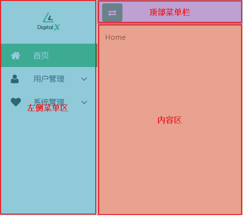

文章系列：

- 基于Vue的管理后台设计（布局篇）
- 基于Vue的管理后台设计（登录鉴权篇）
- 基于Vue的管理后台设计（打包部署篇）

# 前言 
我打算把接下来要写的几篇文章写成一个系列，用来记录一下如何基于Vue一步一步地搭建一个后台管理系统。 

文章前传：

- 《Vue组件中引入jQuery》
- 《Webpack项目中引入Bootstrap4.x》
- 《Webpack项目中使用ToolTipster》

本篇文章就是这个系列的第一篇，将对整个系统的页面布局进行设计。在菜单目录树的实现中我们还将使用到前一篇《前端无小事--Webpack项目中使用ToolTipster》中创建好的提示框组件，最终实现的页面效果如下。

# Layout.vue
整个页面的布局分为三块区域：左侧菜单区、顶部菜单栏和内容区。

下面是它的完整代码：

	<template>
	  

	    

	      

	        
	      

	      

	        <v-menu v-for="(menu,index) in this.menu_list" :key="index" :menu="menu" :status="status"></v-menu>
	      

	    

	 
	    

	      

	        <i class="icon-exchange"></i>
	      

	    

	    

	      

	        <router-view></router-view>
	      

	    

	  

	</template>
	
	

# MenuItem.vue
MenuItem是一个自定义的菜单组件，每一个一级菜单都会被渲染成一个MenuItem实例，并包含了该一级菜单下面的二级菜单。

	<template>
	  

	    

	      <vue-tooltipster
	        :tooltipsterOptions="{side:'right'}"
	        v-if="hasChildren && status.isCollapsed"
	      >
	        

	          
	            <i v-bind:class="menu.icon"></i>
	          
	        

	        

	          <li
	            class="tip-menu"
	            v-for="(submenu,index) in menu.children"
	            :key="index"
	            :title="submenu.title"
	            @click="tipMenuClick($event)"
	          >
	            {{submenu.title}}
	          </li>
	        

	      </vue-tooltipster>
	      

	        
	          <i v-bind:class="menu.icon"></i>
	        
	        {{menu.title}}
	        
	          <i v-if="showSubMenu" class="menu-arrow icon-angle-up icon-large"></i>
	          <i v-else class="menu-arrow icon-angle-down icon-large"></i>
	        
	      

	      <ul class="menu-box l2" v-if="showSubMenu && hasChildren && !status.isCollapsed">
	        <li
	          v-for="(submenu,index) in menu.children"
	          :key="index"
	          :class="submenu.title==status.currentMenu? 'menu-item current-menu':'menu-item'"
	          :title="submenu.title"
	          @click="subMenuClick($event)"
	        >
	          
	          {{submenu.title}}
	        </li>
	      </ul>
	    

	  

	</template>
	
	

`==============================我是分割线===============================`

如果你想和我一样自己写一个目录树组件，我的建议是 最好不要自己写 ，原因很简单 可能出现的意外太多了，你很难能考虑到所有情况。所以，你的目录树组件好用不好用还不一定。我上面自己写的那个组件在实际使用时就出现了问题：当用户直接在地址栏输入地址时，如何定位到菜单；当用户输入一个错误的地址时，菜单要如何展示；云云。。。

明智的做法是使用开源的组件，省得去重复造轮子，关键是稳定性也是经过大家考验的。

例如，我使用的是[Element](https://element.eleme.cn/#/zh-CN "Element")，对上面的布局进行调整后代码如下：

	<template>
	  

	    

	      

	        
	      

	      

	        <el-menu
	          text-color="#000000"
	          active-text-color="#ffffff"
	          router
	          unique-opened
	          :collapse="status.isCollapsed"
	          :default-active="$route.path"
	        >
	          <template v-for="(menu, index) in menu_list">
	            <el-menu-item class="menu-item" v-if="!menu.children" :index="menu.path" :key="index">
	              <i :class="menu.icon" style="font-size:24px;"></i>
	              {{menu.title}}
	            </el-menu-item>
	            <el-submenu v-else :index="menu.path">
	              <template slot="title">
	                <i :class="menu.icon" style="font-size:24px;"></i>
	                {{menu.title}}
	              </template>
	              <el-menu-item
	                class="menu-item"
	                v-for="(subMenu, subIndex) in menu.children"
	                :index="subMenu.path"
	                :key="subIndex"
	              >
	                {{subMenu.title}}
	              </el-menu-item>
	            </el-submenu>
	          </template>
	        </el-menu>
	      

	    

	 
	    

	      

	        <i id="collapsedIcon" class="el-icon-s-fold"></i>
	      

	    

	    

	      

	        <router-view></router-view>
	      

	    

	  

	</template>
	
	

代码少了不少，是不是清爽了许多！！！