文章系列：

- 基于Vue的管理后台设计（布局篇）
- 基于Vue的管理后台设计（登录鉴权篇）
- 基于Vue的管理后台设计（打包部署篇）

管理后台终于开发完了，本篇就来说一说如何打包和部署。

# vue-cli项目打包
`vue-cli`项目开发完成之后，我尝试执行`npm run build`命令构建生产包，并部署到`tomcat`。结果，一启动，吓我一跳，全是404。

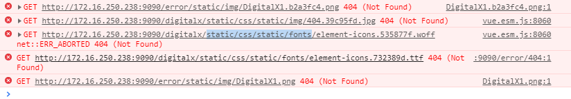

通过查看别人的博客，发现打包之前还需要对`build/uitls.js`和`config/index.js`进行少量配置。

修改`build/uitls.js`，在图示位置增加`publicPath: '../../'`配置项。

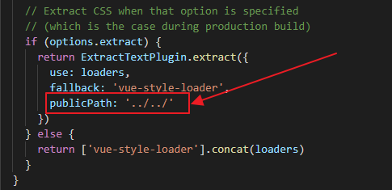

修改`config/index.js`，将`assetsPublicPath: '/'`改为`assetsPublicPath: './'`（多加了一个点号 ）。

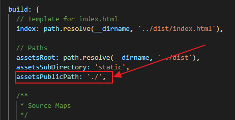

遗憾的是，我的项目按照上面的配置进行修改之后部分js资源的依然找不到。猜测是由于我的项目不是部署在`tomcat`的`webapps`根目录下，而是部署在`tomcat/webapps/digitalx`目录下，于是对`config/index.js`再进行修改将项目直接打包到`/dist/digitalx`目录下。

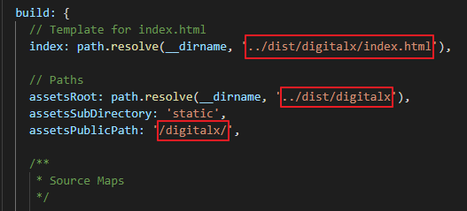

终于，`404`问题解决了。

# 生产环境请求跨域
在开发环境中跨域可以在`config/index.js`中对`proxyTable`进行配置，例如。

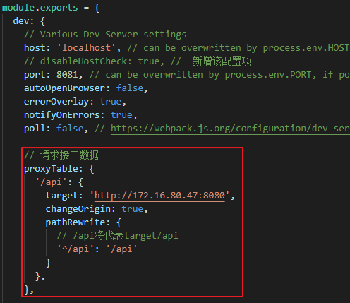

请求数据时URL前加上`/api`就可以跨域请求`http://172.16.80.47:8080/api`下面的接口了。

	this.jsonAxios.post("/api/v1/login", { name: name, password: password })

但是这种跨域解决方案只适用于开发环境，并不能应用在生产环境。接下来贴出网上找到的一种同时适用于生产环境和开发环境的跨域解决办法。

## 设置不同的接口地址
先找到以下文件：

	/config/dev.env.js
	/config/prod.env.js

可以看到`dev.env.js`里面内容如下：

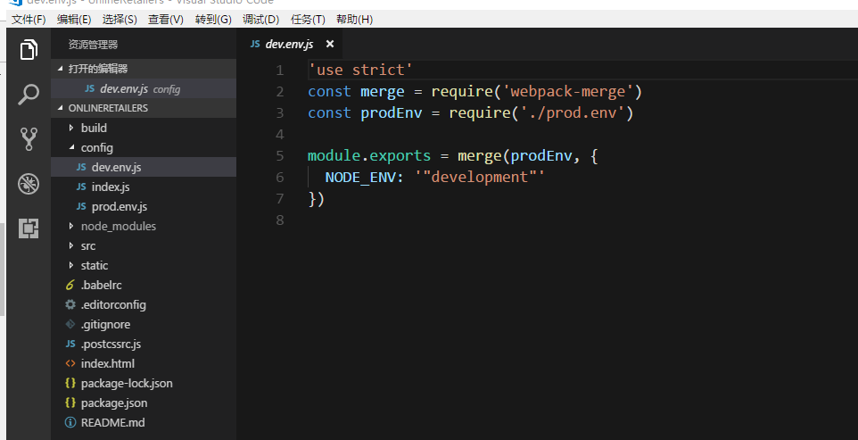

这是生产环境的参数配置，然后我们可以再上面文件加入一行代码，如下：这就是本地测试环境请求后台接口的域名

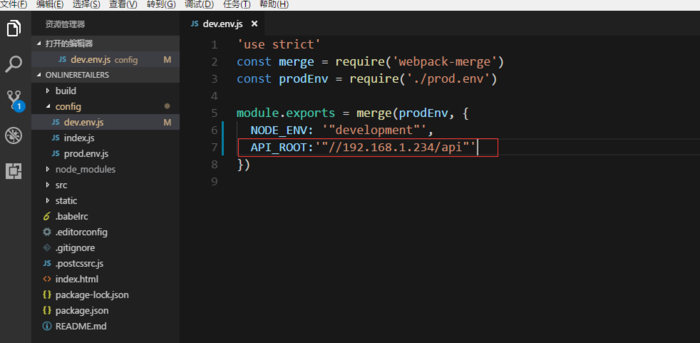

然后找到`prod.env.js`文件，如下：

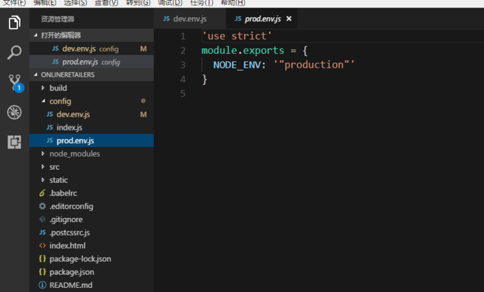

我们加入一行代码，如下：这是我们上传服务器以后，请求后台接口的域名.

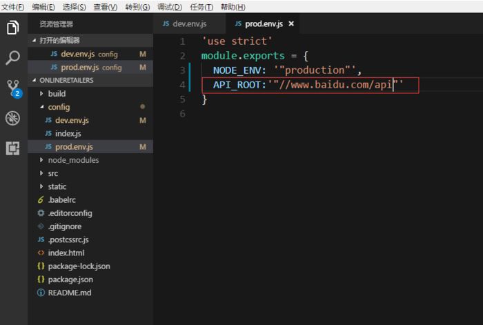

## 在代码中调用设置好的参数
比如我在本项目中重新封装`axios`(api文件在`/src/api/index.js`中)，将配置好的接口地址作为`baseURL`拼接到接口路径中，应用参数部分如下：

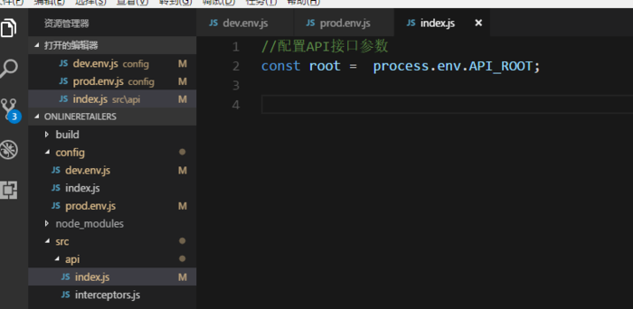

最后重新启动项目就可以了，当`npm run dev`的时候就运行在生产环境，当`npm run build`的时候就是正式的线上环境。

# Springboot后台跨域
vue项目跨域配置完了之后请求能够正常发送，但是由于Springboot后台禁止跨域请求，所以出现了如下`403`错误。

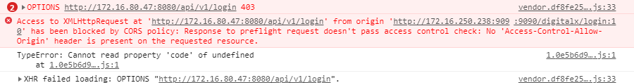

**解决办法：**

	import org.springframework.context.annotation.Configuration;
	import org.springframework.web.servlet.config.annotation.CorsRegistry;
	import org.springframework.web.servlet.config.annotation.WebMvcConfigurer;
	 
	/**
	 * @author pengjunlee
	 * @create 2019-09-11 17:29
	 */
	@Configuration
	public class WebMvcConfig implements WebMvcConfigurer {
	 
	    public void addCorsMappings(CorsRegistry registry) {
	        registry.addMapping("/**")
	                // 允许任何域名请求
	                .allowedOrigins("*")
	                // 允许的请求类型
	                .allowedMethods("POST", "GET", "PUT", "OPTIONS", "DELETE")
	                // 响应的最大缓存时间
	                .maxAge(3600)
	                // 允许携带鉴权信息
	                .allowCredentials(true)
	                // 允许返回的响应头列表
	                .exposedHeaders("access-control-allow-headers",
	                        "access-control-allow-origin",
	                        "access-control-allow-methods",
	                        "access-control-max-age",
	                        "x-Authorization-With");
	    }
	}

# 请求Url报错
项目部署完成之后，输入`http://172.16.250.238:9090/digitalx`终于可以正常访问了，但是当我刷新浏览器或者在地址栏中输入任意其他地址时神奇的`404`又出现了。

**解决办法：**

在`tocmat`的`webapps`下的项目根目录中创建一个`WEB-INF`文件夹，并在文件夹中新建一个`web.xml`文件。内容如下：

	<?xml version="1.0" encoding="UTF-8"?>
	<web-app xmlns="http://xmlns.jcp.org/xml/ns/javaee" xmlns:xsi="http://www.w3.org/2001/XMLSchema-instance"
	xsi:schemaLocation="http://xmlns.jcp.org/xml/ns/javaee
	http://xmlns.jcp.org/xml/ns/javaee/web-app_3_1.xsd"
	version="3.1" metadata-complete="true">
	<display-name>Router for Tomcat</display-name>
	<error-page>
	<error-code>404</error-code>
	<location>/index.html</location>
	</error-page>
	</web-app>

# 参考文章

<https://www.cnblogs.com/goloving/p/8901189.html>

<https://www.jianshu.com/p/9a4690f5bdce>
 