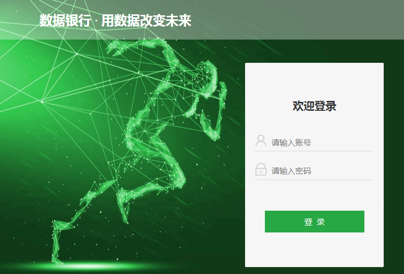
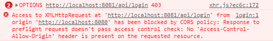
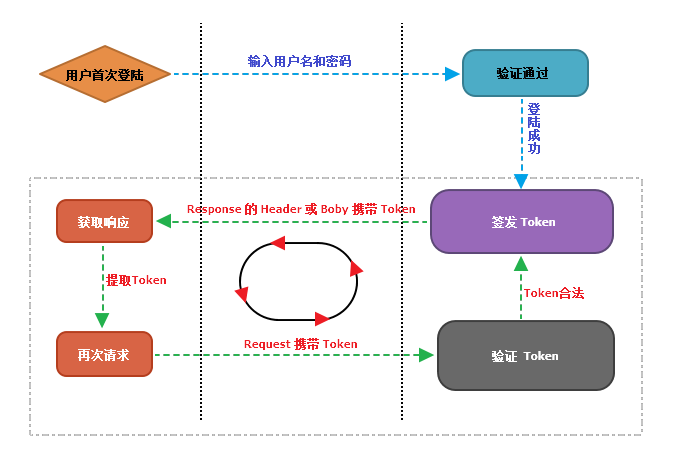

文章系列：

- 基于Vue的管理后台设计（布局篇）
- 基于Vue的管理后台设计（登录鉴权篇）
- 基于Vue的管理后台设计（打包部署篇）

页面布局设计完，本篇接着来说一说登录与鉴权。

# Login.vue
首先你需要有一个登录页面，在这里我直接从网上`download`了一个，页面效果如图所示：

下面是登录页面的完整代码：

	<template>
	  

	    
数据银行&nbsp;·&nbsp;用数据改变未来

	    

	      

	        
欢迎登录

	        

	          
	          <input placeholder="请输入账号" type="text" id="name" />
	        

	        

	          
	          <input placeholder="请输入密码" type="password" id="password" />
	        

	        

	        <button type="button" class="logBut" @click="login">登&nbsp;&nbsp;录</button>
	      

	    

	  

	</template>
	 
	
	 
	

其中，`jsonAxios`用来向后台发送`HTTP`请求并获取`Json`类型的响应数据，然后根据响应结果的状态码来决定是否允许登录。

# 关于跨域
在`Login.vue`中使用`jsonAxios`发送登录请求时，由于我的后台项目（`8081`）与我的Vue项目（`8080`）的端口号不同，存在`CORS`跨域问题，发送请求时浏览器端提示如下错误。

**解决办法**：

在`config/index.js`中对`proxyTable`进行配置，设置请求时所使用的代理映射表。

	dev: {
	host: 'localhost', 
	disableHostCheck: true, 
	port: 8080, 
	autoOpenBrowser: false,
	errorOverlay: true,
	notifyOnErrors: true,
	poll: false, 
	
	// 请求接口数据
	proxyTable: {
	  '/api': {
	    target: 'http://localhost:8081',
	    changeOrigin: true,
	    pathRewrite: {
	      // /api将代表target/api
	      '^/api': '/api'
	    }
	  }
	},
	
	// ...
	}

上面这段代码的作用是将本地`8080`端口的请求代理到`http://localhost:8081`：

	'http://localhost:8080/api/login' ===> 'http://localhost:8081/api/login'

# 路由鉴权
正常来说，只有当用户登录之后才能访问登录页面以外的其他页面。所以，我们需要在定义路由时为这些需要登录才能访问的路由多添加一个自定义字段`requireAuth`，用于判断访问该路由是否需要先登录。

	import Layout from '../components/layout/Layout'
	 
	const loginRouter = [
	    {
	        path: '/',
	        name: 'default',
	        redirect: '/login'
	    },
	    {
	        path: '/login',
	        name: 'login',
	        meta: {
	            title: '登录'
	        },
	        component: () => import('../components/login/Login')
	    }
	];
	const errorRouter = {
	    path: '/error',
	    component: Layout,
	    children: [
	        {
	            path: '404',
	            name: '404',
	            meta: {
	                title: '404'
	            },
	            component: () => import('../components/error/404')
	        }
	    ]
	};
	const digitalRouter = [
	    {
	        path: '/',
	        component: Layout,
	        meta: {
	            requireAuth: true,  // 需要登录才能访问
	        },
	        children: [
	            {
	                path: 'home',
	                name: 'home',
	                meta: {
	                    title: '首页'
	                },
	                component: () => import('../components/home/Home')
	            }
	        ]
	 
	    }, {
	        path: '/user',
	        component: Layout,
	        meta: {
	            requireAuth: true,  // 需要登录才能访问
	        },
	        children: [
	            {
	                path: 'roles',
	                name: 'roles',
	                meta: {
	                    title: '用户角色'
	                },
	                component: () => import('../components/user/Roles')
	            }
	        ]
	 
	    }
	];
	 
	export const routers = [
	    ...loginRouter,
	    errorRouter,
	    ...digitalRouter
	];

定义完路由之后，我们就能够在路由跳转时，通过`router.beforeEach()`方法对当前用户的登录状态进行判断。若用户已经登录，则允许跳转至下一路由，否则就跳转回登录页。

	const router = new VueRouter({ ... })
	 
	router.beforeEach((to, from, next) => {
	  // ...
	})

`router.beforeEach()`方法在从当前路由跳转至下一路由之前会被调用，该方法方法接收三个参数，以下是官方文档中给出的参数说明：

- to: Route: 即将要进入的目标路由对象
- from: Route: 当前正要离开的路由
- next: Function: 一定要调用该方法来 resolve 这个钩子。执行效果依赖 next 方法的调用参数。

`next()`: 进行管道中的下一个钩子。如果全部钩子执行完了，则导航的状态就是`confirmed`(确认的)。
`next(false)`: 中断当前的导航。如果浏览器的`URL`改变了 (可能是用户手动或者浏览器后退按钮)，那么`URL`地址会重置到`from`路由对应的地址。
`next('/')`或者`next({ path: '/' })`: 跳转到一个不同的地址。当前的导航被中断，然后进行一个新的导航。你可以向`next`传递任意位置对象，且允许设置诸如`replace: true、name: 'home'`之类的选项以及任何用在`router-link`的`to prop`或`router.push`中的选项。
`next(error)`: (`2.4.0+`) 如果传入`next`的参数是一个`Error`实例，则导航会被终止且该错误会被传递给 `router.onError()`注册过的回调。

确保要调用`next`方法，否则钩子就不会被`resolved`。

我们通常的做法是，在用户登录成功之后，将代表当前用户的`token`信息存储到本地 ，然后在路由时查看本地是否存在用户`token`即可，有则允许路由，无则拒绝路由。

`/router/index.js`实现如下：

	import Vue from 'vue'
	import Router from 'vue-router'
	import { Loading } from 'element-ui';
	import { routers } from '@/utils/routers';
	 
	Vue.use(Router)
	 
	const routerConfig = {
	  mode: 'history',
	  linkActiveClass: 'active',
	  routes: routers
	};
	 
	const router = new Router(routerConfig);
	 
	let loading;
	router.beforeEach((to, form, next) => {
	  loading = Loading.service({
	    // fullscreen: true,
	    target: '.content-container',
	    text: '页面跳转中...'
	  });
	 
	  // 设置window.document.title 的名称
	  let title = to.meta.title || '数据银行';
	  window.document.title = title;
	 
	  // 判断该路由是否需要先登录
	  if (to.meta.requireAuth) {
	    if (store.state.token) {  // 通过vuex 获取当前的token是否存在
	      next();
	    }
	    else {
	      next({
	        path: '/login',
	        query: { redirect: to.fullPath }  // 将跳转的路由path作为参数，登录成功后跳转到该路由
	      })
	    }
	  }
	  else {
	    next();
	  }
	 
	  if (!to.matched.length) {
	    next({
	      path: '/error/404',
	      replace: true
	    });
	  } else {
	    next();
	  }
	});
	 
	router.afterEach((to, from) => {
	  // 解决某些情况下loading无法关闭的情况
	  setTimeout(() => {
	    loading.close();
	  }, 0)
	});
	 
	export default router;

**需要知道的是**：通过判断`token`是否存在来进行路由，只是一种级简单的路由访问控制。并不能真正实现鉴权，因为存储的`token`可能已经过期失效。如果要实现真正的路由鉴权需要使用`HTTP`拦截器，在用户请求后台数据时，根据后台的鉴权状态码来进行路由。

# HTTP拦截器鉴权
在这里我们使用`axios`来向后台发送`Http`请求，并且所有`Http`请求的响应均为`Json`类型。所有的`token`操作我们统一在拦截器中进行处理：

- 请求拦截器负责在发送请求时将本地保存的token带上；
- 响应拦截器负责从返回的响应中获取新token来对本地token进行更新；

整个用户的请求鉴权流程类似下图所示。

	import Axios from 'axios';
	import {
	  Loading,
	  Message,
	  MessageBox
	} from 'element-ui';
	import store from './vuex-store'
	 
	// 请求json 格式数据的 axios 配置
	const jsonAxios = Axios.create({
	  // 请求模拟数据
	  // baseURL: '/mock',
	  timeout: 5000,
	  headers: {
	    'Content-Type': 'application/json;charset=UTF-8'
	  },
	  transformRequest: [function (data, headers) {
	    console.log("transformRequest...");
	    console.log(headers["X-Authorization-with"]);
	    if (headers['Content-type'] === 'multipart/form-data') {
	      return data;
	    } else {
	      return JSON.stringify(data);
	    }
	  }]
	});
	 
	let loadingInstance;
	 
	// 添加请求拦截器
	jsonAxios.interceptors.request.use(function (config) {
	  console.log("request interceptors...");
	  loadingInstance = Loading.service({
	    fullscreen: true,
	    lock: true,
	    text: '数据玩命加载中...',
	    spinner: 'el-icon-loading',
	    background: 'rgba(0, 0, 0, 0.7)'
	  });
	 
	  // 请求时将本地保存的token带上，也有可能token已经过期
	  if (store.getters.getToken) {
	    config.headers['X-Authorization-with'] = store.getters.getToken;
	  }
	 
	  // 开发环境下，如果是 post、put、patch 请求,则打印请求体，方便调试
	  if (process.env.NODE_ENV === 'development') {
	    const { method } = config;
	    if (method === 'post' || method === 'put' || method === 'patch') {
	      console.log(config.data);
	    }
	  }
	  return config;
	}, function (error) {
	  loadingInstance.close();
	  Message.error({
	    message: '请求失败，请稍后重试...'
	  });
	  return Promise.reject(error);
	});
	 
	var tokenIndex = 1;
	 
	// 添加响应拦截器
	jsonAxios.interceptors.response.use(function (response) {
	  loadingInstance.close();
	  console.log("response interceptors... ");
	  if (response.status === 200) {
	 
	    // 模拟后台携带token，每次请求携带不同的token
	    response.headers['X-Authorization-with'] = "token" + tokenIndex;
	    tokenIndex = tokenIndex + 1;
	 
	    // 将响应带回来的新token 保存起来
	    store.dispatch("updateTokenAction", response.headers['X-Authorization-with']);
	 
	    return Promise.resolve(response);
	  } else {
	    return Promise.reject(response);
	  }
	}, function (error) {
	  loadingInstance.close();
	  if (error && error.response) {
	    switch (error.response.status) {
	      // 401 token失效
	      case 401:
	        MessageBox.alert('身份信息已过期，请重新登陆', '提示', {
	          confirmButtonText: '重新登陆',
	          showClose: false,
	          type: 'error',
	          callback: action => {
	            // 清除token
	            store.dispatch("updateTokenAction", null);
	            // 跳转到登录页
	            router.replace({
	              path: '/login',
	              query: {
	                redirect: router.currentRoute.fullPath
	              }
	            });
	          }
	        });
	        break;
	 
	      // 403 
	      case 403:
	        console.log("error: " + 403);
	        break;
	 
	      // 404 
	      case 404:
	        console.log("error: " + 404);
	        break;
	 
	      // 500 
	      case 500:
	        console.log("error: " + 500);
	        break;
	    }
	 
	    return Promise.reject(error);
	  }
	});
	export default jsonAxios;

# 退出登录
退出登录时要做两件事：1、清空本地保存的当前用户数据，2、返回登录页面。

    logout: function() {
      this.$confirm("确认退出登录?", "提示", {
        confirmButtonText: "确定",
        cancelButtonText: "取消",
        type: "warning"
      })
        .then(() => {
          // 清空vuex中存储的用户数据
          this.$store.dispatch("updateUserAction", {});
          this.$store.dispatch("updateTokenAction", null);
          // 跳转回登录页面
          this.$router.push({ path: "/login" });
 
          console.log("退出成功");
        })
        .catch(() => {
          console.log("退出异常");
        });
    }
 