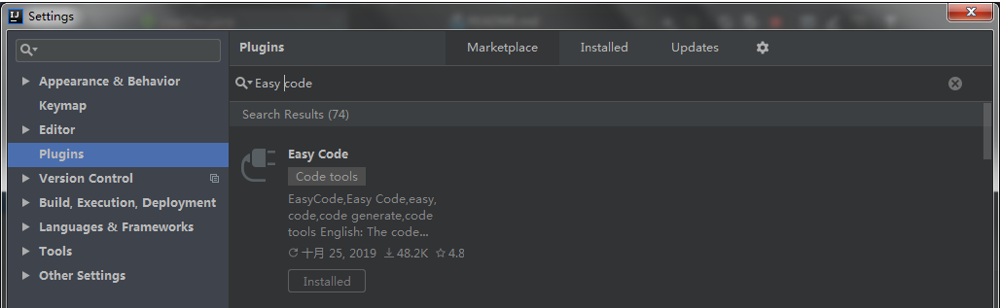

> 原文地址：<https://maimai.cn/article/detail?fid=1410937684&efid=uHQ4_5PagR6f_93IORiLKA&use_rn=1>

Easycode`是idea的一个插件，可以直接对数据的表生成`entity`、`controller`、`service`、`dao`、`mapper`无需任何编码，简单而强大。

# 安装(EasyCode)

我这里的话是已经那装好了。

建议大家在安装一个插件，叫做`Lombok`。

`Lombok`能通过注解的方式，在编译时自动为属性生成构造器、`getter`/`setter`、`equals`、`hashcode`、`toString`方法。出现的神奇就是在源码中没有`getter`和`setter`方法，但是在编译生成的字节码文件中有`getter`和`setter`方法。

# 建立数据库

	-- ----------------------------
	-- Table structure for user
	-- ----------------------------
	DROP TABLE IF EXISTS `user`;
	CREATE TABLE `user` (
	  `id` int(11) NOT NULL,
	  `username` varchar(20) DEFAULT NULL,
	  `sex` varchar(6) DEFAULT NULL,
	  `birthday` date DEFAULT NULL,
	  `address` varchar(20) DEFAULT NULL,
	  `password` varchar(20) DEFAULT NULL,
	  PRIMARY KEY (`id`)
	) ENGINE=InnoDB DEFAULT CHARSET=utf8;
	SET FOREIGN_KEY_CHECKS = 1;

# 在IDEA配置连接数据库
在这个之前，新建一个**Springboot**项目，这个应该是比较简单的。

建好**SpringBoot**项目之后，如下图所示，找到这个`Database`

按照如下图所示进行操作：

然后填写数据库名字，用户名，密码。点击OK即可。这样的话，IDEA连接数据库就完事了。

# 开始生成代码
在这个里面找到你想生成的表，然后右键，就会出现如下所示的截面。

点击1所示的位置，选择你要将生成的代码放入哪个文件夹中，选择完以后点击OK即可。

勾选你需要生成的代码，点击OK。

这样的话就完成了代码的生成了，生成的代码如下图所示：

# pom.xml

 		<dependency>
            <groupId>org.springframework.bootgroupId>
            <artifactId>spring-boot-starterartifactId>
        <dependency>

        <dependency>
            <groupId>org.springframework.bootgroupId>
            <artifactId>spring-boot-starter-webartifactId>
        <dependency>

        <dependency>
            <groupId>org.projectlombokgroupId>
            <artifactId>lombokartifactId>
            <optional>trueoptional>
        <dependency>

        
        <dependency>
            <groupId>org.springframework.bootgroupId>
            <artifactId>spring-boot-devtoolsartifactId>
            <optional>trueoptional> 
        <dependency>

        
        <dependency>
            <groupId>org.mybatis.spring.bootgroupId>
            <artifactId>mybatis-spring-boot-starterartifactId>
            <version>1.3.2version>
        <dependency>

        
        <dependency>
            <groupId>mysqlgroupId>
            <artifactId>mysql-connector-javaartifactId>
            <version>5.1.47version>
        <dependency>

        
        <dependency>
            <groupId>com.alibabagroupId>
            <artifactId>druidartifactId>
            <version>1.0.9version>
        <dependency>

# Application.yml

	server:
	  port: 8089
	spring:
	  datasource:
	    url: jdbc:mysql://127.0.0.1:3306/database?useUnicode=true&characterEncoding=UTF-8
	    username: root
	    password: 123456
	    type: com.alibaba.druid.pool.DruidDataSource
	    driver-class-name: com.mysql.jdbc.Driver
	
	mybatis:
	  mapper-locations: classpath:/mapper/*Dao.xml
	  typeAliasesPackage: com.vue.demo.entity

# 启动项目
在启动项目之前，我们需要先修改两个地方。

在dao层加上@mapper注解

在启动类里面加上@MapperScan("com.vue.demo.dao")注解。

启动项目

测试一下

`EasyCode`的用法就介绍到这里了，觉得有用的童鞋赶紧用起来试试吧~