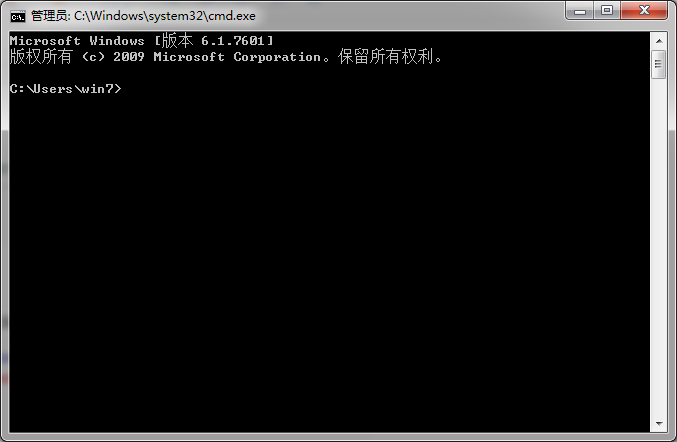

# Tomcat简介
Tomcat是Apache软件基金会（Apache Software Foundation）的`Jakarta`项目中的一个核心项目，由Apache、Sun 和其他一些公司及个人共同开发而成。
Apache是这样介绍Tomcat的：

	The Apache Tomcat software is an open source implementation of the Java Servlet, 
	JavaServer Pages, Java Expression Language and Java WebSocket technologies.
	-----------------------------------------------------------------------------------------
	Tomcat是对Java Servlet、JavaServer Pages(JSP)、Java Expression Language（表达式语言）
	和Java WebSocket(网络套接字)多种技术的一个开源的实现。

由于有了Sun的参与和支持，最新的Servlet和JSP规范总是能在Tomcat中得到体现，再加上它技术先进、性能稳定，而且免费的诸多特点，Tomcat已成为目前比较流行的Web应用服务器。

# Tomcat下载
Tomcat下载地址：<http://tomcat.apache.org/>

进入官网以后，左侧 Download 目录中会列出当前可供下载的 Tomcat 版本，当前时间的最新版是Tomcat 9.0。

选择你想要下载的Tomcat版本，进入下载页面，根据你的操作系统类型选择相应的压缩包进行下载。
            
> 注：`tar.gz`压缩格式用于UNIX操作系统，`zip`压缩格式用于windows操作系统。

如果下载了二进制安装文件Installer，那么tocmat会被安装成一种服务，此时需要注意修改该服务为自动启动。当启动后，会发现状态栏出现tomcat的管理图标。

推荐直接下载压缩包zip即可，我选择下载的是64-bit Windows zip(pgp,md5,sha1)，下载得到的软件信息如下。

# Tomcat安装
接下来开始安装Tomcat，将下载好的Tomcat安装包解压，解压后的文件内容如下。

在windows操作系统下，可通过运行bin目录下的`startup.bat`文件启动Tomcat，若Tomcat未能正确启动且无任何提示，可采取以下方法。
在windows的运行程序窗口中输入`cmd`-->`确定`,调出windows的命令行窗口，将`startup.bat`文件拖拽至windows命令行窗口中执行。

若命令行窗口中出现如下错误提示，则表示`CATALINA_HOME`环境变量配置不正确。

在系统环境变量中配置`CATALINA_HOME`环境变量，变量值为你的Tomcat根目录，及bin目录所在的文件夹目录。

若命令行窗口出现如下错误提示，则表示`JAVE_HOME`或`RE_HOME`环境变量配置不正确。

需先安装JDK或JRE，软件下载地址：<http://www.oracle.com/technetwork/java/javase/downloads/index.html>
在系统环境变量中配置`JAVE_HOME`或`JRE_HOME`环境变量，变量值为你安装的`JDK`或`JRE`的根目录，及bin目录所在的文件夹目录。

JDK安装完成以后，可以通过在命令行中输入`java -version`来查看JDK的版本信息。

若以上配置均正确的情况下，使用`startup.bat`文件启动Tomcat时，仍然出现Tomcat不能正确启动，且新弹出的tomcat启动窗口马上消失导致无法查看启动失败原因，可通过以下方法解决。
改为使用`catalina run`命令启动Tomcat，在windows命令行窗口中运行`catalina run`。
若命令行窗口出现以下错误提示，需将 %CATALINA_HOME%\bin 目录添加到 path 环境变量中。

`catalina run`命令会在当前窗口中启动Tomcat ，若启动失败不会自动关闭窗口，我们可以通过窗口中的启动日志来查看启动失败的原因。
若在启动日志中看到如下错误提示信息，则表示启动失败是由于端口被占用导致。

此时需修改`CATALINA_HOME/conf/server.xml`中端口配置。

至此，运行Tomcat所需基本配置都已设置完毕，再次运行`startup.bat`文件启动Tomcat。

# Tomcat启动测试
打开浏览器，输入：<http://localhost:8080/>
出现如下页面，表示Tomcat正确启动了，可以通过执行shutdown.bat 文件来关闭Tomcat。

> 备注：实际上，无论是通过`startup.bat`文件启动Tomcat还是通过`shutdown.bat`文件来关闭Tomcat，其最终都是通过调用`catalina.bat`文件来执行(UNIX系统下是.sh文件)。

catalina命令用法如下：

|----|----|
|debug|在调试器中启动Tomcat|
|debug -security|在带有安全管理器的调试器中启动Tomcat|
|jpda start|在JPDA调试器中启动Tomcat|
|run|在当前窗口中启动Tomcat（不切换窗口）|
|run -security|在带有安全管理器的情况下，在当前窗口中启动Tomcat（不切换窗口）|
|start|打开一个新窗口，并在其中启动Tomcat（切换至新窗口）|
|start -security|在带有安全管理器的情况下，在新窗口中启动Tomcat（切换至新窗口）|
|stop|关闭Tomcat |
|version|显示Tomcat版本信息|