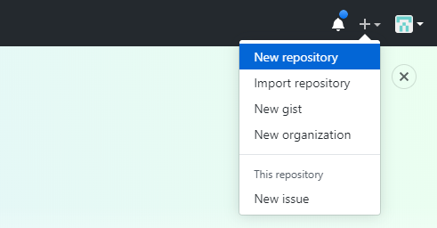
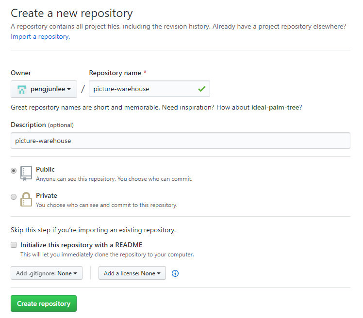
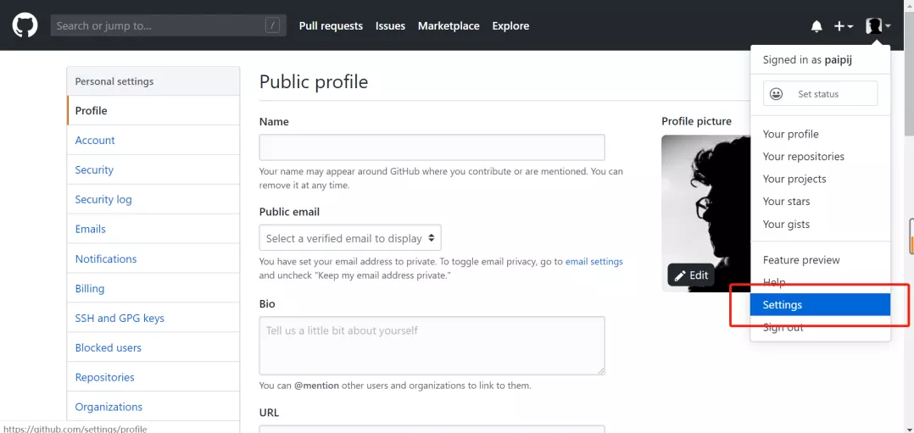
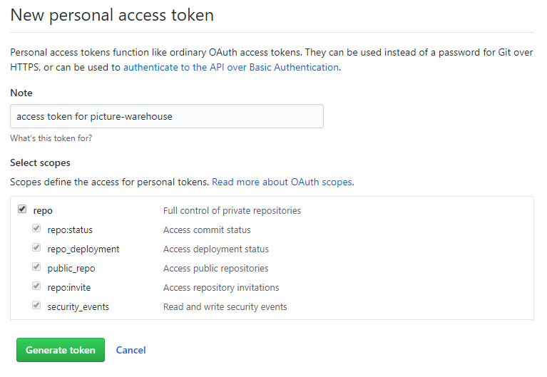
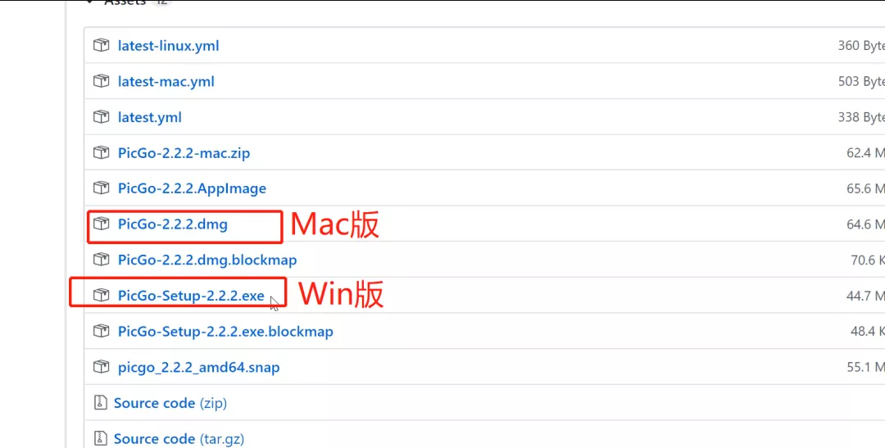
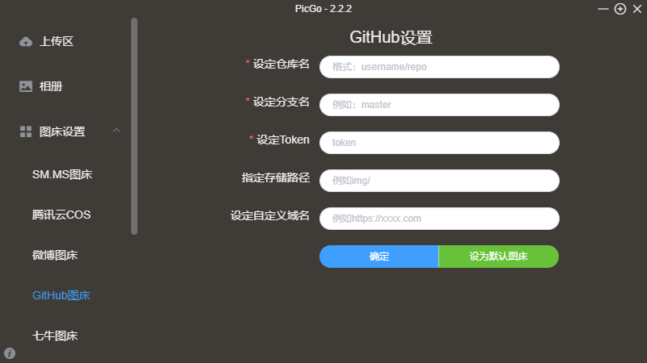
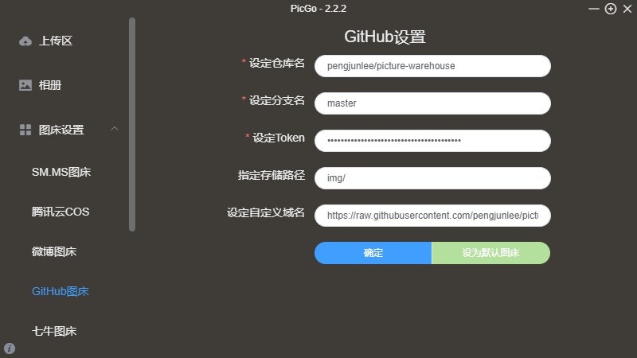
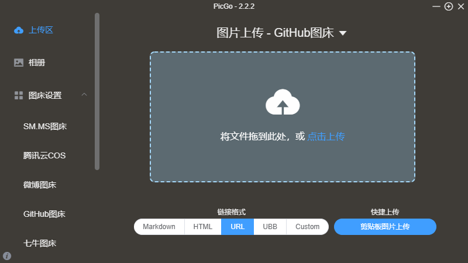
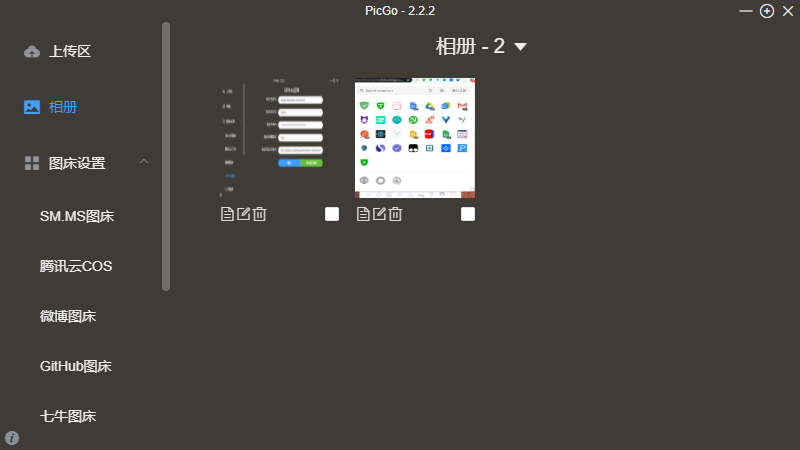
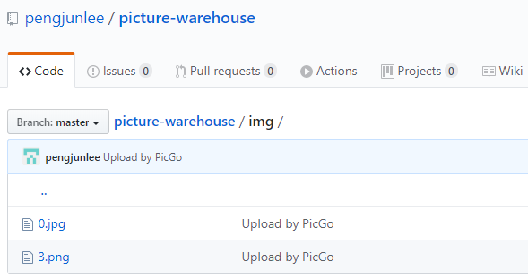

`PicGo`是一个用于快速上传图片并获取图片URL链接的工具，目前支持七牛云，腾讯云COS，又拍云，GitHub，阿里云OSS，imgur等多种常用图床，功能强大，简单易用。

通过这个教程，你将学会如何通过`github`和`picgo`搭建一个属于自己的在线云端相册，超级简单，绝对实用。

# 新建仓库
登录到GitHub，点击页面右上角的`+`按钮==>选择`New repository`。

填写好仓库的仓库名称和描述信息，例如我创建的仓库名称为`picture-warehouse`。因为后面通过客户端访问仓库算是外部访问，不能访问`Private`的仓库，所以需要将仓库的访问权限设置为`Public`。

# 创建 token
点击右上角头像，选择`Settings`。

然后依次选择`Developer settings`==>`Personal access tokens`==>`Generate new token`，并按下图所示创建一个新`token`。

将生成的token复制下来备用。

# PicGo 客户端配置
## 下载PicGO客服端
到下面的链接下载最新版本：<https://github.com/Molunerfinn/PicGo/releases>

## 配置github图床

下面是我的配置：

# 上传图片

## 效果图

## 仓库图

成功了！完成上述步骤就搭建成功了，再配合快捷键就更加舒适了。此刻，你将拥有一个属于自己的在线云端相册，可以通过连接访问到你想要的照片。喜欢记得关注作者喔，或者点击下方在看按钮！