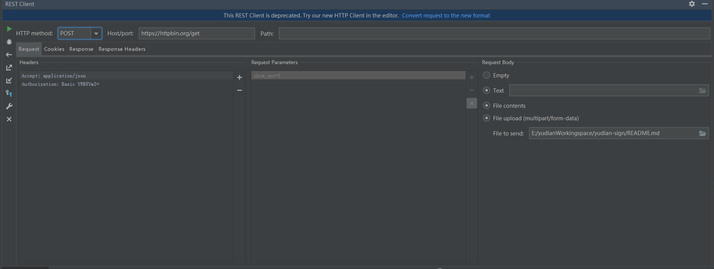
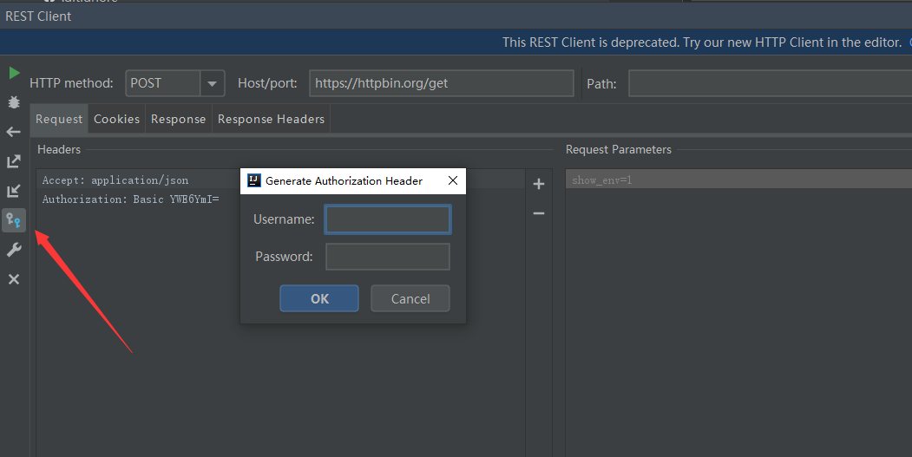
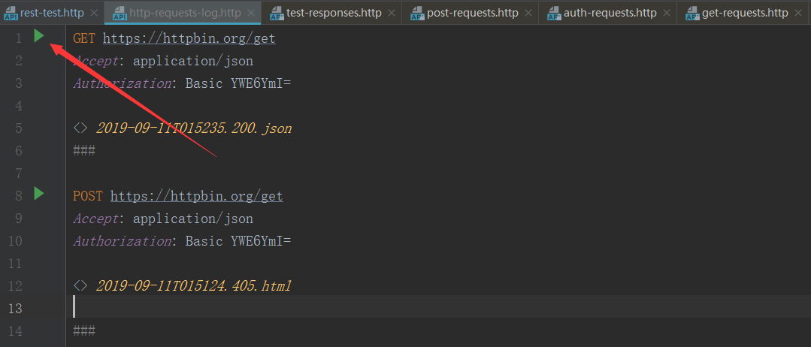
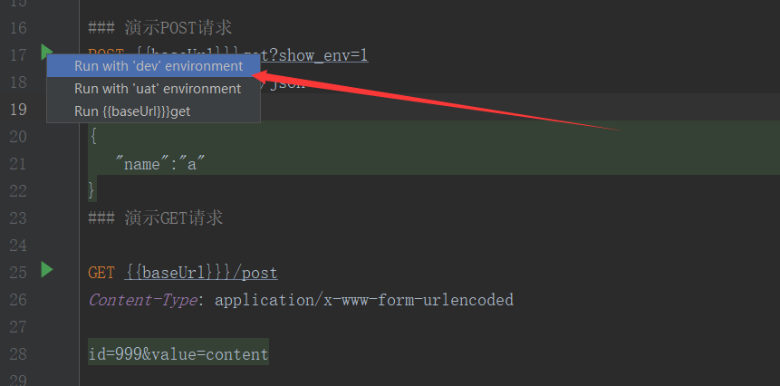

> 原文地址：<https://my.oschina.net/keking/blog/3104972>

# 前言
接口调试是每个软件开发从业者必不可少的一项技能，一个项目的的完成，可能接口测试调试的时间比真正开发写代码的时间还要多，几乎是每个开发的日常工作项。所谓工欲善其事必先利其器，在没有尝到`IDEA REST`真香之前，postman（chrome的一款插件）确实是一个非常不错的选择，具有完备的`REST Client`功能和请求历史记录功能。但是当使用了`IDEA REST`之后，postman就可以丢了，因为，`IDEA REST Client`具有postman的所有功能，而且还有postman没有的功能，继续往下看。

# 从postman到IDEA REST Client
真香定律的原因有如下几个：

- 首先postman的所有功能IDEA REST Client都具备了，如REST Client控制台和历史请求记录
- 其次如果能够在一个生产工具里完成开发和调试的事情，干嘛要切换到另一个工具呢
- 然后IDEA REST Client还支持环境配置区分的功能，以及接口响应断言和脚本化处理的能力
- IDEA REST Client的请求配置可以用文件配置描述，所以可以跟随项目和项目成员共享

# IDEA REST Client控制台
从顶层工具栏依次`Tools` -> `HTTP Client` -> `Test RESTFUL Web Service` 打开后，`IDEA REST Client`控制台的界面如下样式：

可以看到，这个控制台展示的功能区和postman已经没什么差别了，包括请求方式，请求参数和请求头的填充都已经包含了，特别说明下的是，如果请求的方式是`Authorization :Basic`这种方式认证的话，可以点击下图所示的按钮，会弹出填充用户名和密码的窗口出来，填完后会自动补充到`Authorization`的`header`里面去

# 历史请求记录
`IntelliJ IDEA`自动将最近执行的50个请求保存到**http-requests-log.http**文件中，该文件存储在项目的`.idea/httpRequests/`目录下。使用请求历史记录，您可以快速导航到特定响应并再次发出请求。文件内容大如下图所示，再次发出请求只要点击那个运行按钮即可。如果从请求历史记录再次发出请求，则其执行信息和响应输出的链接将添加到请求历史记录文件的顶部。

# 构建HTTP请求脚本
上面的历史记录就是一个完整的`IDEA REST Client`请求脚本，如果你是从控制台触发的，那么可以直接复制历史请求记录的文件放到项目里作为HTTP请求的脚本，给其他成员共享，如果不是，也可以直接新建一个`.http`或者`.rest`结尾的文件，IDEA会自动识别为HTTP请求脚本。

## 语法部分

	### 演示POST请求
	POST {{baseUrl}}}get?show_env=1
	Accept: application/json
	
	{
	   "name":"a"
	}
	### 演示GET请求
	
	GET {{baseUrl}}}/post
	Content-Type: application/x-www-form-urlencoded
	
	id=999&value=content

首先通过`###`三个井号键来分开每个请求体，然后请求`url`和`header`参数是紧紧挨着的，请求参数不管是POST的body传参还是GET的parameter传参，都是要换行的。

## 环境区分
细心的你可能发现了上面示例的代码，没有真实的请求地址，取而代之的，是一个`{{baseUrl}}`的占位符，这个就是`IDEA REST Client`真香的地方，支持从指定的配置文件中获取到环境相关的配置参数，不仅baseUrl可以通过占位符替换，一些请求的参数如果和接口环境相关的都可以通过配置文件来区分。

首先在`.http`的脚本同目录下创建一个名为`http-client.private.env.json`的文件，然后内容如下，一级的key值时用来区分环境的，比如，`dev`、`uat`、`pro`等，环境下的对象就是一次HTTP请求中能够获取到的环境变量了，你可以直接在请求的HTTP的脚本中通过`{{xx}}`占位符的方式获取到这里配置的参数

	{
	  "uat": {
	    "baseUrl": "http://gateway.xxx.cn/",
	    "username": "",
	    "password": ""
	  },
	  "dev": {
	    "baseUrl": "http://localhsot:8888/",
	    "username": "",
	    "password": ""
	  }
	}

那么在选择执行请求的时候，IDEA就会让你选执行那个环境的配置，如：

## 结果断言
`IDEA REST Client`可以针对接口的响应值进行脚本化的断言处理，立马从一个接口调试工具上升到测试工具了，比如：

	### Successful test: check response status is 200
	GET https://httpbin.org/status/200
	
	> 

## 结果值暂存
试想下这样的场景，当一个系统需要通过认证才能访问的时候，如果用postman的时候，是不是先访问登录接口，然后获得`token`后，手动粘贴复制到新的调试接口的`header`参数里面去，这太麻烦了，`IDEA REST Client`还有一个真香的功能，可以完美解决这个问题，请看下面的脚本：

	### 演示POST请求
	POST https://httpbin.org/post
	Content-Type: application/json
	
	{
	  "user": "admin",
	  "password": "123456"
	}
	
	> 
	### 演示GET请求
	
	GET https://httpbin.org/headers
	Authorization: Bearer {{auth_token}}

在第一个认证的请求结束后，可以在`response`里拿到返回的`token`信息，然后我们通过脚本设置到了全局变量里，那么在接下来的接口请求中，就可以直接使用双大括号占位符的方式获取到这个`token`了。

# 结语
postman有口皆碑，确实是一个非常不错的必备工具，之前给比人推荐这种工具时总是安利他postman。但是，`IDEA REST Client`也真的很不错，值得尝试一下，后面安利这种工具就切换到`IDEA REST Client`了，postman反正被我丢掉了。和第三方做接口对接时，项目里必备一个`rest-http.http`接口请求文件，满足自己的同时也成方便了他人。