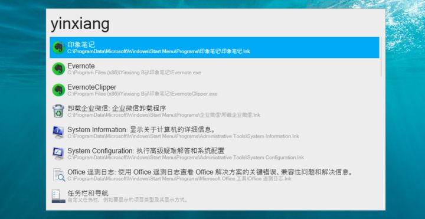
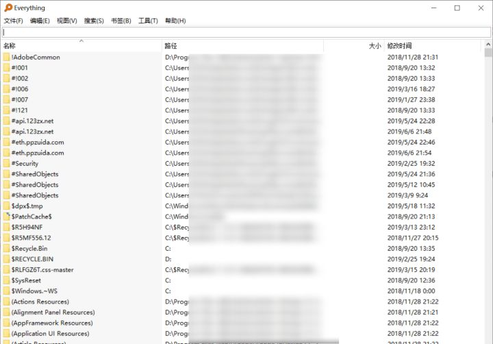
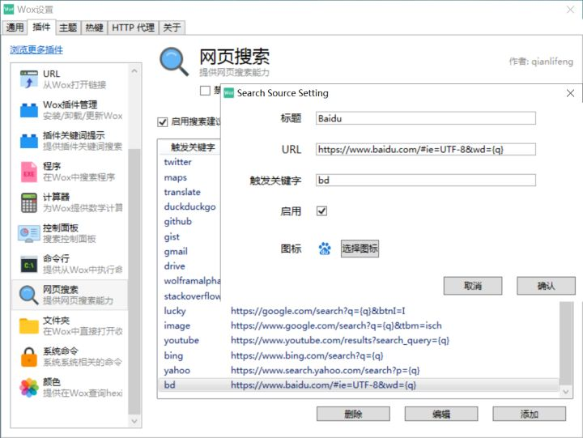
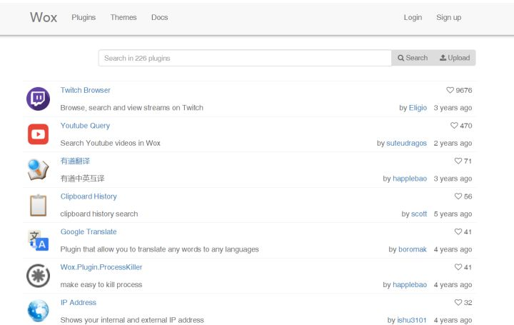
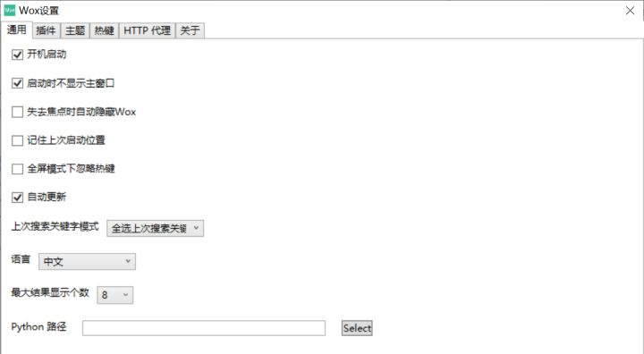

想必用过`mac`的人都会知道一款效率神器`Alfred`，可快速启动、计算、查找等，使用起来非常的方便。Win上面也有类似的效率神器，比如`Listary`和`WOX`。

今天介绍的神器是[WOX](http://www.wox.one/ "WOX")，这个真的算是每天必用的一款软件。用起来非常的舒服，得心应手！

点击下载以后，会跳转到[GitHub](https://github.com/Wox-launcher/Wox/releases "GitHub")，找到对应的文件下载即可，同时还附带了`Everything`的下载链接，也是很棒了！

下载之后，点击文件，便可快速使用。

快速启动按键为`ALT+SPACE`，例如我要快速启动 [印象笔记]，可实现良好的模糊查找，无论是汉字还是拼音，都可以快速查找并启动。

# 快速查找电脑上的文件
首先，该款软件需要配合强大的搜索软件Everything，有了它便可以快速查找电脑上所有你想要查找的文件。详情可到官网去查看，比WIN自带的搜索强大太多！而且软件本身非常Mini。用了之后，就再也不用担心你找不到文件放在哪个旮旯里面了。桌面几乎都不需要放文件和文件夹，尽可能的保持桌面的清新干净。

# 快速进行简单的计算

# 快速网页搜索
通过指定的关键字可实现快速的网页搜索。例如：在WOX启动栏直接输入[bd 建筑]，即可快速启动默认浏览器，并通过百度搜索指定词语“建筑”。

默认的WOX是不提供百度搜索的，只需自己通过几个简单的步骤添加即可：

在网页搜索界面，点击·添加·，触发关键字可以根绝自己的习惯进行添加，一般Google搜索为g，当然都是可以修改的。

但是如何URL呢？

细心的你可能会发现上述几个网址的设置规则，都是搜索引擎加入了一个`={q}`，我们刚在尝试搜索建筑的时候，出现了下面的这一串网址：<https://www.baidu.com/s?ie=UTF-8&wd=%E5%BB%BA%E7%AD%91>，然后我们可以找到`=`的位置，然后把后面的全部替换为`={q}`，然后就是我们要设置的URL了！

以此类推。。。

# 其他功能
在官网我们可以看到非常多的插件，可以根据自己的需求自行添加。这里再简单举例几个常用的插件。

# 关于WOX 的一些设置

- 设置通用：开机自启动、语言、显示个数等，根据个人习惯设自行设置。一般此类软件，都是设置开机启动的，因为开机以后必然要开启一些软件和文件。
- 设置喜欢的主题、字体
- 设置不冲突而又顺手的热键，这个自行设置。