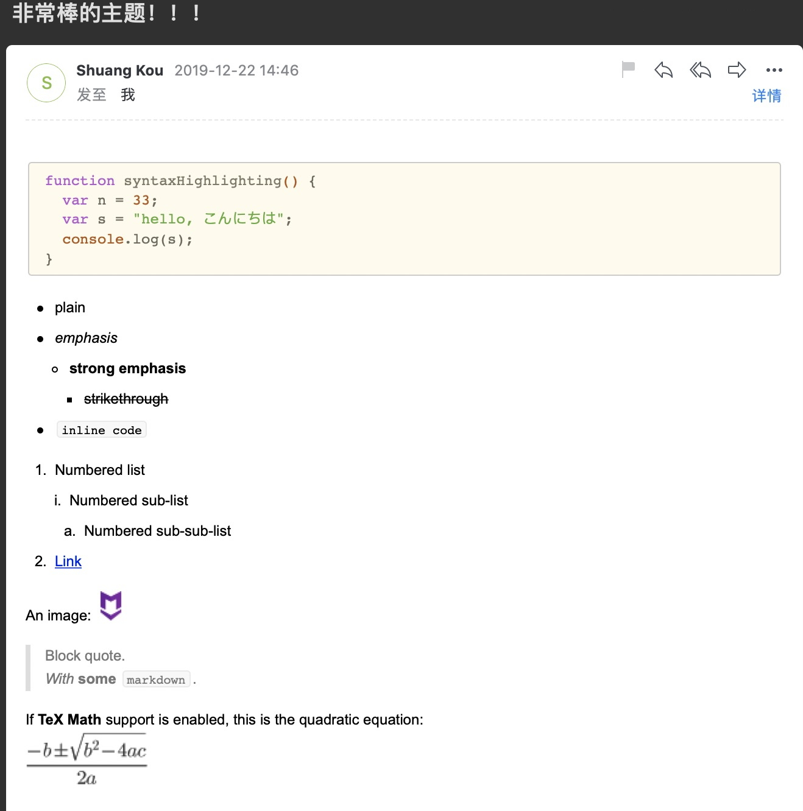
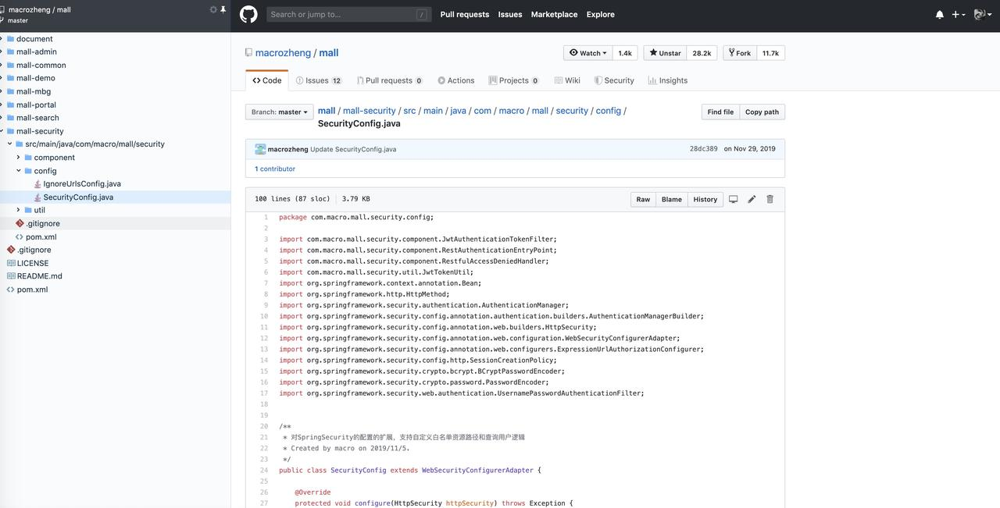
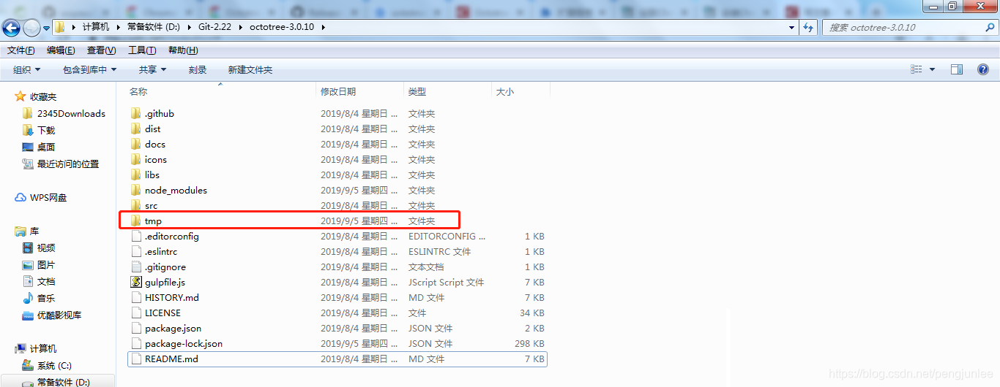
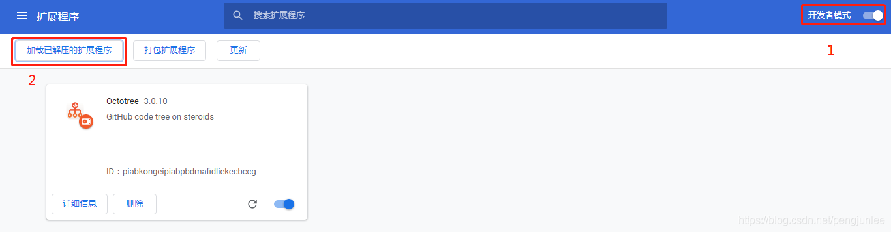
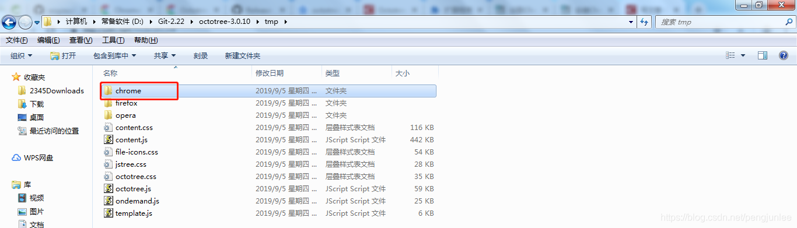
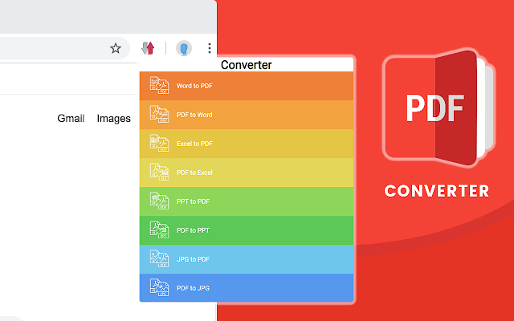
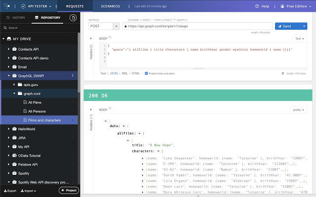
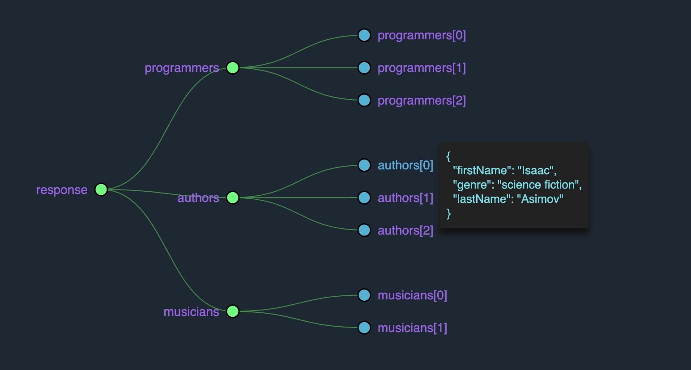
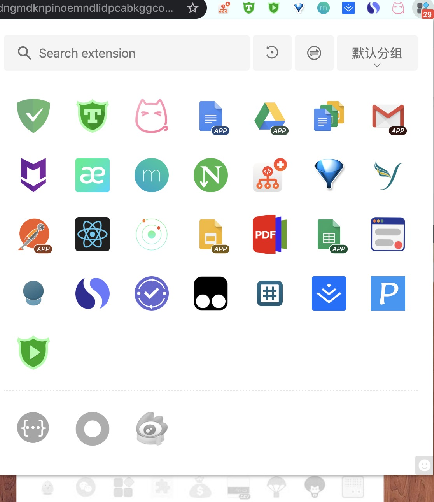

> 原文地址：<https://maimai.cn/article/detail?fid=1395172596&efid=tozQGiYf-RXf_R3r4dB83Q&use_rn=1>

上次搬家的时候，发了一个朋友圈，附带的照片中不小心暴露了自己的`Chrome`浏览器插件之多，于是就有小伙伴评论说分享一下我觉得还不错的浏览器插件。

我下面就把我日常工作和学习中经常用到的一些`Chrome`浏览器插件分享给大家，随便一个都能提高你的“生活品质”和工作效率。

# Markdown Here
Markdown Here 可以让你更愉快的写邮件，由于支持 Markdown 直接转电子邮件格式，你无需太多精力，就能写出美观的电子邮件。

下面我实际测试的效果：

# Similar Sites
查看你当前所浏览的网站相似的一些网站，很不错！

插件下载地址: <https://chrome.google.com/webstore/detail/similar-sites-discover-re/necpbmbhhdiplmfhmjicabdeighkndkn>

中文官方网站: <https://cn.similarsites.com/>

# Octotree
Octotree 可以让我们在 Github 上浏览代码更加方便和优雅。

## 如何安装
源码地址：<https://github.com/ovity/octotree/releases/tag/v3.0.10>

Windows用户下载`octotree-3.0.10.zip`，并将其解压到任意目录。打开一个`CMD`窗口，并切换到上一步的解压目录文件夹，按照`README.md`中说明的步骤进行构建：

- Install [node 8 or above](https://nodejs.org/en/download/)
- Run `npm install` to install dependencies
- Run `npm start` to watch code changes and build unpacked extensions
- Load the unpacked extensions in the `tmp` folder (check instructions of the specific browser)
- Please follow existing style for new code

查看生成的目录结果

从`chrome://extensions/`中按照截图操作

chrome请选择`\tmp\chrome`，其他浏览器目前仅支持opera和firefox。

# OneTab
一键收纳你正在浏览的网页！

非常实用！比如我们做一件事情经常会打开很多的网页，这时候有另外一件事情来了，你就可以利用这个插件将之前浏览的网页给隐藏了！

# Momentum
专注、待办清单.....

# 简悦
让你瞬间进入沉浸式阅读的`Chrome`扩展，类似`Safari`的阅读模式，并且集成了丰富的功能。

# Smart PDF
我非常非常喜欢的一个插件。`Smart PDF`可以让你免费将Word转换为PDF，也可以将Excel转换为PDF，反之亦然。

# My IP address
查看自己设备真实的IP地址, 并获得ip所在的国家或地区。当然如果你自己用命令行也可以查看，这个会更加直观。

# Talend API Tester
让你的`API`测试变的更加简单！

# JSON Viewer Awesome
这个插件可以帮助您在浏览器中可视化来自任何网站或API请求的JSON响应。并且，你可以以图表的形式来查看，就像下面这样。

原始 Json 数据：

	{
	    "programmers": [
	        {
	            "firstName": "Brett",
	            "lastName": "McLaughlin",
	            "email": "aaaa"
	        },
	        {
	            "firstName": "Jason",
	            "lastName": "Hunter",
	            "email": "bbbb"
	        },
	        {
	            "firstName": "Elliotte",
	            "lastName": "Harold",
	            "email": "cccc"
	        }
	    ],
	    "authors": [
	        {
	            "firstName": "Isaac",
	            "lastName": "Asimov",
	            "genre": "science fiction"
	        },
	        {
	            "firstName": "Tad",
	            "lastName": "Williams",
	            "genre": "fantasy"
	        },
	        {
	            "firstName": "Frank",
	            "lastName": "Peretti",
	            "genre": "christian fiction"
	        }
	    ],
	    "musicians": [
	        {
	            "firstName": "Eric",
	            "lastName": "Clapton",
	            "instrument": "guitar"
	        },
	        {
	            "firstName": "Sergei",
	            "lastName": "Rachmaninoff",
	            "instrument": "piano"
	        }
	    ]
	}

图表形式展示：

# AdGuard AdBlocker
非常有必要的一个插件！拦截广告和烦人的弹窗！

# Extension Manager
一键管理所有扩展，快速开启/禁用、批量闪电管理，智能排序，右键卸载、锁定、选项配置，角标提醒，大小布局随心配。快捷、简单、安全。

