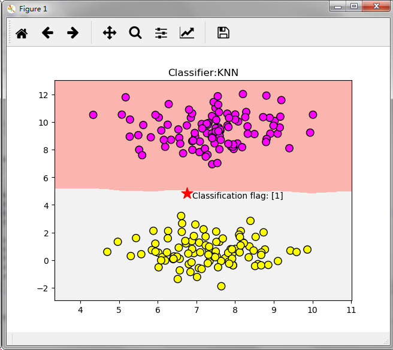

# KNN算法简介
**KNN（K-Nearest Neighbor）**最邻近分类算法是数据挖掘分类（classification）技术中最简单的算法之一，其指导思想是`近朱者赤，近墨者黑`，即由你的邻居来推断出你的类别。

KNN最邻近分类算法的实现原理：为了判断未知样本的类别，以所有已知类别的样本作为参照，计算未知样本与所有已知样本的距离，从中选取与未知样本距离最近的K个已知样本，根据少数服从多数的投票法则（majority-voting），将未知样本与K个最邻近样本中所属类别占比较多的归为一类。

以上就是KNN算法在分类任务中的基本原理，实际上K这个字母的含义就是要选取的最邻近样本实例的个数，在 scikit-learn 中 KNN算法的 K 值是通过 n_neighbors 参数来调节的，默认值是 5。

如下图所示，如何判断绿色圆应该属于哪一类，是属于红色三角形还是属于蓝色四方形？如果**K=3**，由于红色三角形所占比例为**2/3**，绿色圆将被判定为属于红色三角形那个类，如果**K=5**，由于蓝色四方形比例为**3/5**，因此绿色圆将被判定为属于蓝色四方形类。

由于KNN最邻近分类算法在分类决策时只依据最邻近的一个或者几个样本的类别来决定待分类样本所属的类别，而不是靠判别类域的方法来确定所属类别的，因此对于类域的交叉或重叠较多的待分样本集来说，KNN方法较其他方法更为适合。

## KNN算法的关键：

- 样本的所有特征都要做可比较的量化

若是样本特征中存在非数值的类型，必须采取手段将其量化为数值。例如样本特征中包含颜色，可通过将颜色转换为灰度值来实现距离计算。

- 样本特征要做归一化处理

样本有多个参数，每一个参数都有自己的定义域和取值范围，他们对距离计算的影响不一样，如取值较大的影响力会盖过取值较小的参数。所以样本参数必须做一些 scale 处理，最简单的方式就是所有特征的数值都采取归一化处置。

- 需要一个距离函数以计算两个样本之间的距离

通常使用的距离函数有：欧氏距离、余弦距离、汉明距离、曼哈顿距离等，一般选欧氏距离作为距离度量，但是这是只适用于连续变量。在文本分类这种非连续变量情况下，汉明距离可以用来作为度量。通常情况下，如果运用一些特殊的算法来计算度量的话，K近邻分类精度可显著提高，如运用大边缘最近邻法或者近邻成分分析法。

以计算二维空间中的**A(x1,y1)、B(x2,y2)**两点之间的距离为例，欧氏距离和曼哈顿距离的计算方法如下图所示：

- 确定K的值

K值选的太大易引起欠拟合，太小容易过拟合，需交叉验证确定K值。

## KNN算法的优点：

- 简单，易于理解，易于实现，无需估计参数，无需训练；
- 适合对稀有事件进行分类；
- 特别适合于多分类问题(multi-modal,对象具有多个类别标签)， kNN比SVM的表现要好。

## KNN算法的缺点：

KNN算法在分类时有个主要的不足是，当样本不平衡时，如一个类的样本容量很大，而其他类样本容量很小时，有可能导致当输入一个新样本时，该样本的K个邻居中大容量类的样本占多数，如下图所示。该算法只计算最近的邻居样本，某一类的样本数量很大，那么或者这类样本并不接近目标样本，或者这类样本很靠近目标样本。无论怎样，数量并不能影响运行结果。可以采用权值的方法(和该样本距离小的邻居权值大)来改进。

该方法的另一个不足之处是计算量较大，因为对每一个待分类的文本都要计算它到全体已知样本的距离，才能求得它的K个最近邻点。

可理解性差，无法给出像决策树那样的规则。

# KNN算法实现
要自己动手实现KNN算法其实不难，主要有以下三个步骤：

- 算距离：给定待分类样本，计算它与已分类样本中的每个样本的距离；
- 找邻居：圈定与待分类样本距离最近的K个已分类样本，作为待分类样本的近邻；
- 做分类：根据这K个近邻中的大部分样本所属的类别来决定待分类样本该属于哪个分类；

以下是使用Python实现KNN算法的简单示例：

	import math
	import csv
	import operator
	import random
	import numpy as np
	from sklearn.datasets import make_blobs
	 
	#Python version 3.6.5
	 
	# 生成样本数据集 samples(样本数量) features(特征向量的维度) centers(类别个数)
	def createDataSet(samples=100, features=2, centers=2):
	    return make_blobs(n_samples=samples, n_features=features, centers=centers, cluster_std=1.0, random_state=8)
	 
	# 加载鸢尾花卉数据集 filename(数据集文件存放路径)
	def loadIrisDataset(filename):
	    with open(filename, 'rt') as csvfile:
	        lines = csv.reader(csvfile)
	        dataset = list(lines)
	        for x in range(len(dataset)):
	            for y in range(4):
	                dataset[x][y] = float(dataset[x][y])
	        return dataset
	    
	# 拆分数据集 dataset(要拆分的数据集) split(训练集所占比例) trainingSet(训练集) testSet(测试集)
	def splitDataSet(dataSet, split, trainingSet=[], testSet=[]):
	    for x in range(len(dataSet)):
	        if random.random() <= split:
	            trainingSet.append(dataSet[x])
	        else:
	            testSet.append(dataSet[x])
	# 计算欧氏距离 
	def euclideanDistance(instance1, instance2, length):
	    distance = 0
	    for x in range(length):
	        distance += pow((instance1[x] - instance2[x]), 2)
	    return math.sqrt(distance)
	 
	# 选取距离最近的K个实例
	def getNeighbors(trainingSet, testInstance, k):
	    distances = []
	    length = len(testInstance) - 1
	    for x in range(len(trainingSet)):
	        dist = euclideanDistance(testInstance, trainingSet[x], length)
	        distances.append((trainingSet[x], dist))
	    distances.sort(key=operator.itemgetter(1))
	    
	    neighbors = []
	    for x in range(k):
	        neighbors.append(distances[x][0])
	    return neighbors
	 
	#  获取距离最近的K个实例中占比例较大的分类
	def getResponse(neighbors):
	    classVotes = {}
	    for x in range(len(neighbors)):
	        response = neighbors[x][-1]
	        if response in classVotes:
	            classVotes[response] += 1
	        else:
	            classVotes[response] = 1
	    sortedVotes = sorted(classVotes.items(), key=operator.itemgetter(1), reverse=True)
	    return sortedVotes[0][0]
	 
	# 计算准确率
	def getAccuracy(testSet, predictions):
	    correct = 0
	    for x in range(len(testSet)):
	        if testSet[x][-1] == predictions[x]:
	            correct += 1
	    return (correct / float(len(testSet))) * 100.0
	 
	 
	def main():
	    # 使用自定义创建的数据集进行分类
	    # x,y = createDataSet(features=2)
	    # dataSet= np.c_[x,y]
	    
	    # 使用鸢尾花卉数据集进行分类
	    dataSet = loadIrisDataset(r'C:\DevTolls\eclipse-pureh2b\python\DeepLearning\KNN\iris_dataset.txt')
	        
	    print(dataSet)
	    trainingSet = []
	    testSet = []
	    splitDataSet(dataSet, 0.75, trainingSet, testSet)
	    print('Train set:' + repr(len(trainingSet)))
	    print('Test set:' + repr(len(testSet)))
	    predictions = []
	    k = 7
	    for x in range(len(testSet)):
	        neighbors = getNeighbors(trainingSet, testSet[x], k)
	        result = getResponse(neighbors)
	        predictions.append(result)
	        print('>predicted=' + repr(result) + ',actual=' + repr(testSet[x][-1]))
	    accuracy = getAccuracy(testSet, predictions)
	    print('Accuracy: ' + repr(accuracy) + '%')
	main()
    
尾花卉数据文件百度网盘下载链接：<https://pan.baidu.com/s/10vI5p_QuM7esc-jkar2zdQ> 密码：`4und`

# KNN算法应用
## 使用KNN算法处理简单分类任务
在`scikit-learn`中，内置了若干个玩具数据集（Toy Datasets），还有一些API让我们可以自己动手生成一些数据集。接下来我们将使用scikit-learn的make_blobs函数来生成一个样本数量为200，分类数量为2的数据集，并使用KNN算法来对其进行分类。

	# 导入画图工具
	import matplotlib.pyplot as plt
	# 导入数组工具
	import numpy as np
	# 导入数据集生成器
	from sklearn.datasets import make_blobs
	# 导入KNN 分类器
	from sklearn.neighbors import KNeighborsClassifier
	# 导入数据集拆分工具
	from sklearn.model_selection import train_test_split
	 
	# 生成样本数为200，分类数为2的数据集
	data=make_blobs(n_samples=200, n_features=2,centers=2, cluster_std=1.0, random_state=8)
	X,Y=data
	 
	# 将生成的数据集进行可视化
	# plt.scatter(X[:,0], X[:,1],s=80, c=Y,  cmap=plt.cm.spring, edgecolors='k')
	# plt.show()
	 
	clf = KNeighborsClassifier()
	clf.fit(X,Y)
	 
	# 绘制图形
	x_min,x_max=X[:,0].min()-1,X[:,0].max()+1
	y_min,y_max=X[:,1].min()-1,X[:,1].max()+1
	xx,yy=np.meshgrid(np.arange(x_min,x_max,.02),np.arange(y_min,y_max,.02))
	z=clf.predict(np.c_[xx.ravel(),yy.ravel()])
	 
	z=z.reshape(xx.shape)
	plt.pcolormesh(xx,yy,z,cmap=plt.cm.Pastel1)
	plt.scatter(X[:,0], X[:,1],s=80, c=Y,  cmap=plt.cm.spring, edgecolors='k')
	plt.xlim(xx.min(),xx.max())
	plt.ylim(yy.min(),yy.max())
	plt.title("Classifier:KNN")
	 
	# 把待分类的数据点用五星表示出来
	plt.scatter(6.75,4.82,marker='*',c='red',s=200)
	 
	# 对待分类的数据点的分类进行判断
	res = clf.predict([[6.75,4.82]])
	plt.text(6.9,4.5,'Classification flag: '+str(res))
	 
	plt.show()

 程序执行后得到结果如下图所示：

## 使用KNN算法处理多元分类任务
接下来，我们再使用scikit-learn的make_blobs函数来生成一个样本数量为500，分类数量为5的数据集，并使用KNN算法来对其进行分类。

	# 导入画图工具
	import matplotlib.pyplot as plt
	# 导入数组工具
	import numpy as np
	# 导入数据集生成器
	from sklearn.datasets import make_blobs
	# 导入KNN 分类器
	from sklearn.neighbors import KNeighborsClassifier
	# 导入数据集拆分工具
	from sklearn.model_selection import train_test_split
	 
	# 生成样本数为500，分类数为5的数据集
	data=make_blobs(n_samples=500, n_features=2,centers=5, cluster_std=1.0, random_state=8)
	X,Y=data
	 
	# 将生成的数据集进行可视化
	# plt.scatter(X[:,0], X[:,1],s=80, c=Y,  cmap=plt.cm.spring, edgecolors='k')
	# plt.show()
	 
	clf = KNeighborsClassifier()
	clf.fit(X,Y)
	 
	# 绘制图形
	x_min,x_max=X[:,0].min()-1,X[:,0].max()+1
	y_min,y_max=X[:,1].min()-1,X[:,1].max()+1
	xx,yy=np.meshgrid(np.arange(x_min,x_max,.02),np.arange(y_min,y_max,.02))
	z=clf.predict(np.c_[xx.ravel(),yy.ravel()])
	 
	z=z.reshape(xx.shape)
	plt.pcolormesh(xx,yy,z,cmap=plt.cm.Pastel1)
	plt.scatter(X[:,0], X[:,1],s=80, c=Y,  cmap=plt.cm.spring, edgecolors='k')
	plt.xlim(xx.min(),xx.max())
	plt.ylim(yy.min(),yy.max())
	plt.title("Classifier:KNN")
	 
	# 把待分类的数据点用五星表示出来
	plt.scatter(0,5,marker='*',c='red',s=200)
	 
	# 对待分类的数据点的分类进行判断
	res = clf.predict([[0,5]])
	plt.text(0.2,4.6,'Classification flag: '+str(res))
	plt.text(3.75,-13,'Model accuracy: {:.2f}'.format(clf.score(X, Y)))
	 
	plt.show()

 程序执行后得到结果如下图所示：

## 使用KNN算法进行回归分析
这里我们使用scikit-learn的make_regression生成数据集来进行实验，演示KNN算法在回归分析中的表现。

	# 导入画图工具
	import matplotlib.pyplot as plt
	# 导入数组工具
	import numpy as np
	 
	# 导入用于回归分析的KNN模型
	from sklearn.neighbors import KNeighborsRegressor
	# 导入数据集拆分工具
	from sklearn.model_selection import train_test_split
	# 导入数据集生成器
	from sklearn.datasets.samples_generator import make_regression
	from docutils.utils.math.math2html import LineWriter
	 
	# 生成样本数为200，分类数为2的数据集
	X,Y=make_regression(n_samples=100,n_features=1,n_informative=1,noise=50,random_state=8)
	 
	# 将生成的数据集进行可视化
	# plt.scatter(X,Y,s=80, c='orange',  cmap=plt.cm.spring, edgecolors='k')
	# plt.show()
	reg = KNeighborsRegressor(n_neighbors=5)
	 
	reg.fit(X,Y)
	 
	# 将预测结果用图像进行可视化
	z = np.linspace(-3,3,200).reshape(-1,1)
	plt.scatter(X,Y,c='orange',edgecolor='k')
	plt.plot(z,reg.predict(z),c='k',Linewidth=3)
	#
	plt.title("KNN Regressor")
	 
	plt.show()

  程序执行后得到结果如下图所示：

# KNN算法项目实战----酒的分类

	from sklearn.datasets.base import load_wine
	from sklearn.model_selection import train_test_split
	from sklearn.neighbors import KNeighborsClassifier
	import numpy as np
	 
	# 从 sklearn的datasets模块载入数据集加载酒的数据集
	wineDataSet=load_wine()
	print(wineDataSet)
	print("红酒数据集中的键：\n{}".format(wineDataSet.keys()))
	print("数据概况：\n{}".format(wineDataSet['data'].shape))
	print(wineDataSet['DESCR'])
	 
	# 将数据集拆分为训练数据集和测试数据集
	X_train,X_test,y_train,y_test=train_test_split(wineDataSet['data'],wineDataSet['target'],random_state=0)
	print("X_train shape:{}".format(X_train.shape))
	print("X_test shape:{}".format(X_test.shape))
	print("y_train shape:{}".format(y_train.shape))
	print("y_test shape:{}".format(y_test.shape))
	 
	knn = KNeighborsClassifier(n_neighbors=1)
	knn.fit(X_train,y_train)
	print(knn)
	 
	# 评估模型的准确率
	print('测试数据集得分：{:.2f}'.format(knn.score(X_test,y_test)))
	 
	# 使用建好的模型对新酒进行分类预测
	X_new = np.array([[13.2,2.77,2.51,18.5,96.6,1.04,2.55,0.57,1.47,6.2,1.05,3.33,820]])
	prediction = knn.predict(X_new)
	print("预测新酒的分类为：{}".format(wineDataSet['target_names'][prediction]))

执行程序后打印如下结果：
	
	X_train shape:(133, 13)
	X_test shape:(45, 13)
	y_train shape:(133,)
	y_test shape:(45,)
	KNeighborsClassifier(algorithm='auto', leaf_size=30, metric='minkowski',
	           metric_params=None, n_jobs=1, n_neighbors=1, p=2,
	           weights='uniform')
	测试数据集得分：0.76
	预测新酒的分类为：['class_2']

参考书籍：《深入浅出 Python 机器学习》 作者：段小手