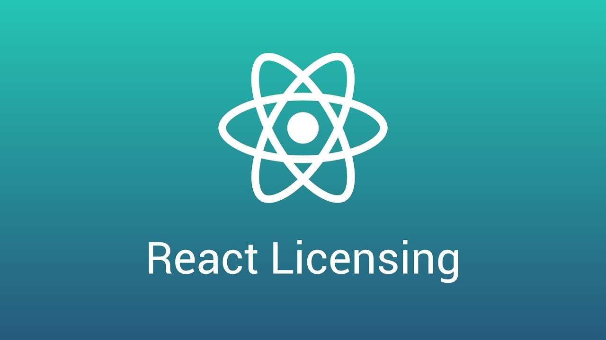
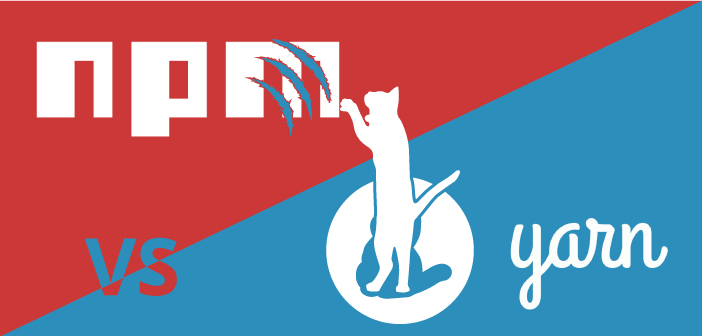
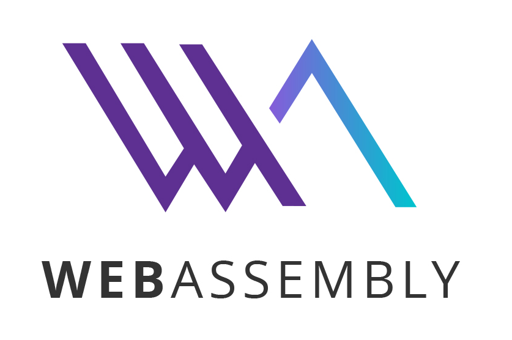
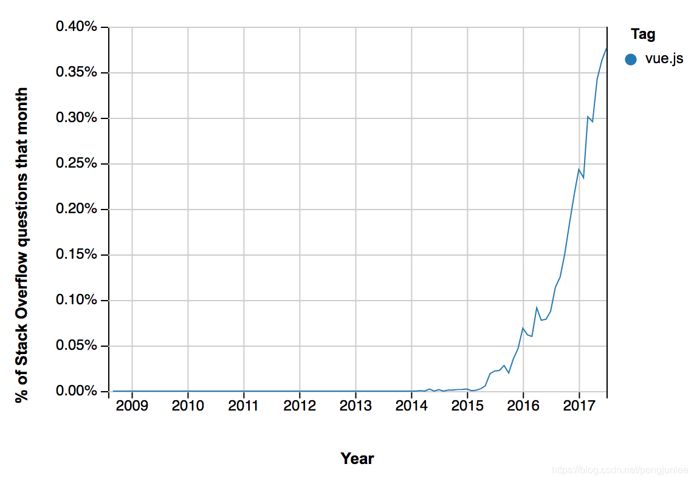
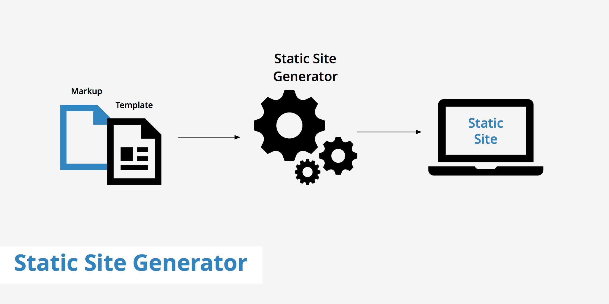
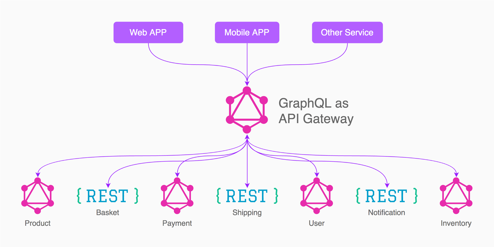
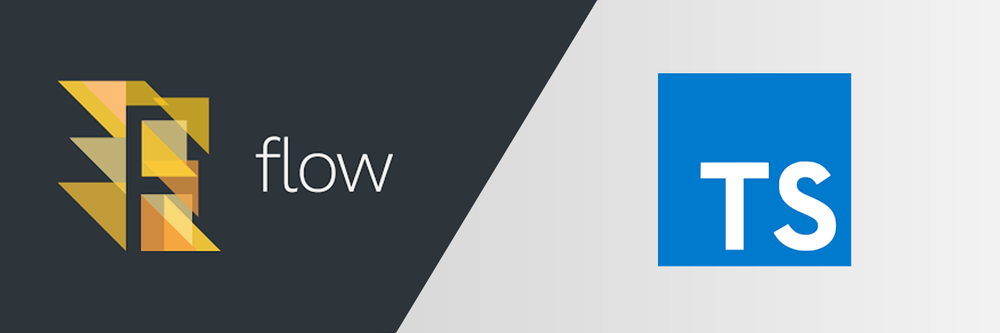

> 原文链接：<https://my.oschina.net/editorial-story/blog/1586488>

`2017`年，前端开发继续飞速发展。以下是在过去的一年中非常值得关注的一些事件和趋势整理，主要参考了国内外的一些报道和文章，希望能对大家在思考`2018`年的趋势和走向上有所帮助。欢迎指正、评论和补充。

# React 16 和 MIT 许可证
`2017`年，`React`继续在前端领域占据主导地位，备受期待的`React 16`也正式发布。该版本包含可实现异步`UI`渲染的`fiber`架构，以及更便捷的错误管理。

不过，`React`更引人关注的不是其新特性，而是开源许可证的更改。`Facebook`放弃了导致很多企业拒绝使用其开源项目的`BSD+`专利许可模式，并采用了对用户友好的`MIT`许可证。同时，`Jest`、`Flow`、`Immutable.js`和 `GraphQL`等项目也更改为了`MIT`许可证。

> 相关阅读：

- [React 16.0.0 发布，去除专利条款，改用 MIT 许可证](https://www.oschina.net/news/89089/react-16-0-0 "React 16.0.0 发布，去除专利条款，改用 MIT 许可证")
- [Facebook 被集体“声讨”，要求更改 ReactJS 许可](https://www.oschina.net/news/87076/facebook-reactjs-license "Facebook 被集体“声讨”，要求更改 ReactJS 许可")

# 下一代 Web 应用模型 — PWA
`PWA（Progressive Web App）`是`Google`于`2016`年提出的概念，`2017`年已被迅速采用。`PWA`旨在增强`Web `体验，可显著提高加载速度、可离线工作、可被添加至主屏、全屏执行、推送通知消息等等。这些特性将使得`Web`应用渐进式接近原生`App`。

> 相关阅读：

- [您的第一个 Progressive Web App](https://developers.google.com/web/fundamentals/codelabs/your-first-pwapp/?hl=zh-cn "您的第一个 Progressive Web App") 
- [Chrome Web App 已被谷歌干掉 未来将主推 PWA](https://www.oschina.net/news/91277/google-removes-chrome-apps-from-chrome-web-store "Chrome Web App 已被谷歌干掉 未来将主推 PWA")

# Yarn 快速普及，NPM 跟上脚步
`Facebook`与`Exponent`、`Google`和`Tilde`合作开发的`Yarn`在2016年10月发布以后，迅速蹿红。`Yarn`可以看做是对`NPM`缺失的一些关键特性的补充，能够更快速地安装软件包和管理依赖关系，并且可以在跨机器或者无网络的安全环境中保持代码的一致性。据悉，`Yarn`下载量目前已超过10亿次（每月下载量达到125万次）。`Yarn`的成功，使得 `NPM`在`5.0`版本中也加入了上述的这些特性。

> 相关阅读：

- [npm v5.0.0 正式发布，改进了稳定性](https://www.oschina.net/news/85338/npm-5-0-0-released "npm v5.0.0 正式发布，改进了稳定性")
- [Facebook 新推 Yarn，或取代 npm 客户端](https://www.oschina.net/news/78072/yarn-a-new-package-manager-for-javascript "Facebook 新推 Yarn，或取代 npm 客户端")

# WebAssembly 受主流浏览器支持
`WebAssembly （wasm）`在今年受到了所有主流浏览器的支持，包括`Chrome`、`Firefox`、`Safari`和`Edge`。`wasm`源于`Mozilla`发起的`Asm.js`项目，用于补充`JavaScript`，其本地解码速度比`JS`解析快得多，让高性能的 `Web`应用在浏览器上运行成为可能，比如视频游戏、计算机辅助设计、视频和图像编辑、科学可视化等等。而且由于 `wasm`字节码（Bytecode）较一般程序代码小许多倍，意谓着这项标准可节省移动设备的使用带宽，有助于改善网页加载速度，且字节码更适合浏览器读取。`wasm`还提供了一个`JavaScript API`，为前端开发人员提供了一个更容易的切入点。

> 相关阅读：

- [主流浏览器都加入了 WebAssembly 支持](https://www.oschina.net/news/90591/popular-browsers-add-webassembly "主流浏览器都加入了 WebAssembly 支持")
- [抢先一步，Rust 构建版支持直接编译 WebAssembly](https://www.oschina.net/news/91079/rust-gets-direct-webassembly-compilation "抢先一步，Rust 构建版支持直接编译 WebAssembly")

# Angular 发布了 v4，以及……v5
由于采用语义化版本控制，`Angular`在今年跨越了两个大版本：于`3月23日`发布的`Angular 4`以及于`11月1日`发布的`Angular 5`。`Angular 4`优化了视图引擎、减少代码体积；`Angular 5`中包含了一些用户期待已久的改进，像是编译器的改进，能更快的构建/重建；新的`@angular/service-worker`包能够更好的构建渐进式`Web`应用程序。

> 相关阅读：

- [Angular 5.0.0 发布，Web 前端框架](https://www.oschina.net/news/90170/angular-5-0-0 "Angular 5.0.0 发布，Web 前端框架")
- [Angular 4.0.0 正式版发布， Web 前端框架](https://www.oschina.net/news/83195/angular-4-0-0-released "Angular 4.0.0 正式版发布， Web 前端框架")
- [没有 Angular 3 ，Angular 4 计划2017年3月发布](https://www.oschina.net/news/82842/angular-4-plan-to-released-by-3-22 "没有 Angular 3 ，Angular 4 计划2017年3月发布")

# Vue.js 继续流行
既然说到了`React`，说到了`Angular`，自然不能落下`Vue`。2017年，`Vue`依然越来越受欢迎，该框架提供基于组件的架构，是`React`在因许可证问题被抵制时的主要替代方案之一。它已经被包括`GitLab`在内的许多大型公司采用，在 `Stack Overflow`上的关注度居高不下。

> 相关阅读：

- [Vue.js 框架成为 WordPress 弃用 React 后的最佳选择](https://www.oschina.net/news/88935/vue-js-be-the-best-choice-for-wordpress "Vue.js 框架成为 WordPress 弃用 React 后的最佳选择")
- [翻译 | 我们为什么以及是如何从 Angular.js 迁移到 Vue.js ？](https://www.oschina.net/translate/why-and-how-we-migrated-from-angularjs-to-vuejs "翻译 | 我们为什么以及是如何从 Angular.js 迁移到 Vue.js ？")

# CSS-in-JS 在争议中沉淀
`React`的出现，打破了以前“关注点分离”的网页开发原则，因其采用组件结构，组件强制要求把`HTML`、`CSS`、`JavaScript`写在一起。随着`React`的走红和组件模式深入人心，这种"关注点混合"的新写法逐渐成为主流。表面上，`React`的写法是`HTML`、`CSS`、`JavaScript`混合在一起。实际上并不是，其实是用`JavaScript`在写`HTML`和 `CSS`，`React`是在`JavaScript`里面实现了对`HTML`和`CSS`的封装。由于`CSS`的封装非常弱，导致了一系列的第三方库，用来加强`React`的`CSS`操作，它们统称为`CSS in JS`，意思就是使用`JS`语言写`CSS`。

`CSS in JS`的出现带来了很多争议，有不少人认为是在重复造轮子，或者说是没有找到其优势。`CSS-IN-JS`是不是未来的方向我们暂且不议，但其在2017年已得到明显的采用。

# 静态网站卷土重来
`2017`，静态网站卷土重来。`Gatsby`等框架使你能够使用`React`和其他现代工具构建静态网站。不是每个网站都需要或应该是一个复杂的现代`Web`应用，静态网站生成器能够提供的服务器端渲染和无与伦比的速度，正式其优势所在。

静态网站生成器还引发了另一个被称为`JAMStack`的趋势：`JavaScript，APIs，Markup`。 `JAMStack`使用相同的静态预构建`HTML`文件以及可重复使用的`API`和`JavaScript`来处理请求/响应周期内的任何动态编程，旨在提供更好的性能，更高的安全性，更低的扩展成本和更优的开发人员体验。
的方向我们暂且不议，但其在2017年已得到明显的采用。

# GraphQL 继续挑战 REST
虽然很多人认为`GraphQL`在2017年依然没有火起来，但不可否认的是`GraphQL`已逐渐占据了一席之地。不再管理多个端点并获取不必要的数据，`GraphQL`允许客户端声明式地定义所需的数据，并从单个端点检索所有数据。这也正式它在刚出现时被认为是革命性的`API`工具的原因，因为它可以让客户端在请求中指定希望得到的数据，而不像传统的`REST`那样只能呆板地在服务端进行预定义。

# TypeScript 和 Flow 受追捧
`2017`年，`TypeScript`受到了很多`JavaScript`开发者的追捧。`TypeScript`由微软创建，也是新版`Angular`采用的语言，其强类型正是优势所在。 而`Flow`则提供了一种更加灵活的方式来引入类型，而不需要进行重构。

