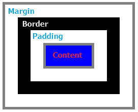

在进行WEB应用开发的过程中，我们经常会需要使用到三角形图标，例如下面这个下拉选择控件右侧的收缩箭头。

又或者像下面这种情形。

搜索网络之后发现三角形可以通过以下CSS代码实现：

	#triangle_bottom{
		height:0px;
		width:0px;
		border-left:20px solid transparent;
		border-right:20px solid transparent ;
		border-bottom:20px solid #9E9E9E ;
	}

效果如下：

那么，其内部到底是如何实现的呢？接下来是我学习CSS画三角形原理的一点小总结。
其实使用CSS代码绘制三角形，只是对盒子模型中的`border`属性的简单应用。盒子模型将HTML元素划分为内容(`Content`)、填充(`Padding`)、边框(`Border`)和边界(`Margin`)四部分，参照下图。

为了能更好的看清`Border`的四条边界的真实形状，我们为`Border`的四条边设置上不同的颜色。

	border-left:red;
	border-top:blue;
	border-right:green;
	border-bottom:yellow;

不难看出，当`Border`的四条边宽度相同时，每条边均为等腰梯形。
为四条边设置各不相同的宽度，其各边的形状改变为如下图所示。

	border-left:20px red;
	border-top:10px blue;
	border-right:30px green;
	border-bottom:40px yellow;

删除底部一条边后，其相邻边界的形状改变如下。

	border-bottom:0px;

由此我们不难得出CSS画三角形所需的第一条结论：每条边(以黄色边为例)与其邻边所成夹角A，tanA=n/m（n,m分别为自己和邻边的宽度），当邻边宽度为0px时，A角大小为90°。

接下来我们将盒子模型中的内容(Content)和填充(Padding)都设置为0px，四条边的宽度相同时如下图所示。

四条边宽度不同时，各边形状如下图。

当`border-top`宽度为`0px`时，其它三边形状如下图。

再将上图中的左侧红色和右侧绿色三角形的颜色设置为透明(transparent)，其最终形状如下图。

由此我们可以得出CSS画三角形所需的第二条结论：当盒子模型中的内容(`Content`)+填充(`Padding`)的大小为`0px`时，`Border`边的形状将由梯形变为三角形。

有了以上两条结论，我们就可以通过控制`Border`各条边的宽度和设置透明色来轻松画出各种角度的三角形了。以画向上的底角45°的等腰三角形为例，由于tan(45°)=1，我们需将`border-bottom`、`border-left`、`border-right`三者设置为相等的宽度，并将`border-left`和`border-right`设置为透明色，代码如下：

	#triangle_bottom{
		height:0px;
		width:0px;
		border-left:20px solid transparent;
		border-right:20px solid transparent ;
		border-bottom:20px solid #FF9800;
	}

其画出的三角形效果如下：

其它三个朝向的三角形画法依此类推，四个朝向的三角形的完整代码如下：

	<!DOCTYPE HTML>
	<HTML>
	<head>
		
	</head>
	<body>
		

		

		

		

	</body>
	</HTML>

效果如下：

