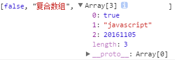

> 参考书籍：《JavaScript 权威指南----ECMAScript5+HTML5DOM+HTML5BOM》编著：张亚飞

# 声明和命名变量
在`JavaScript`中，可以使用关键字`var`声明变量，声明方法如下： 

	var 变量名 ; //仅声明变量
	var 变量名=初始值 ; //声明变量并直接为变量赋初值

在声明变量时，需注意`JavaScript`的变量是`区分大小写`的，例如，下面的语句声明的两个变量是不相同的： 

	var username="路飞";
	var userName="One Piece";
	//检测一下
	alert(username); //输出 路飞
	alert(userName); //输出 One Piece

# 变量的作用域
在`Javascript`中，使用使用关键字`var`定义的变量既可以是局部变量也可以是全局变量，这取决于定义语句所在的位置。在函数体中使用`var`关键字定义的变量为局部变量；在函数体外使用`var`关键字定义的变量为全局变量。 

	function local(){
	    var localVar="局部变量"; //这里定义的是局部变量
	    alert(localVar); //输出 局部变量
	}
	local();
	var globalVar="全局变量"; //这里定义的是全局变量
	alert(globalVar); //输出 全局变量
	alert(localVar); //输出 undefined

不使用`var`关键字声明而直接赋值使用的变量为全局变量，无论其是否在函数体内，例如下面这段代码。 

	function local(){
	    undefinedVar="未声明的变量"; //对未被声明的变量undefinedVar直接赋值使用
	}
	local();
	alert(undefinedVar); //输出 未声明的变量

# 变量声明提升
在没有声明变量的情况下使用变量，和在使用变量之后声明变量的结果是不同的，例如下面的代码： 

	alert(userName);

这一行代码仅使用`userName`变量，既没有在其前声明该变量，也没有在其后声明该变量，那么在执行时就会弹出出错警告，并且不会执行成功。

但是如果在使用`userName`变量的语句之后补充声明了该变量，那么就不会弹出警告，并且会顺利执行，例如下面的代码：

	alert(userName); //userName变量未声明， 输出 undefined
	var userName="浪里花"; //声明userName变量，并赋初值
	alert(userName); //输出 浪里花

虽然之前没有声明变量，但是随后进行了声明，那么执行器就会将所有的变量声明移到语句的顶部，这也被称为变量声明提升。如果是在函数内声明局部变量，那么就会将变量声明提升到函数体内的最顶部。

虽然变量声明提升能将变量声明提到最顶部，但是却不能将赋值语句也提到顶部，所以，当用户之前访问未声明的变量时，一般就会返回该变量对应数据类型的默认值。 

# 变量的数据类型
`JavaScript`的数据类型分为`简单数据类型`和`复杂数据类型`。

## 简单数据类型
下表列出了`JavaScript`的`5`种简单数据类型。

<table border="1" cellpadding="0" cellspacing="0"><tbody><tr><td style="text-align:center;">数据类型</td>
<td style="text-align:center;">取值范围</td>
</tr><tr><td style="text-align:center;">Boolean</td>
	<td>true或false</td>
</tr><tr><td style="text-align:center;">Number</td>
	<td>双精度浮点型，IEEE 754规定的双精度取值范围。</td>
</tr><tr><td style="text-align:center;">String</td>
	<td>字符串，需在首尾加上双引号或者单引号。</td>
</tr><tr><td style="text-align:center;">Undefined</td>
	<td>undefined (注意区分大小写)，当定义了一个变量而未为该变量赋值时 
	，该变量的值就是undefined</td>
</tr><tr><td style="text-align:center;">Null</td>
	<td>null (注意区分大小写)</td>
</tr></tbody></table>

### Boolean数据类型
`Boolean`为逻辑数据类型，其值是`true`或`false`，常用于`if-else`等条件语句中以控制程序流。任何`JavaScript`简单数据类型的值都可以通过类型转换函数`Boolean()`来将其转换为`Boolean`值，`JavaScript`也会在适当时将值`true`和`false`转换为`1`和`0`.

<table border="1" cellpadding="0" cellspacing="0"><tbody><tr><td style="text-align:center;">数据类型</td>
	<td style="text-align:center;">转换为true的值</td>
	<td style="text-align:center;">转换为false的值</td>
</tr><tr><td style="text-align:center;">Boolean</td>
	<td>true</td>
	<td>false</td>
</tr><tr><td style="text-align:center;">Number</td>
	<td>任何非零数字值（包括无穷大）</td>
	<td>0和NaN</td>
</tr><tr><td style="text-align:center;">String</td>
	<td>任何非空字符串</td>
	<td>""(空字符串)</td>
</tr><tr><td style="text-align:center;">Undefined</td>
	<td>/</td>
	<td>undefined</td>
</tr><tr><td style="text-align:center;">Null</td>
	<td>/</td>
	<td>null</td>
</tr></tbody></table>

### String数据类型
`String`即为字符串类型，值得注意的是，要赋字符串值给变量，需在字符串的首尾加上双引号或者单引号，例如：

	"这是字符串"
	'这是字符串'
	''					//这是空字符串，两个单引号之间没有空白
	""					//这是空字符串，两个双引号之间没有空白

如果要让字符串换行，可以使用转义字符（十六进制字符或使用十六进制指定16位`Unicode`字符），常用转义字符如下表。

<table border="1" cellpadding="0" cellspacing="0"><tbody><tr><td style="text-align:center;">转义字符</td>
	<td style="text-align:center;">含义</td>
	<td style="text-align:center;">十六进制字符值</td>
	<td style="text-align:center;">Unicode字符值</td>
</tr><tr><td style="text-align:center;">\b</td>
	<td>退格符（ASCII 8）</td>
	<td style="text-align:center;">\x08</td>
	<td style="text-align:center;">\u0008</td>
</tr><tr><td style="text-align:center;">\t</td>
	<td>水平制表符（ASCII 9）</td>
	<td style="text-align:center;">\x08</td>
	<td style="text-align:center;">\u0009</td>
</tr><tr><td style="text-align:center;">\n</td>
	<td>换行符（ASCII 10）</td>
	<td style="text-align:center;">\x0A</td>
	<td style="text-align:center;">\u000A</td>
</tr><tr><td style="text-align:center;">\v</td>
	<td>垂直制表符（ASCII 11）</td>
	<td style="text-align:center;">\x0B</td>
	<td style="text-align:center;">\u000B</td>
</tr><tr><td style="text-align:center;">\f</td>
	<td>换页符（ASCII 12）</td>
	<td style="text-align:center;">\x0C</td>
	<td style="text-align:center;">\u000C</td>
</tr><tr><td style="text-align:center;">\r</td>
	<td>回车符（ASCII 13）</td>
	<td style="text-align:center;">\x0D</td>
	<td style="text-align:center;">\u000D</td>
</tr><tr><td style="text-align:center;">\"</td>
	<td>双引号（ASCII 34）</td>
	<td style="text-align:center;">\x22</td>
	<td style="text-align:center;">\u0022</td>
</tr><tr><td style="text-align:center;">\'</td>
	<td>单引号（ASCII 39）</td>
	<td style="text-align:center;">\x27</td>
	<td style="text-align:center;">\u0027</td>
</tr></tbody></table>

### Null数据类型
`Null`数据类型只有一个值，即`null`，表示一个空对象。`null`值可以用在很多情况下，例如：

- 表明变量还没有接收到值。
- 表明变量不再包含值。
- 作为函数的返回值，表明函数没有可以返回的值。
- 作为函数的一个参数，表明省略了一个参数。

### Number数据类型
`Number`是双精度浮点值，浮点值即是带有小数点的数字。浮点数字都是十进制的，如果是整数，那么数字可以以十进制、八进制（前导`0`）和十六进制（前导`0x`或`0X`，推荐小写）来表示。

另外，有两个数字常量需要注意：

- Infinity 表示正无穷大，一个正数除以0就会返回正无穷。
- NaN表示非数字，一个变量定义后未赋值就进行数学运算，就会返回NaN。

## 复杂数据类型
`JavaScript`的复杂数据类型常用的有两种：`Array`数据类型和`Object`数据类型。

### Array数据类型
`Array`为数组变量，`JavaScript`数组中的元素的数据类型很自由，可以混合各种数据类型，甚至是混合复杂的数据类型，也可以嵌套另一个数组。

例如：

	var arr1=[true,'javascript',20161105];
	var arr2=new Array(false,'复合数组',arr1);
	alert(arr1); //输出 true,javascript,20161105
	alert(arr2); //输出 false,复合数组,true,javascript,20161105
	alert(arr2.length); //输出 3

arr2为复合数组，其内部包含另外一个数组（arr1），结构如下图。 

### Object数据类型
`Object`本质上是一组属性和属性值的集合，我们可以使用`new`关键字来创建`Object`对象，并为其添加属性和（或）方法，例如： 

	var user=new Object();
	user.name="百里香";
	user.age=18;
	//user={name: "百里香", age: 18}

# 数据类型转换
`JavaScript`是一种弱类型的语言，弱类型意味着用户不必显式地声明变量的数据类型，`JavaScript`将根据需要自动进行数据类型转换。

例如，下面的语句声明了一个名为`myValue`的数字类型变量。之后，由于又为其赋值一个字符串，该变量被隐式地转换为了字符串类型。 

	var myValue=20161105;
	alert(myValue); //输出 20161105
	myValue="2016年11月5日";
	alert(myValue); //输出 2016年11月5日

在`JavaScript`中，还可以使用全局函数对变量的数据类型进行强制(显式)转换，这些函数包括`parseFloat()`、`parseInt()`、`Number()`、`String()`和`Boolean()`。  

# typeof操作符
`typeof`操作符用来检测变量的数据类型。对于值或变量使用`typeof`操作符会返回如下字符串。 

<table border="1" cellpadding="0" cellspacing="0"><tbody><tr><td style="text-align:center;">字符串</td>
	<td style="text-align:center;">描述</td>
</tr><tr><td style="text-align:center;">undefined</td>
	<td style="text-align:center;">未定义</td>
</tr><tr><td style="text-align:center;">boolean</td>
	<td style="text-align:center;">布尔值</td>
</tr><tr><td style="text-align:center;">string</td>
	<td style="text-align:center;">字符串</td>
</tr><tr><td style="text-align:center;">number</td>
	<td style="text-align:center;">数值</td>
</tr><tr><td style="text-align:center;">object</td>
	<td style="text-align:center;">对象或null</td>
</tr><tr><td style="text-align:center;">function</td>
	<td style="text-align:center;">函数</td>
</tr></tbody></table>
 