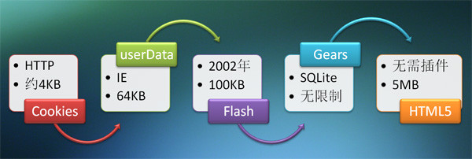

> 参考书籍：《JavaScript 权威指南----ECMAScript5+HTML5DOM+HTML5BOM》编著：张亚飞

# 什么是Web存储？
Web存储机制是一种通过字符串形式的`key/value`对来安全地存储和使用客户端数据的方法。在HTML5之前，Web存储先后出现了`Cookie`，IE的`userData`，`Flash`，Google的`Gears`等多种解决方案，以下是一张网上的图片，能够很好地展示web存储的这一发展历程。 

HTML5对web存储进行了规范和统一，提出了一种新的`Storage`存储方式，并把它分为以下两种：

- 本地存储（localStorage） 没有时间限制的数据存储。
- 会话存储（sessionStorage） 针对一个会话期的数据存储。

在使用`Storage`存储前,应检查浏览器是否支持`localStorage`和`sessionStorage`。 

	//以下函数用来检测浏览器是否支持localStorage和sessionStorage
	function storageAvailable(type) {
	    try {
	        var storage = window[type],
	        x = '__storage_test__';
	        storage.setItem(x, x);
	        storage.removeItem(x);
	        return true;
	    }
	    catch(e) {
	        return false;
	    }
	}
	//以下是storageAvailable函数的用法
	//检测是否支持sessionStorage，调用sessionStoragestorageAvailable('sessionStorage')
	if (storageAvailable('localStorage')) {
	    // 浏览器支持localStorage
	}
	else {
	    // 浏览器不支持localStorage
	}

各大主流浏览器对`localStorage`支持情况如下图。 

# localStorage、sessionStorage、Cookie和Session
`localStorage`用于在客户端持久存储数据，除非主动删除数据，否则数据是永远不会过期的。

`sessionStorage`用于在会话期间存储数据，被存储的数据只有在同一个会话中的页面才能访问，并且当会话结束后数据也会随之销毁。

与`Cookie`相比，`localStorage`有以下优势：

- 每个Cookie最多只能存储4KB信息，而官方建议的localStorage的大小为5M。
- 每个域下可创建的Cookie数量有限制（IE6下至多存储20个Cookie），localStorage对数据条数无限制。
- 原生的cookie接口并不友好，程序员需重新封装，localStorage提供了方便的数据操作接口。
- Cookie的内容会随页面请求在服务器和客户端之间来回传递，占用带宽资源，传输效率低，而localStorage内存储的数据不会被发送到服务器端。
- Cookie存在安全性问题，如果cookie被人拦截了，那人就可以取得所有的session信息。即使加密也与事无补，因为拦截者并不需要知道cookie的意义，他只要原样转发cookie就可以达到目的了。

`localStorage`的局限：

- 各浏览器的localStorage大小不统一，并且IE只在IE8以上版本才支持localStorage。
- localStorage只能存储字符串，任何格式的数据在存储的时候都会被自动转为字符串，所以读取的时候，需要进行类型的转换。
- localStorage本质上是对字符串的存储和读取，存储数据会消耗浏览器的内存空间，存储数据多的情况下，会影响浏览器响应效率。
- localStorage在浏览器的隐私模式下是不可读取的。
- localStorage不能被爬虫抓取到。

另外，`sessionStorage`和服务端`Session`存储也不相同，`sessionStorage`存储区域存储在客户端计算机上。 

# Storage接口
HTML5规范规定了`WindowSessionStorage`和`WindowLocalStorage`接口，分别对应于`SessionStorage`和 `LocalStorage`，在这两个接口内分别定义了`sessionStorage`和`localStorage`属性。`window`实现了这两个接口，因此，可以使用`window.sessionStorage`和`window.localStorage`属性来处理`SessionStorage`和`LocalStorage`。

`window.sessionStorage`和`window.localStorage`属性返回的数据类型都是`Storage`，支持HTML5的浏览器都实现了`Storage`接口，因此这两个属性都可以返回一个`Storage`对象。

`Storage`接口包含的属性和方法如下：

**只读属性**：`Storage.length`返回存储在`Storage`对象内的`key/value`对的个数。

**方法**：

- `Storage.key(n)`返回存储在`Storage`对象内的第`n`条数据的`key`。
- `Storage.getItem(key)`返回指定`key`的`value`。
- `Storage.setItem(key,value)`向`Storage`对象内添加或更新`key/value`。
- `Storage.removeItem(key)`从`Storage`对象内删除指定`key/value`。
- `Storage.clear()`从`Storage`对象内删除所有`key/value`。 

# localStorage基本操作
使用`window.localStorage`属性可以获取与当前域对应的本地存储区域，其中存储的数据可以在当前域的多个页面和会话之间传递。

以下代码演示了如何使用`localStorage`进行本地存储：

	var storage=window.localStorage; //获取当前域所对应本地存储区域
	//使用setItem(key,value)方法向本地存储区域中写入数据
	storage.setItem("visitedCount",1);
	storage.setItem("visitedUser","pengjunlee");
	storage.setItem("visitedPage","Using the Web Storage API");
	//使用本地存储的length属性、key()和getItem()方法对存储的数据进行遍历显示
	for (var i=0, len = storage.length; i < len; i++)
	{
	    var key = storage.key(i);
	    var value = storage.getItem(key);
	    alert(value); //三次依次输出：1，Using the Web Storage API ，pengjunlee
	}
	storage.setItem("visitedUser","A Gentleman");//使用setItem(key,value)方法更新visitedUser的值
	alert(storage.getItem("visitedUser"));//输出 A Gentleman
	storage.setItem("visitedTime",new Date().toUTCString());//使用setItem(key,value)添加新建visitedTime
	storage.removeItem("visitedPage");//使用removeItem(key)方法删除指定的键/值对
	//使用本地存储的length属性、key()和getItem()方法对存储的数据再次进行遍历显示
	for (var i=0, len = storage.length; i < len; i++)
	{
	    var key = storage.key(i);
	    var value = storage.getItem(key);
	    alert(value); //三次次依次输出：1，Sat, 05 Nov 2016 15:08:28 GMT，A Gentleman
	}
	storage.clear();//使用clear()方法清除所有的键/值对
	alert(storage.length);//输出 0

以下是在Chrome浏览器中截取的代码中两次遍历时`LocalStorage`的数据存储情况。 

`localStorage`不但可以用自身的`setItem()`,`getItem()`等方法方便存取，还可以像普通的JavaScript对象一样使用点`.`操作符，及以`[]`的方式进行数据存储，例如下面的代码： 

	var storage=window.localStorage; //获取当前域所对应本地存储区域
	//使用点 . 操作符，及 [] 方式向本地存储区域中写入数据
	storage.visitedCount=1;
	storage.visitedUser="pengjunlee";
	storage["visitedPage"]="Using the Web Storage API";
	//使用本地存储的length属性、key()和[]方式对存储的数据进行遍历显示
	for (var i=0, len = storage.length; i < len; i++)
	{
	    var key = storage.key(i);
	    var value = storage[key];
	    alert(value); //三次依次输出：1，Using the Web Storage API ，pengjunlee
	}

# storage事件
当使用的存储区域内容发生变化时还可能触发`storage`事件，使用`window.onstorage`可以捕获该事件。例如下面的代码： 

	var storage=window.localStorage;
	(function(){
		window.addEventListener("storage",function storageHandler(event){
			var myDiv=document.getElementById("myDiv");
			myDiv.innerHTML="存储发生了变化： <b>"+
			event.key+"</b>键改变了 旧值<b>"+
			event.oldValue+"</b>被改变为新值<b>"+
			event.newValue+"</b> 发生更改所在的网址：<b>"+
			event.url+"</b>";
		});
	})()

执行`Storage.setItem()`、`Storage.removeItem()`和`Storage.clear()`方法都可以触发该事件，对于前面的范例，如果`storage`中的键值发生变化，会返回类似如下图所示的结果。 

Event事件对象可以获取的属性如下：

- 属性`key`，表示被更改键。
- 属性`oldValue`，表示被更改的键的旧值。
- 属性`newValue`，表示被更改的键的新值。
- 属性`url`，表示发生更改所在的网址。
- 属性`storageArea`，表示发生更改所在的`Storage`对象。

需要注意的是：

- IE使用`storagecommit`事件替代了`storage`事件，它使用XML文件存储`localstorage`，并且IE的`localstorage`并不支持本地文件，所以需要将以上测试代码所在页面部署到`TomCat`服务器上进行测试。
- 当`storage`发生改变的时候，会触发当前域下所有非当前页面的`storage`事件（IE除外，IE的`storagecommit`事件会触发当前域下所有页面的`storagecommit`事件）。 