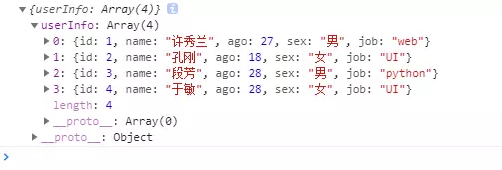

> 原文链接：<https://www.jianshu.com/p/5dfa9f0bb11e>

# 什么是Mock.js?
生成随机数据，拦截`Ajax`请求。

通过随机数据，模拟各种场景；不需要修改既有代码，就可以拦截`Ajax`请求，返回模拟的响应数据；支持生成随机的文本、数字、布尔值、日期、邮箱、链接、图片、颜色等；支持支持扩展更多数据类型，支持自定义函数和正则。

优点是非常简单方便, 无侵入性, 基本覆盖常用的接口数据类型。

# 安装

	# 使用npm安装：
	npm install mockjs
	# 或直接：
	

# 使用方式
## 基本语法

	Mock.mock('地址',{ "dataname|rule":{"对应的值"} }) 

> 说明：地址就是我们通过`ajax`获取数据时候填写的地址，这里填写的地址可以是任意不存在的地址，第二个参数是我们要模拟的数据，以及相应的规则。

## 语法规则
参照官网实例即可，**示例：**

	Mock.mock('https://www.test.com',{
	      "userInfo|4":[{    //生成|num个如下格式名字的数据
	      "id|+1":1,  //数字从当前数开始后续依次加一
	      "name":"@cname",    //名字为随机中文名字
	      "ago|18-28":25,    //年龄为18-28之间的随机数字
	      "sex|1":["男","女"],    //性别是数组中的一个，随机的
	      "job|1":["web","UI","python","php"]    //工作是数组中的一个
	      }]
	})

最后通过`ajax`接收数据，形式如下：

	//ajax接收数据，通过jq
	$.get('https://www.test.com',function(data){
	    console.log(JSON.parse(data));
	})

最终生成的数据为：

> 注意：对于通过`Random`属性而来的一些随机数据-比如随机生成图片，使用方式如下。

	Mock.mock('http://www.test.com',{
	    "ListInfo|5":[{
	      "img":Mock.Random.image('200x100')
	    }]
	});
	//这里的图片数据就是随机生成的，只是大小被指定为200X100了