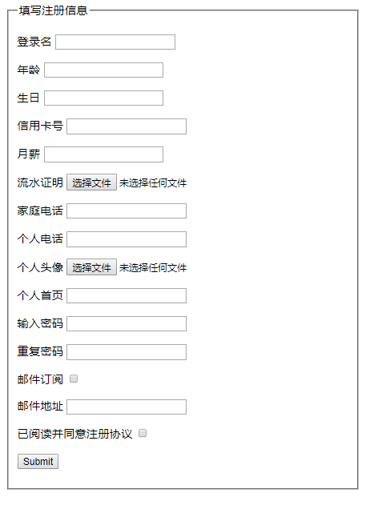

# jQuery Validate简介
`jQuery Validate`插件提供了强大的表单验证功能，能够让客户端表单验证变得更简单，同时它还提供了大量的可定制化选项，以满足应用程序的各种需求。该插件捆绑了一套非常有用的验证方法，包括 URL 和电子邮件验证，同时也提供了`API`允许用户自定义校验方法。提供的所有捆绑方法默认使用英语作为错误信息，且已翻译成其他`37`种语言。

# 引入jQuery Validate
官网下载地址：<https://github.com/jquery-validation/jquery-validation/releases>
根据项目需要引入需要的Js库文件到`<head>`标签下或者在`<body>`标签关闭之前（推荐）。

	<body>
	   //页面内容 
	   
	   
	   
	  
	</body>

注意事项：

1. 所有需要被校验的`<input>`元素都必须有`name`属性，并且其取值在一个表单中必须唯一。
2. 同组的`<radio>`或`<checkbox>`元素`name`属性值相同。、
3. 复杂的`name`属性在定义`rules`选项时需要使用`""`括起来。
4. 推荐为每一个`<input>`元素添加一个与其关联的`<label>`元素，`<label>`元素的`for`属性为`<input>`元素的 `id`属性。

	$("#example_form").validate({
	    rules: {
	        // 不需要使用 "" 括起来
	        name: "required",
	        // 需要使用 "" 括起来
	        "user[email]": "email",
	        // 需要使用 "" 括起来
	        "user.address.street": "required"
	    }
	});

# 默认校验规则
<table cellspacing="0" cellpadding="0" border="1" style="table-layout:fixed;border:1px solid rgb(204,204,204);width:370px;"><tbody><tr><td style="width:80px;font-weight:bold;text-align:center;color:rgb(84,141,212);">规则名称</td><td style="width:98px;height:12px;font-weight:bold;text-align:center;color:rgb(84,141,212);">类型</td><td style="width:192px;height:12px;font-weight:bold;text-align:center;color:rgb(84,141,212);">描述</td></tr><tr><td style="width:80px;text-align:center;">required</td><td style="width:98px;height:12px;text-align:center;color:rgb(0,0,0);">Boolean</td><td style="width:192px;height:12px;color:rgb(0,0,0);">设置该项内容为必填</td></tr><tr><td style="width:80px;text-align:center;">remote</td><td style="width:98px;height:12px;text-align:center;color:rgb(0,0,0);">Json|String</td><td style="width:192px;height:12px;color:rgb(0,0,0);">请求远程资源来校验内容有效性</td></tr><tr><td style="width:80px;text-align:center;">minlength</td><td style="width:98px;height:12px;text-align:center;color:rgb(0,0,0);">Number</td><td style="width:192px;height:12px;color:rgb(0,0,0);">设置内容的最少字符长度</td></tr><tr><td style="width:80px;text-align:center;">maxlength</td><td style="width:98px;height:12px;text-align:center;color:rgb(0,0,0);">Number</td><td style="width:192px;height:12px;color:rgb(0,0,0);">设置内容的最多字符长度</td></tr><tr><td style="width:80px;text-align:center;">rangelength</td><td style="width:98px;height:12px;text-align:center;color:rgb(0,0,0);">Array</td><td style="width:192px;height:12px;color:rgb(0,0,0);">设置内容的字符长度范围</td></tr><tr><td style="width:80px;text-align:center;">min</td><td style="width:98px;height:12px;text-align:center;color:rgb(0,0,0);">Number</td><td style="width:192px;height:12px;color:rgb(0,0,0);">设置内容的最小允许值</td></tr><tr><td style="width:80px;text-align:center;">max</td><td style="width:98px;height:12px;text-align:center;color:rgb(0,0,0);">Number</td><td style="width:192px;height:12px;color:rgb(0,0,0);">设置内容的最大允许值</td></tr><tr><td style="width:80px;text-align:center;">range</td><td style="width:98px;height:12px;text-align:center;color:rgb(0,0,0);">Array</td><td style="width:192px;height:12px;color:rgb(0,0,0);">设置内容的允许值范围</td></tr><tr><td style="width:80px;text-align:center;">step</td><td style="width:98px;height:12px;text-align:center;color:rgb(0,0,0);">Number</td><td style="width:192px;height:12px;color:rgb(0,0,0);">设置内容为某一固定值的倍数</td></tr><tr><td style="width:80px;text-align:center;">email</td><td style="width:98px;height:12px;text-align:center;color:rgb(0,0,0);">Boolean</td><td style="width:192px;height:12px;color:rgb(0,0,0);">设置该项内容为一个有效邮箱地址</td></tr><tr><td style="width:80px;text-align:center;">url</td><td style="width:98px;height:12px;text-align:center;color:rgb(0,0,0);">Boolean</td><td style="width:192px;height:12px;color:rgb(0,0,0);">设置该项内容为一个有效网址</td></tr><tr><td style="width:80px;text-align:center;">date</td><td style="width:98px;height:12px;text-align:center;color:rgb(0,0,0);">Boolean</td><td style="width:192px;height:12px;color:rgb(0,0,0);">设置该项内容为日期格式</td></tr><tr><td style="width:80px;height:12px;text-align:center;color:rgb(0,0,0);">dateISO</td><td style="width:98px;text-align:center;">Boolean</td><td style="width:192px;height:12px;color:rgb(0,0,0);">设置该项内容为ISO日期格式</td></tr><tr><td style="width:80px;text-align:center;">number</td><td style="width:98px;height:12px;text-align:center;color:rgb(0,0,0);">Boolean</td><td style="width:192px;height:12px;color:rgb(0,0,0);">设置该项内容为十进制小数</td></tr><tr><td style="width:80px;height:12px;text-align:center;color:rgb(0,0,0);">digits</td><td style="width:98px;height:12px;text-align:center;color:rgb(0,0,0);">Boolean</td><td style="width:192px;height:12px;color:rgb(0,0,0);">设置该项内容为十进制整数</td></tr><tr><td style="width:80px;text-align:center;">equalTo</td><td style="width:98px;height:12px;text-align:center;color:rgb(0,0,0);">Selector</td><td style="width:192px;height:12px;color:rgb(0,0,0);">设置该项内容与指定元素内容相同</td></tr><tr><td style="width:80px;text-align:center;">accept</td><td style="width:98px;height:12px;text-align:center;color:rgb(0,0,0);">String</td><td style="width:192px;height:12px;color:rgb(0,0,0);">设置上传文件所接受的 MIME 类型</td></tr><tr><td style="width:80px;text-align:center;">creditcard</td><td style="width:98px;height:12px;text-align:center;color:rgb(0,0,0);">Boolean</td><td style="width:192px;height:12px;color:rgb(0,0,0);">设置该项内容为一个信用卡卡号</td></tr><tr><td style="width:80px;text-align:center;">extension</td><td style="width:98px;height:12px;text-align:center;color:rgb(0,0,0);">String</td><td style="width:192px;height:12px;color:rgb(0,0,0);">设置上传文件所接受的扩展名</td></tr><tr><td style="width:80px;height:12px;text-align:center;color:rgb(0,0,0);">phoneUS</td><td style="width:98px;height:12px;text-align:center;color:rgb(0,0,0);">Boolean</td><td style="width:192px;height:12px;color:rgb(0,0,0);">设置该项内容为一个美国电话号码</td></tr><tr><td style="width:80px;text-align:center;">require_from_group</td><td style="width:98px;height:12px;text-align:center;color:rgb(0,0,0);">Array</td><td style="width:192px;height:12px;color:rgb(0,0,0);">设置同一组至少填写多少项</td></tr></tbody></table>

# 插件功能
## 选择器
`jQuery Validate`插件对`JQuery`库进行了扩展，增加了下面3个选择器：

	:blank –选择所有值为空的元素
	:filled – 选择所有值不为空的元素
	:unchecked –选择所有未被选中的元素

## 方法
`jQuery Validate`插件提供了3个非常重要的校验方法：

- validate() – 对选中的表单进行校验
- valid() – 判断选中的表单或元素输入的内容是否有效
- rules() – 获取、添加或者移除元素的规则

**方法应用示例**：

	// 移除元素的所有校验规则
	$("#user_age").rules("remove");
	// 为元素添加 required max min 校验规则
	$("#user_age").rules("add", {
	    required: true,
	    max: 100,
	    min: 10
	});
	// 移除元素的 max min 校验规则
	$("#user_age").rules("remove", "min max");

## Validator
调用`validate()`方法将会返回一个`Validator`对象，该对象提供了很多方法，其中比较常用的方法列举如下。

- Validator.form() – 校验表单
- Validator.element() – 校验元素
- Validator.resetForm() – 重置表单
- Validator.showErrors() – 显示指定的错误信息
- Validator.numberOfInvalids() – 显示无效的项目数量
- Validator.destroy() –销毁Validator对象

**方法应用示例**：

	var validator = $("#example_form").validate();
	validator.element("#user_age");
	validator.showErrors({
	    "userAge": "年龄输入格式不合法"
	});
	validator.form();
	console.log(validator.numberOfInvalids() + " 个字段无效");
	validator.resetForm();
	validator.destroy();

## 静态方法
同时，`Validator`对象还提供了下面几个静态方法。

- jQuery.validator.addMethod() – 添加一个自定义的校验方法
- jQuery.validator.format() – 使用参数替换掉 {n} 占位符
- jQuery.validator.setDefaults() – 修改校验器的默认选项
- jQuery.validator.addClassRules() – 为某一类元素添加校验规则

# 应用示例

对以上注册信息进行验证，完整代码如下。

	<!DOCTYPE html>
	<html>
	 <head>
	  <meta charset="UTF-8" />  
	  <meta http-equiv="Content-Type" content="text/html; charset=utf-8" /> 
	 </head> 
	 <body> 
	  <form id="example_form" method="get" action=""> 
	   <fieldset> 
	    <legend>填写注册信息</legend> 
	    
 <label for="user_name">登录名</label> <input id="user_name" name="name" /> 
 
	    
 <label for="user_age">年龄</label> <input class="math_class" id="user_age" name="age" /> 
 
	    
 <label for="user_birthday">生日</label> <input id="user_birthday" name="birthday" /> 
 
	    
 <label for="user_card_id">信用卡号</label> <input id="user_card_id" name="card" /> 
 
	    
 <label for="user_salary">月薪</label> <input id="user_salary" name="salary" /> 
 
	    
 <label for="user_prove">流水证明</label> <input id="user_prove" type="file" name="prove" /> 
 
	    
 <label for="user_phone">家庭电话</label> <input class="phone_group" id="user_phone" name="phone" /> 
 
	    
 <label for="user_mobile">个人电话</label> <input class="phone_group" id="user_mobile" name="mobile" /> 
 
	    
 <label for="user_image">个人头像</label> <input id="user_image" type="file" name="image" /> 
 
	    
 <label for="user_home">个人首页</label> <input id="user_home" type="url" name="home" /> 
 
	    
 <label for="user_password">输入密码</label> <input id="user_password" type="password" name="password" /> 
 
	    
 <label for="user_repassword">重复密码</label> <input id="user_repassword" type="password" name="repassword" /> 
 
	    
 <label for="send_to_me">邮件订阅</label> <input id="send_to_me" type="checkbox" name="sendMe" /> 
 
	    
 <label for="user_email">邮件地址</label> <input id="user_email" type="email" name="email" /> 
 
	    
 <label for="registration_agree">已阅读并同意注册协议</label> <input id="registration_agree" type="checkbox" name="regAgree" /> 
 
	    
 <input class="submit" type="submit" value="Submit" /> 
 
	   </fieldset> 
	  </form> 
	  
 
	   

 
	   <ul></ul>
	  
 
	  

 
	   
	   
	   
	   
	    
	 </body>
	</html>
