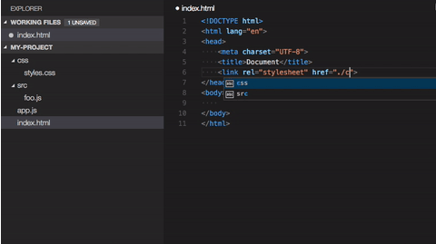
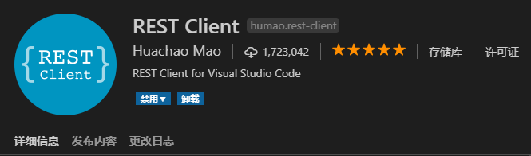
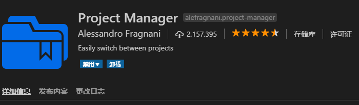

> 原文地址：<https://www.cnblogs.com/clwydjgs/p/10078065.html>

# 前言
在前端开发中，有一个非常好用的工具，`Visual Studio Code`，简称`VS code`。

都不用我安利`VS code`，大家就会乖乖的去用，无数个大言不惭的攻城狮，都被`VS code`比德芙还丝滑的强大功能所折服。

我是来给大家安利插件的，想做个比较全面的插件集合给大家。网上的我也看过一些，但是都比较零散，时间也久了一些，我结合最近的情况，总结一下，造福大家，才是我想做的。手动比心❤。

`VS vode`特点：

- 开源，免费；
- 自定义配置
- 集成git
- 智能提示强大
- 支持各种文件格式（html/jade/css/less/sass/xml）
- 调试功能强大
- 各种方便的快捷键
- 强大的插件扩展
　　　
对前端这么友好，没理由不用。

Visual Studio Code（VScode ）官网　：<https://code.visualstudio.com/>

Visual Studio Code（VScode ）github地址 ：<https://github.com/Microsoft/vscode>

# 安装插件
## 方法一：
按`F1`或`Ctrl+Shift+p`，输入`extensions`，点击第一个就可以了 。

## 方法二：
`ctrl + P`然后输入`ext install`。

## 方法三：
点击图中位置。

# 插件合集
插件官网：<https://marketplace.visualstudio.com/>

每一个插件名都超链接到官网，注意查看。

## 配置类插件
### Settings Sync
最好用的插件，没有之一，一台电脑配置好之后，其它的几台电脑都不用配置。新机器登录一下就搞定了。再也不用折腾环境了，使用`GitHub Gist`同步多台计算机上的设置，代码段，主题，文件图标，启动，键绑定，工作区和扩展。 

### Debugger for Chrome
从VS Code调试在Google Chrome中运行的JavaScript代码。

用于在Google Chrome浏览器或支持Chrome DevTools协议的其他目标中调试JavaScript代码的VS Code扩展。 

### beautify
格式化代码工具，美化Javascript，JSON，CSS，Sass，和HTML在Visual Studio代码。 

### Atuo Rename Tag
修改`html`标签，自动帮你完成头部和尾部闭合标签的同步修改。

### 中文（简体）语言包
`Chinese (Simplified) Language Pack for Visual Studio Code`，将界面转换为中文，对英语不好的人，非常友好。例如我。。。 

### Code Spell Checker
代码拼写检查器，一个与camelCase代码配合良好的基本拼写检查程序。此拼写检查程序的目标是帮助捕获常见的拼写错误，同时保持误报数量较低。 

### vscode-icons
显示Visual Studio代码的图标，目前该插件已被vscode内部支持："文件" -> "首选项" -> "文件图标主题"。 

### guides
显示代码对齐辅助线，很好用。 

### Rainbow Brackets
为圆括号，方括号和大括号提供彩虹色。这对于Lisp或Clojure程序员，当然还有JavaScript和其他程序员特别有用。

效果如下： 

### Bracket Pair Colorizer
用于着色匹配括号。 

### Indent-Rainbow
用四种不同颜色交替着色文本前面的缩进。 

### filesize
在状态栏中显示当前文件大小，点击后还可以看到详细创建、修改时间。 

### Import Cost
对引入的计算大小。 

### Path Intellisense
可自动填充文件名。 

### WakaTime 
从您的编程活动自动生成的度量标准，见解和时间跟踪。 

### GitLens
git日志查看插件，GitLens 增强了 Visual Studio Code 中内置的 Git 功能。例如 commits 搜索，历史记录和和查看代码作者身份，还能通过强大的比较命令获得有价值的见解，等等。 

### REST Client
REST客户端允许您直接发送HTTP请求并在Visual Studio Code中查看响应。 

### Npm Intellisense 
用于在 import 语句中自动填充 npm 模块，require 时的包提示（最新版的vscode已经集成此功能）。

### Azure Storage
VS Code的Azure存储扩展允许您部署静态网站并浏览Azure Blob容器，文件共享，表和队列。按照本教程从VS Code部署Web应用程序到Azure存储。 

### Project Manager
它可以帮助您轻松访问项目，无论它们位于何处。不要再错过那些重要的项目了。您可以定义自己的收藏项目，或选择自动检测VSCode项目，Git，Mercurial和SVN存储库或任何文件夹。

从版本8开始，您就有了专门的项目活动栏！

以下是Project Manager提供的一些功能：

- 将任何项目保存为收藏夹
- 自动检测VSCode，GIT中，水银或SVN存放区
- 在相同或新窗口中打开项目
- 识别已删除/重命名的项目
- 一个状态栏标识当前项目
- 专门的活动栏 

### Language Support for Java(TM) by Red Hatredhat.java
这个插件，这个下载次数，安装就对了。 

### Todo Tree 
此扩展可以快速搜索（使用ripgrep）您的工作区以获取TODO和FIXME等注释标记，并在资源管理器窗格的树视图中显示它们。单击树中的TODO将打开文件并将光标放在包含TODO的行上。

找到的TODO也可以在打开的文件中突出显示。 

## VScode主题集合
### Night Owl
一个非常适合夜猫子的 VS Code 主题。像是为喜欢深夜编码的人精心设计的。 

### Atom One Dark Theme
一个基于Atom的黑暗主题。 

### Dracula Official
官方吸血鬼主题，博主用的就是这款，很漂亮。 

### One Dark Pro
Atom标志性的One Dark主题，也是VS Code下载次数最多的主题之一！ 

### Bimbo
简约而现代的神奇海洋主题。 

## 代码提示类
### HTML Snippets
完整的HTML代码提示，包括HTML5。 

### HTML CSS Support
在 html 标签上写class 智能提示css样式。 

### jQuery Code Snippets
JQuery代码提示，超过130个用于JavaScript代码的jQuery代码片段。

只需键入字母'jq'即可获得所有可用jQuery代码片段的列表。 

### HTMLHint
html代码检测，支持html5。 

## 语言相关
### C＃

- 适用于[.NET Core](https://dotnet.github.io/ ".NET Core")的轻量级开发工具。
- 伟大的C＃编辑支持，包括语法突出显示，智能感知，转到定义，查找所有引用等。
- 调试支持.NET Core（CoreCLR）。注意：不支持单声道调试。桌面CLR调试支持有限。
- 支持Windows，macOS和Linux上的project.json和csproj项目。

### CodeMetrics
计算TypeScript / JavaScript文件的复杂性。

### VUE插件
vetur   　　 语法高亮、智能感知、Emmet等

VueHelper  　　snippet代码片段

ESLint    　　将ESLint JavaScript集成到VS代码中。

prettier    代码规范性插件

### Java Extension Pack
它是一组流行的扩展，可以帮助在Visual Studio Code中编写，测试和调试Java应用程序。查看VS Code中的Java以开始使用。

 

 