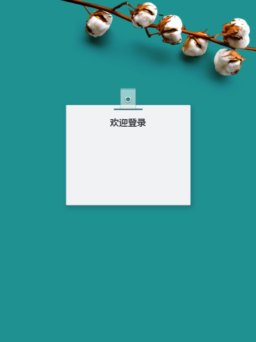

觉得公司管理后台的登录界面挺简洁的，于是就记录下来了，方便日后直接拿来用。

	<!DOCTYPE html>
	<html lang="en">
	 
	<head>
	    <meta charset="utf-8">
	    <title>登录页面布局</title>
	 
	    
	</head>
	 
	<body>
	    

	        
欢迎登录

	        <form action="/login" name="loginForm" target="_self" method="POST">
	            

	 
	            

	        </form>
	    

	</body>
	 
	</html>

登录界面效果如下图所示。 

	网盘链接：https://pan.baidu.com/s/1v1kPXmtVBvbH2kA6Q7Jb1g
	提取码：89n2 