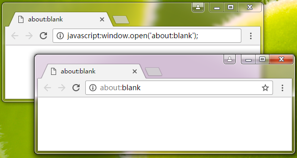

> 参考书籍：《JavaScript 权威指南----ECMAScript5+HTML5DOM+HTML5BOM》编著：张亚飞

# 使用script元素定义JavaScript脚本代码
在HTML文档中，可以使用使用`

参数说明： 

- language="脚本语言类型" 

已废弃。原来用于指定``标记对之间，有以下两种方式：

在`

例如下面的HTML代码片段： 

	

通过`

例如在HTML页面中引入JQuery函数库文件： 

	

使用`
	<a href="javascript:void(0);" onclick="popupMsg('这是一个空链接')">这是一个空链接</a>
	<a href="javascript:popupMsg('这是一个空链接');" onclick="">这是一个空链接</a>

当单击该链接时，都会调用一个自定义的函数`popupMsg()`，该函数会弹出一个警告框。

该方法还可以用来实现打开新窗口这样的操作，例如下面的代码将会打开一个新的空窗口： 

	<a href="javascript:window.open('about:blank');">打开新窗口</a>

甚至于，用户可以在浏览器地址栏中输入一段以`javascript:`作为前缀的脚本代码，都会被执行，例如下面的代码： 

	javascript:window.open('about:blank');

对于一些浏览器，如果在浏览器地址栏中输入以上语句，将会打开一个新窗口或新标签页，如图所示。 

# 浏览器不支持脚本时应注意的问题
在HTML4中，规定可以在`

或者： 

	

HTML4之所以这样规定，是因为当时还有很多浏览器不支持`JavaScript`，甚至也不支持`<script>`元素，当浏览器不支持`<script>`元素时，这样做就可以避免这些代码直接呈现为文本。

但是，当前不会再存在这种情况，`<script>`元素是`HTML5`标准所明确规定的，凡支持`HTML5`的浏览器都会支持`<script>`元素。

另外，还可以在HTML网页中在定义`<script>`元素的同时定义`<noscript>`元素，如果客户端浏览器可以识别脚本但设置了禁止执行脚本，那么就会执行`<noscript>`元素中的内容。例如： 

	<noscript>
	
浏览器不支持JavaScript...

	</noscript>

# 声明脚本语言
因为HTML并不依赖于某个特定的脚本语言，所以文档创作者必须显式地告诉浏览器每个脚本所使用的语言，可以通过一个默认声明或者本地声明来完成。

## 默认的脚本语言

一般，应该在文档头部定义所使用脚本的默认语言，可以通过`<meta>`元素来实现。指定默认语言的`<meta>`元素声明的格式如下： 

	<meta http-equiv="Content-Script-Type" content="脚本语言类型"></meta>

这里，`content`属性的值是W3C标准定义的内容类型，比较常用的就是:"text/tcl"，"text/javascript"和"text/vbscript"。

如果没有使用`<meta>`元素指定默认语言，还可以通过HTTP报头的`Content-Script-Type`来设置默认语言。如下所示：

	Content-Script-Type：脚本语言类型

## 脚本语言的本地声明

通过`<script>`元素的`type`属性可以指定其中的脚本代码所使用的脚本语言，这被称为本地声明。本地声明的脚本语言将会覆盖文档默认的脚本语言。 