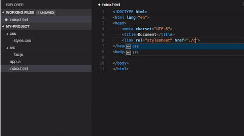
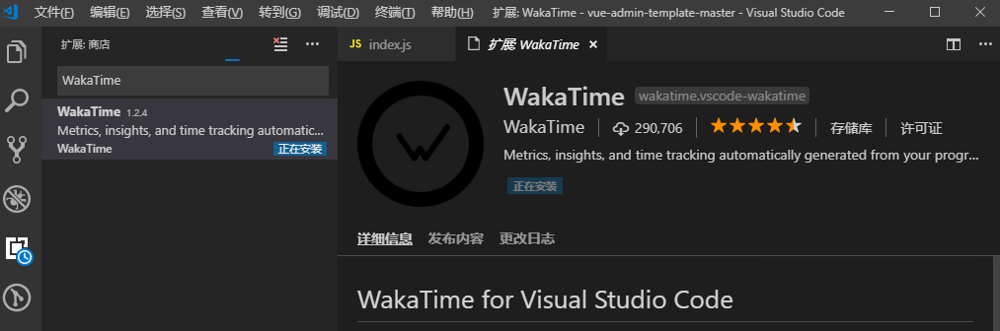
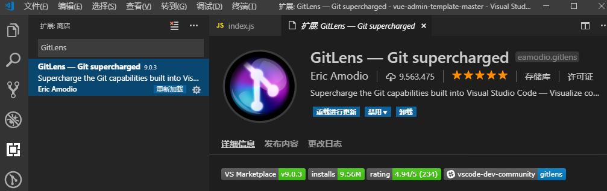
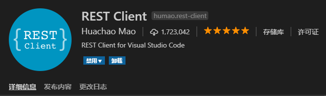
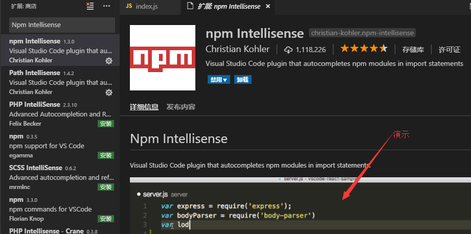
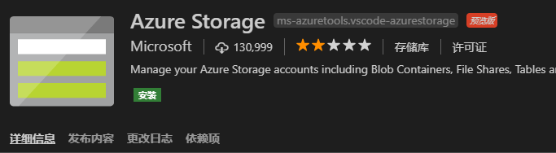
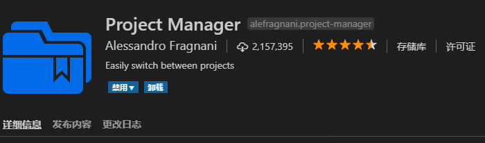

实际开发工作中经常用到json数据，那么就会有这样一个需求：在谷歌浏览器中访问URL地址返回的json数据能否按照json格式展现出来。比如，在谷歌浏览器中访问：<http://jsonview.com/example.json>
展现效果如下：

那么安装了JsonView扩展程序后的展现效果如下：

很明显，后者的效果更好。实现步骤如下：

# 下载JsonView扩展程序压缩包

下载地址：<https://github.com/gildas-lormeau/JSONView-for-Chrome>

点击`Clone or download`-->`Download Zip`

# 解压这个压缩包

# 打开谷歌浏览器的扩展程序界面

- 方式一：在谷歌浏览器地址栏中输入：`chrome://extensions/`
- 方式二：

# 加载JsonView扩展程序
选中开发者模式，点击`加载正在开发的扩展程序…`，选择插件目录（例如，我的是 `D:\JSONView-for-Chrome-master\WebContent`）。

点击确定后，就安装上了。安装后界面如下：

安装完成，重新加载 (`Ctrl+R`)。

# 参考资料

[chrome jsonView插件安装](https://blog.csdn.net/u011053407/article/details/49909799 "chrome jsonView插件安装")

[如何在谷歌浏览器chrome中离线安装.crx扩展程序的三种方法？](http://www.cnplugins.com/tool/three-methods-to-install-crx.html "如何在谷歌浏览器chrome中离线安装.crx扩展程序的三种方法？")