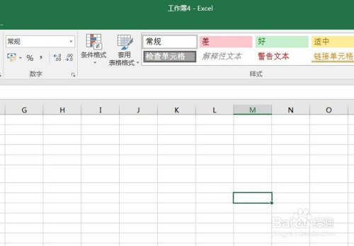
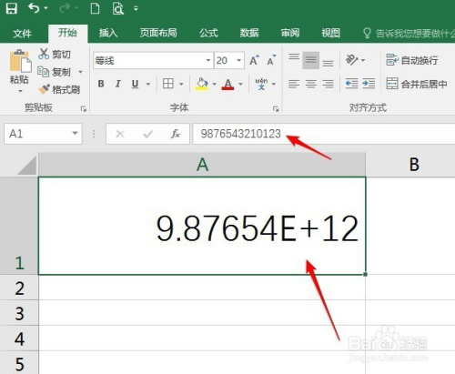
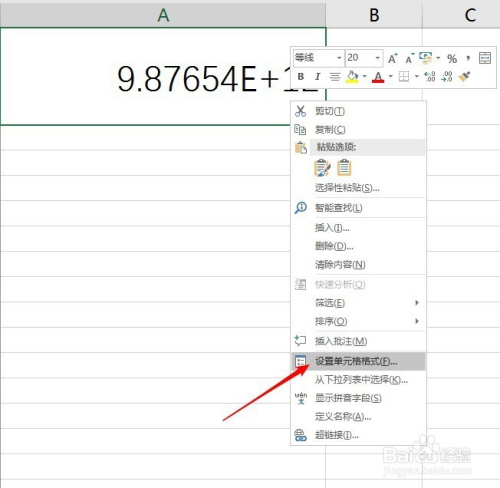
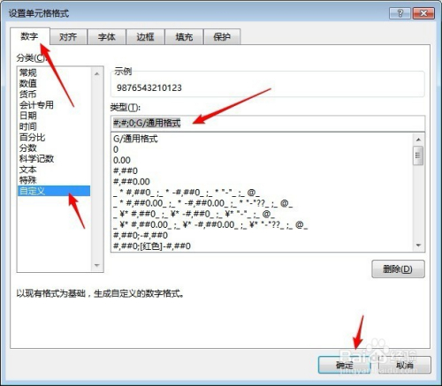
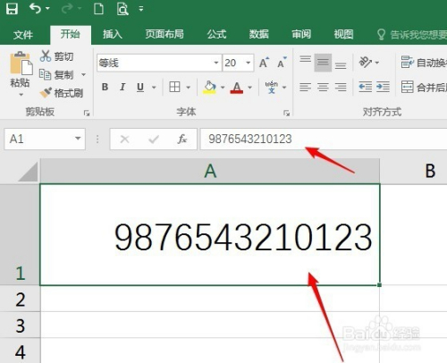

> 转载自：<https://jingyan.baidu.com/article/1974b2894ac96ef4b0f7744b.html>

Excel中输入位数较大的数据时，软件会自动使用科学计数法显示。很多时候并不需要这样的计数格式，所以需要把它转变为普通的数字格式。

**打开Excel，建立空白工作簿。**

**比如，在A1中输入一个位数较多的数字9876543210123。**

**回车后，就看到，这个数字被转变为了科学计数法计数。**

**如果想把它转变为通常的显示方法，需要做如下设置。在单元格上点击鼠标右键，点击“设置单元格格式”。**

**在打开的窗口中，切换到“数字”选项卡，点击“自定义”，然后在右侧“类型”中输入如下代码：#;#;0;G/通用格式。**

**点击“确定”后，再看数字，就显示成了正常的数据格式。**

