其实我也是小白，我就用小白的话跟各位小白讲解怎样重装系统吧！

一般重装系统分为两种：

- 一种就是您要装的这台机器可以正常使用，你只是用这个系统不爽或者是系统是试用版的，有试用期限，需要重装系统。
- 另一种是小白们经常会犯的一个错误，误删了系统文件之后，系统进不去了；或者是用杀毒软件杀毒的时候，把系统文件误删了，导致进不了系统而需要重装系统。

根据这两种情况，我分两块跟大家讲解。

# 第一种：本身可以进入系统的，这种要重装很简单
## 需要的工具：（工欲善其事，必先利其器）
### 老毛桃一键还原工具
软件官网：<http://www.laomaotao.net/>

### 系统镜像（下载一个自己喜欢的——比什么都重要）
登录[系统之家](http://www.xitongzhijia.net/ "系统之家官网") ，在这里面选择您需要下载的系统类型。
这里有详细的系统介绍，点进去之后有详细的软件版本型号，系统的一些功能、特点以及系统文件的详细介绍（小白不懂的话，可以不用管，安装好之后，不喜欢就卸载，下载自己喜欢的就OK）。

### 解压、压缩软件
将win7安装包解压，一般情况下载的都是`.iso`格式的镜像，解压出来后会有如下文件：

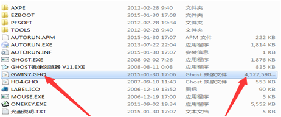

找到上图所指的这个.GHO格式的文件。

## 制作的操作步骤：
### 第一步：打开老毛桃一键重装软件

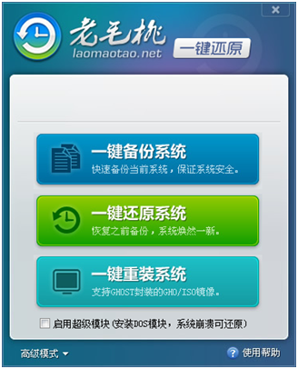

这个软件点开之后，等待10s左右，因为这个软件会自动检测您的系统当前有没有备份过，大概10s左右之后，如果系统没有备份过就会出现这种情况。

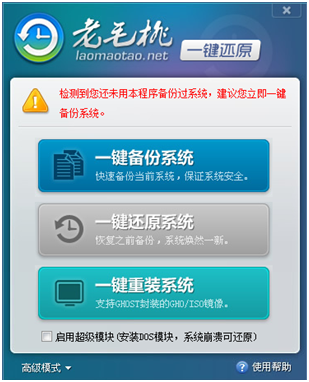

中间【一键还原系统】的选项会变成灰色，不可点击的状态，这个跟您没有关系，我们往下面说。

### 第二步：点击一键重装系统

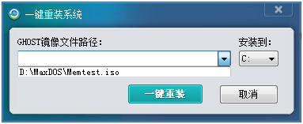

会出现这个页面，页面左侧`GHOST镜像文件路径`选择，就选择您解压出来的系统文件中`.GHO`格式的文件。`安装位置`选择系统盘，一般为`C盘`
然后点击`一键重装`。点击`一键重装`之后，会出现这个提示。

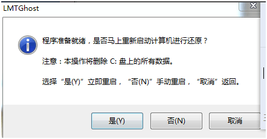

这是提示您，重装系统需要将C盘和桌面上的所有资料文件全部格式掉，而且是无法恢复的。所有在重装系统之前，一定要吧C盘和桌面上的所有重要资料转移阵地，移动到其他分盘里面。

### 第三步：点击是(Y)

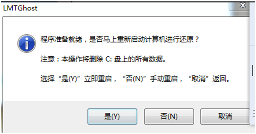

下面就是系统自动重装的画面

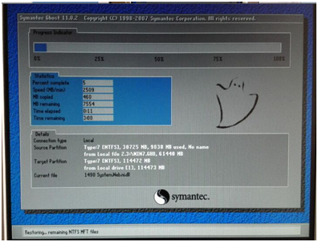

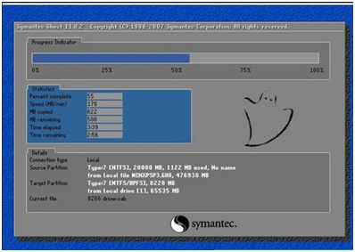

还有一些驱动安装的画面，这里就不一一贴图了。

# 第二种：机器本身进不了系统，需要借助外物（如光驱，U盘等，这里以U盘为例）
## 需要的工具：（工欲善其事，必先利其器）
用U盘做系统当然离不开U盘了，需要一个`≥4G`的U盘，还需要事先下载好的一个系统镜像，这个上文中都有详细的介绍，这里就不废话了，给您[一个网址](http://www.xitongzhijia.net/ "系统之家官网") ，喜欢哪个系统就选择哪个系统。
需要一个软件，百度上面搜这个关键词：（u盘启动盘制作工具软件），上面都是

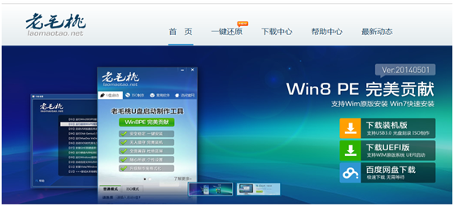

一般比较常用的是老毛桃，大白菜等（这里以老毛桃为例），老毛桃软件下载地址：<http://www.laomaotao.net/>

## 格式化U盘步骤
下载好之后，把U盘插到一个电脑上面（如果实在没有电脑，可以去网咖），U盘需要格式化，如果U盘里面有资料的话，可以先移出来，然后在格式化。格式化的时候可以更改一下模式，改成NTFS格式的（改成这个个是可以一次性移动`＞4G`的资料了）。
操作步骤：

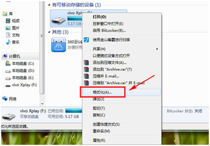

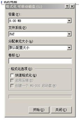

 
### 格式化U盘

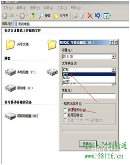

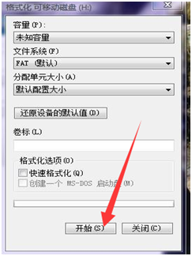

### U盘格式化选择NTFS格式，然后点击开始
点击之后会提示您是否确认删除硬盘里面的资料，您点击确定就可以了。等格式化完成之后，就可以进行U盘启动工具的制作过程了。

## 制作U盘启动工具步骤
步骤解析：打开老毛桃软件之后，在`请选择`里面，选择自己的U盘，然后点击`一键制作成USB启动盘`；然后会弹出一个`信息提示`的对话框，您点击`确定`就可以了，然后就开始制作了：

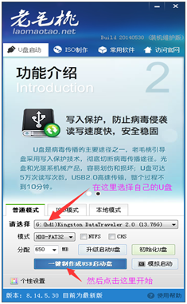

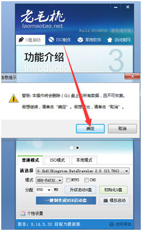

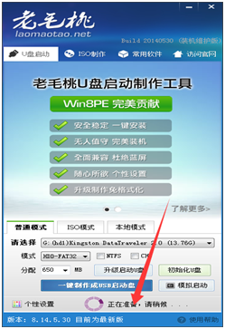

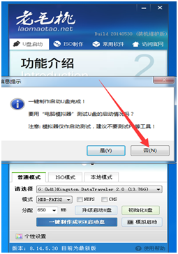

步骤解析：第一幅图是正在制作的过程，这个时间可能会长一点，制作完成之后，会弹出一个`信息提示`的对话框，让您进行模拟测试的，直接点`否`就可以了（新手没试过Y）。到此U盘启动工具就算是做好了，但是想要用U盘装系统，还需要吧系统的镜像（也就是您下载系统中的`*.GHO`格式的文件放到U盘里就可以了，如果不懂的，就吧下载的系统文件，解压出来，全部放到U盘里面），下面讲解用U盘装系统的步骤，有图解。

## U盘装系统步骤
在用U盘重装系统之前，要跟大家说一下；因为现在好多配置主板都是更换的新一代的四代主板，这款主板大部分商家在安装系统的时候SATA模式都是高级模式AHCI的，而重装系统需要将模式调整为IDE，恰恰好多蒙人的小维修店就不知道，重装系统老是重启。

### 第一步：硬盘模式设置（这里以华硕主板为例）
进入BIOS（操作步骤：开机之后一直点DEL键）

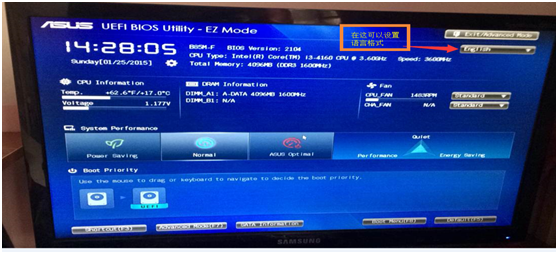

步骤讲解：在上面箭头所指的方向里可以选择语言，下面以英语为例，为大家讲解。
进入高级设置模式（操作步骤：按F7 ，然后弹出对话框之后，点回车键）

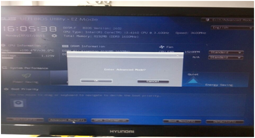

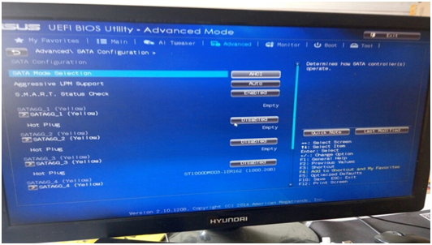

将硬盘模式调为IDE（操作步骤：用键盘左右键选择`Advanced`，然后上下键选择`SATA Configuration`，然后点回车进入图2，然后再点回车进入图3，然后用上下键选择IDE模式，然后点回车，然后按F10进入图4，然后点回车就可以了，这样就设置好了。）

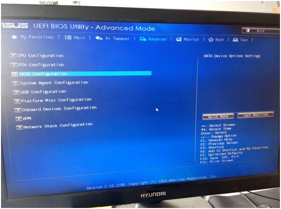

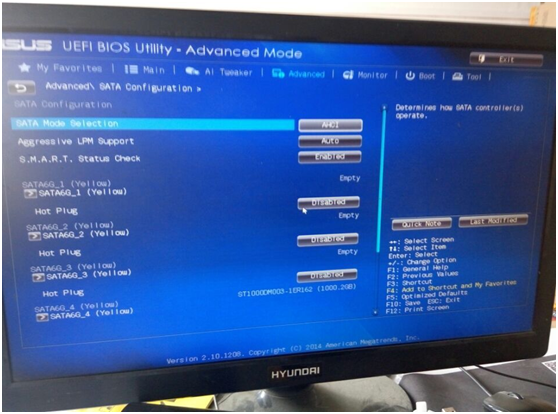

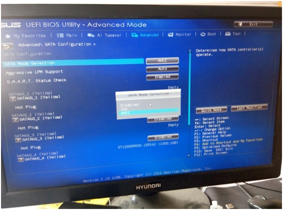

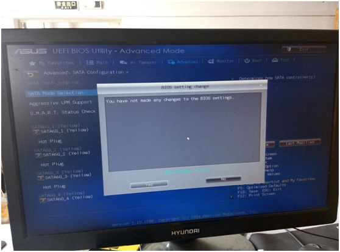

 
### 第二步：U盘装系统操作步骤（这里以华硕主板为例）
进入U盘PE（操作步骤：按`F8` ，然后弹出对话框之后，点回车键）

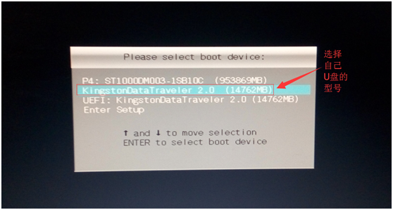

选择自己的U盘之后,然后点回车进入老毛桃U盘制作工具页面
不要等着跑秒跑完,可以点击键盘上的上下键选择(建议选择Win8PE)

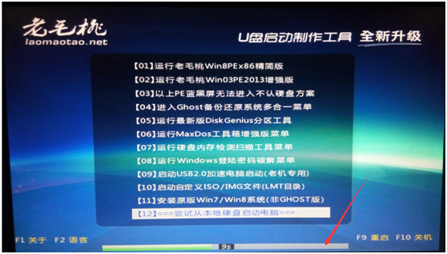

然后点回车，等待下，就可以进入PE桌面了

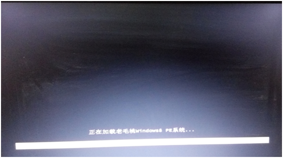

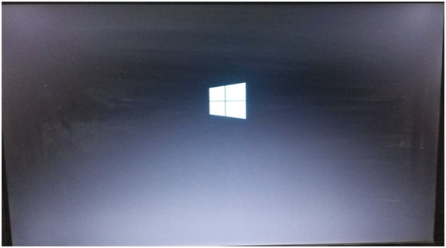

然后点击`老毛桃一键装机`图标 ，点击之后就会弹出装系统页面，直接点点击确定，确定，然后会自动安装，驱动，导入软件的。在这个阶段里不要动电脑，不要断电，只需要安静的等待就可以了，下面是手动和自动的一系列画面，发出来给大家共享一下：

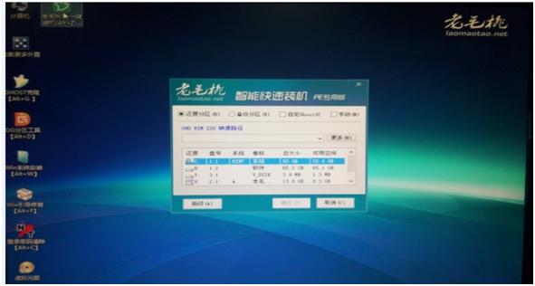

手动：这里是选择系统安装在哪个盘里的，直接点确定就可以进入下一步。

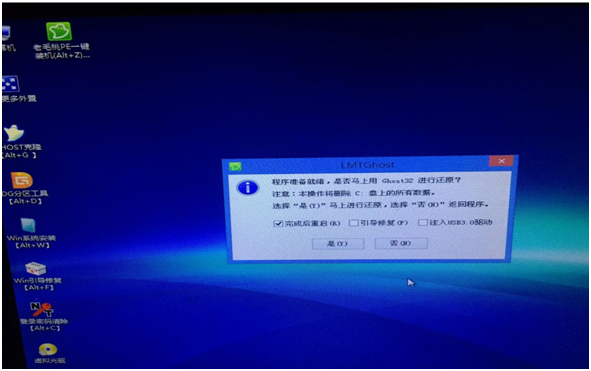

手动：这里是提示你是否确定格式化C盘的所有数据。
 
> 注意：一般直接从系统之家下载下来的系统镜像，都会安装他们推广的一些软件，说实话这些软件真心的不好，而且还都一上来就自动默认设置开机启动项，导致机器开机速度龟速。所以，一般我重装系统，要么装纯净版系统（打驱动费劲），要么就吧所有的垃圾软件都卸载掉，重新安装（包括安全卫士）。
 
希望都有所收获，如果不准确的地方，还请多多指教。
 