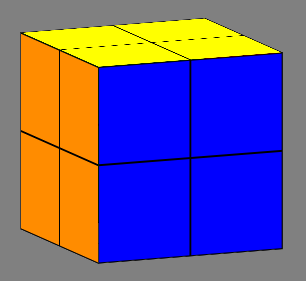

教你如何用HTML画一个二阶魔方，效果如下。

源代码如下：

	<!doctype html>
	<html>
	<head>
	
	</head>
	<body>
	

		

			

				

					

					

					

					

					

					

					

					

				

				

					

					

					

					

					

					

					

					

				

				

					

					

					

					
			
					

					

					

					

				

				

					

					

					

					

					

					

					

					

				

				

					

					

					

					

					

					

					

					

				

				

					

					

					

					

					

					

					

					

				

			

		

	

	</body>
	</html>